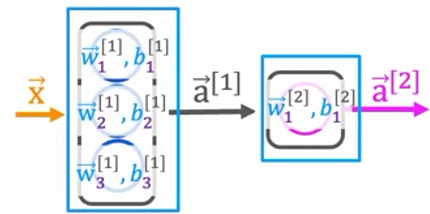
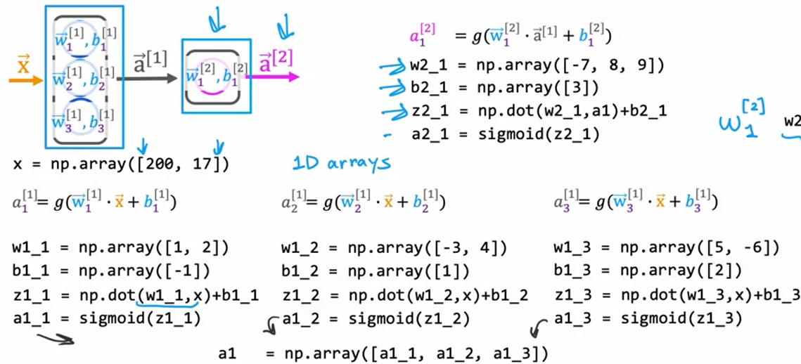

# Neural network layer
https://www.coursera.org/learn/advanced-learning-algorithms/lecture/z5sks/neural-network-layer  
  
-neural network layer - a fundamental building block of modern neural networks  
  
-input layer (ie. values that are being passed to the network) is often called *layer 0*  
-first layer containing any neurons is often called *layer 1*  
  
-brackets in superscript are used to denote to which layer we are referring to : `[n]`  

<br></br>
<p>
    
</p>  

In the orange bracket we can see that the input is a 4 value vector.  
We can see that the network layer is made up of 3 neurons, each doing logistic regression on the given inputs.  
Notation is also shown here :  
&nbsp;&nbsp;&nbsp; $\vec{w}_{1}^{[1]}, b_{1}^{[1]}, a_{1}^{[1]}$ are all values refering to the **first** neuron in the **first** layer, while **0.3** at the end of first line represents the **activation value** of the first neuron.  
  
At the far right hand part of the picture we can see a column vector $\vec{a}^{[i]}$ comprised of activation values for all neurons in layer **[1]**.  
  
Output of each layer **L** represents the input for layer **L+1**.  
  
 
  
Now we will take a look at **L[2]** - layer that follows one shown above.  
Notice how input to $\vec{a}^{[2]}$ is output of $\vec{a}^{[1]}$.  
Considering our example network is made up of only L1 and L2, output of this layer is output of the whole network.  
In this case, our output is a scalar - as such it might be indicating what is the likelihood of some event.  
<br></br>
  
# More complex neural networks  
https://www.coursera.org/learn/advanced-learning-algorithms/lecture/a5AfY/more-complex-neural-networks  
  
Here is the neural network we will be working on in this chapter :  
  
  
Layers 1, 2 and 3 are **hidden layers**.  
Layer 4 is the **output layer**.  
Layer 0 is the **input layer**.  
  
By convention, when we say a network has **4** layers, only hidden layers and the output layer contribute to that number - input layer is **NOT** taken into account  
  
Here is a screenshot focusing on **L[3]** :  
  
This is a general expression used to compute activation value of neuron *j* in layer *l* :  
&nbsp;&nbsp;&nbsp;&nbsp; $a_{j}^{[l]} = g(\vec{w}_{j}^{[l]} \cdot \vec{a}^{[l-1]} + b_{j}^{[l]})$  
&nbsp;&nbsp;&nbsp;&nbsp; $g$ represents the sigmoid function, however in the broader context of neural networks, whichever function is used here instead of the *sigmoid* is generally called the **activation function**  
  
# Inference : making predictions (forward prop)  
https://www.coursera.org/learn/advanced-learning-algorithms/lecture/vYsrR/inference-making-predictions-forward-propagation  
  
-forward propagation - neural network structure that propagates the activation values from left to right  
-backward propagation - contrasts forward propagation, contrasts forward prop (covered later)  
  
-neural network structure with decreasing number of neurons in each layer is a pretty typical neural network structure  
  
# TensorFlow implementation  
-covers using forward prop offered by TF library  
-points out difference in TF matrix representation (tensors) and how it must be handled using numpy to adhere to TF's convention  
  
# Neural Network implementation in Python  
# Forward prop in a single layer  
https://www.coursera.org/learn/advanced-learning-algorithms/lecture/AJc5g/forward-prop-in-a-single-layer  
  
-this video/lecture shows how to implement forward prop for a single network layer  
  
Let us imagine we have one network layer before us :  
  
  
First hidden layer is made up of 3 neurons.  
Second hidden layer, which is also the otput layer, is made up of 1 neuron.  
  
Output of first hidden layer is $\vec{a}^{[1]}$ - a vector made up of 3 activation values (because we have 3 neurons).  
We can write out this vector like this : $\vec{a}^{[1]} = [a_{1}^{[1]}, a_{2}^{[1]}, a_{3}^{[1]}]$  
Value in superscript ($[1]$) represents layer where the observed variable is found.  
Value in subscript ($_{1}$) represents position of the observed value in the vector.  
E.g. : $a_{2}^{[1]}$ is the second value of the *a* vector in layer 1.  
  
As the screenshot show, for each layer there will be some *w* and *b* prediction.
For example :  
$a_{1}^{[1]} = g(\vec{w}_{1}^{[1]} \cdot \vec{x} + b_{1}^{[1]})$  
w1_1 = np.array([some_value, some_value_2])  
b1_1 = np.array([some_value_b])  
z1_1 = np.dot(w1_1, x) + b1_1
a1_1 = sigmoid(z1_1)  
  
All of the expressions above for $a_{1}^{[1]}$ need to be run also for $a_{2}^{[1]}$ and $a_{3}^{[1]}$, of course with appropriate *w* and *b* values.  
Once we have all 3 activation values for the first sublayer, we have our output vector :  
a1 = np.array([a1_1, a1_2, a1_3])  
  
Vector *a1* is now the input for the second hidden layer, ie. the output layer.  
  
Here is a screenshot from the video showing all of the operations :  
  
  
Everything written here can be generalized a lot more.
Each set of layer is composed of a certain number of nodes (at least 1).  
Each node uses some kind of activation function (e.g. *sigmoid* in all of the example so far).  
Therefore, each layer can be considered a function which you supply with the desired number of neurons, as well as the appropriate activation functions :  
```python
# x - input vector for our observed layer L
def myLayer(number_of_neurons, activation_functions, x):
    layer_output = np.zeros([number_of_neurons])

    for i in range(number_of_neurons):
        w[i] = #some w[i] guess
        b[i] = # some b[i] guess
        z[i] = np.dot(w[i], x) + b[i]
        neuron_a[i] = sigmoid(z[i])
        layer_output[i] = neuron_a[i]
```  
I am a bit conflicted as to where to *w* and *b* guesses come from - are the guesses, and the consequent *w* and *b* corrections (just like in grad desc) done here before the activation values for each neuron are computed, or do optimized *w* and *b* parameters already arrive as such in *myLayer* function? I guess it would make sense that everything is done in *myLayer* function. This will probably be explained in later chapters.