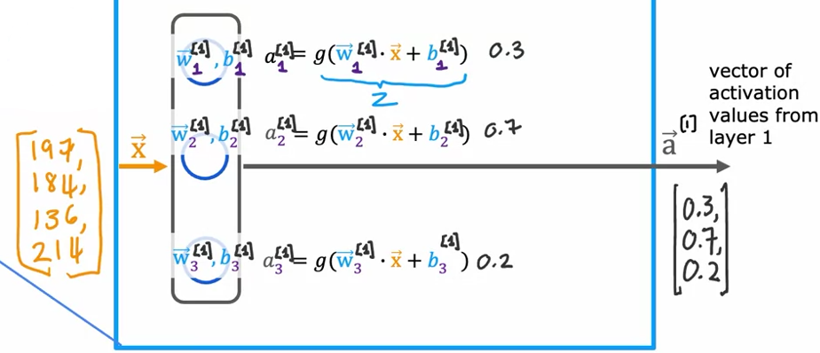
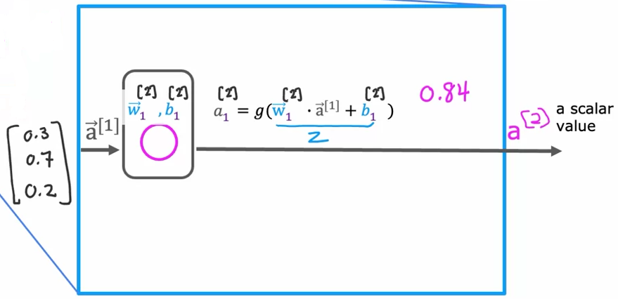
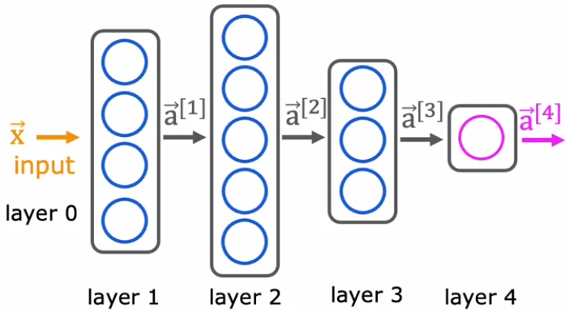
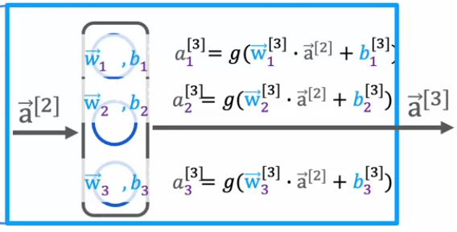

# Neural network layer
https://www.coursera.org/learn/advanced-learning-algorithms/lecture/z5sks/neural-network-layer  
  
-neural network layer - a fundamental building block of modern neural networks  
  
-input layer (ie. values that are being passed to the network) is often called *layer 0*  
-first layer containing any neurons is often called *layer 1*  
  
-brackets in superscript are used to denote to which layer we are referring to : `[n]`  

  

    

  

In the orange bracket we can see that the input is a 4 value vector.  
We can see that the network layer is made up of 3 neurons, each doing logistic regression on the given inputs.  
Notation is also shown here :  
&nbsp;&nbsp;&nbsp; $\vec{w}_{1}^{[1]}, b_{1}^{[1]}, a_{1}^{[1]}$ are all values refering to the **first** neuron in the **first** layer, while **0.3** at the end of first line represents the **activation value** of the first neuron.  
  
At the far right hand part of the picture we can see a column vector $\vec{a}^{[i]}$ comprised of activation values for all neurons in layer **[1]**.  
  
Output of each layer **L** represents the input for layer **L+1**.  
  
 
  
Now we will take a look at **L[2]** - layer that follows one shown above.  
Notice how input to $\vec{a}^{[2]}$ is output of $\vec{a}^{[1]}$.  
Considering our example network is made up of only L1 and L2, output of this layer is output of the whole network.  
In this case, our output is a scalar - as such it might be indicating what is the likelihood of some event.  
  
  
# More complex neural networks  
https://www.coursera.org/learn/advanced-learning-algorithms/lecture/a5AfY/more-complex-neural-networks  
  
Here is the neural network we will be working on in this chapter :  
  
  
Layers 1, 2 and 3 are **hidden layers**.  
Layer 4 is the **output layer**.  
Layer 0 is the **input layer**.  
  
By convention, when we say a network has **4** layers, only hidden layers and the output layer contribute to that number - input layer is **NOT** taken into account  
  
Here is a screenshot focusing on **L[3]** :  
  
This is a general expression used to compute activation value of neuron *j* in layer *l* :  
&nbsp;&nbsp;&nbsp;&nbsp; $a_{j}^{[l]} = g(\vec{w}_{j}^{[l]} \cdot \vec{a}^{[l-1]} + b_{j}^{[l]})$  
&nbsp;&nbsp;&nbsp;&nbsp; $g$ represents the sigmoid function, however in the broader context of neural networks, whichever function is used here instead of the *sigmoid* is generally called the **activation function**  