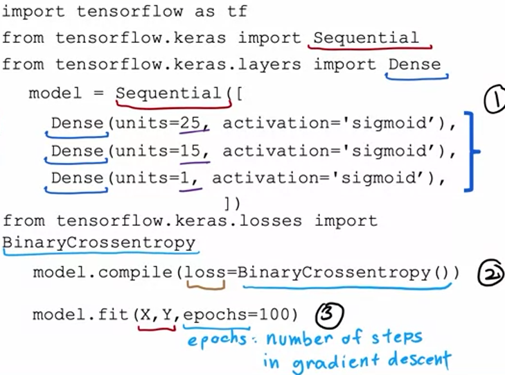
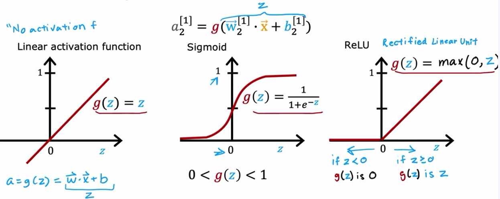

# Advanced Learning Algorithms - W2  
# Neural network training - TensorFlow implementation  
-this lecture shows a simple NN implementation example using TensorFlow  
-here is a screenshot of the code professor wrote :  

    

  
  
`Sequential` function groups a linear stack of layers into a `Model` (https://www.tensorflow.org/api_docs/python/tf/keras/Sequential)  
  
`Dense` represents a single layer (made up of chosen number of neurons/units) which executes all of the operations we've described at the end of W1 notes (https://www.tensorflow.org/api_docs/python/tf/keras/layers/Dense)  
  
`model.compile` is a somewhat confusing expression because no `compilation` of model is done.  
`compile` method simply does the necessary model setup, such as what optimizer we want to use, which loss function we want to use, etc.  
In the screenshot you can see professor has passed `BinaryCrossentroy()` as the desired loss function for our model - this is exactly the purpose of `compile` method : to set up the model  
  
`model.fit()` - fitting our model to the training data over 100 epochs (epochs are basically number of grad desc steps/iteratons)  
  
-neural networks are also called **multilayer perceptrons**  
  
# Alternatives to the sigmoid function  
https://www.coursera.org/learn/advanced-learning-algorithms/lecture/04Maa/alternatives-to-the-sigmoid-activation  
  
-most often we will need a NN model to determine values that are not exclusively binary, but can rather take on a vast range of values  
-using sigmoid function as our activation function in such cases is not suitable  
-one activation function which sees a lot of usage is **ReLU**  
  
-ReLU - Rectified Linear Unit  
  
-here are a few activaiton functions :  

    

  
# Choosing activation function  
https://www.coursera.org/learn/advanced-learning-algorithms/lecture/aWivF/choosing-activation-functions  

  
-choice of activation function matters most for the output layer  
&nbsp;&nbsp;&nbsp;&nbsp; -if we are dealing with a binary classification problem, then we expect a binary output value from the model, therefore a sigmoid function is appropriate  
&nbsp;&nbsp;&nbsp;&nbsp; -if we are expecting a vast, continuous, range of values, ReLU or linear function is appropriate (linear function is appropriate if we expect negative values)  
  
-however, when it comes to hidden layers, nowadays ReLU is most often used simply because it is a lot less computationally intense compared to sigmoid, and because we are mostly dealing with such modelling problems (image classification with non-binary classification, predicting non-binary values, ...) that anyways expect ReLU  
  
-linear activation functions should not be used in hidden layers because it does not contribute anything to better modelling of the behaviour captured by the training data  
  
