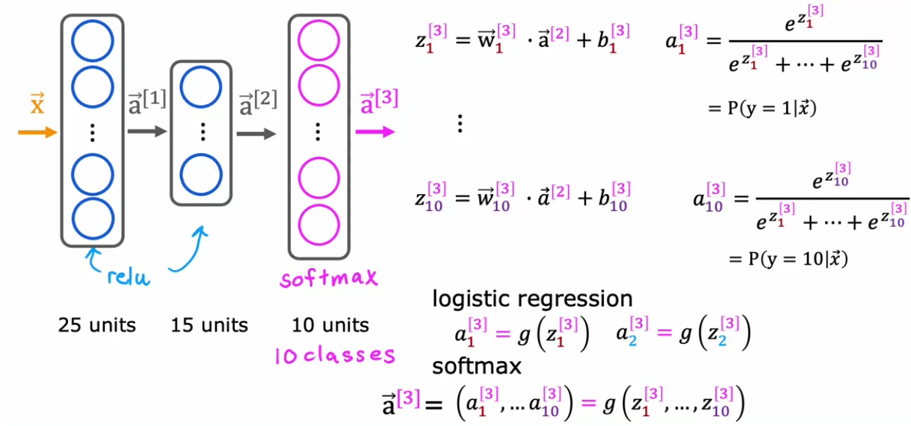
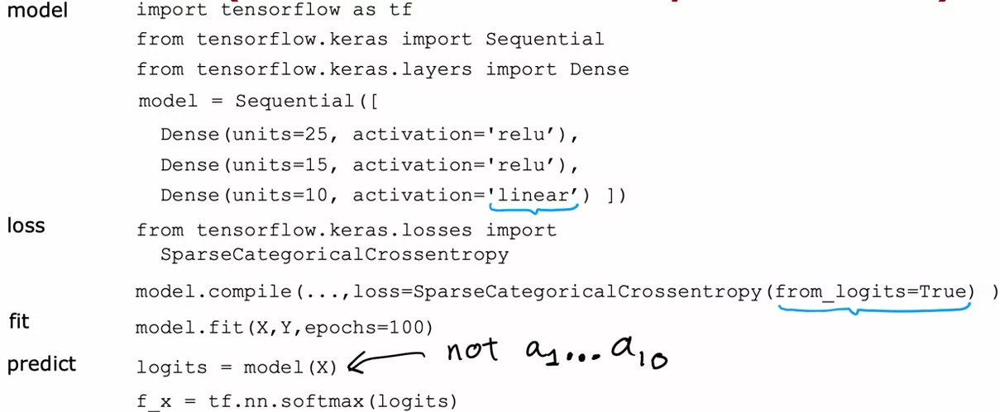

# Advanced Learning Algorithms - W2  
# Neural network training - TensorFlow implementation  
-this lecture shows a simple NN implementation example using TensorFlow  
-here is a screenshot of the code professor wrote :  
<p style="text-align: center">
    
</p>  
  
`Sequential` function groups a linear stack of layers into a `Model` (https://www.tensorflow.org/api_docs/python/tf/keras/Sequential)  
  
`Dense` represents a single layer (made up of chosen number of neurons/units) which executes all of the operations we've described at the end of W1 notes (https://www.tensorflow.org/api_docs/python/tf/keras/layers/Dense)  
  
`model.compile` is a somewhat confusing expression because no `compilation` of model is done.  
`compile` method simply does the necessary model setup, such as what optimizer we want to use, which loss function we want to use, etc.  
In the screenshot you can see professor has passed `BinaryCrossentroy()` as the desired loss function for our model - this is exactly the purpose of `compile` method : to set up the model  
  
`model.fit()` - fitting our model to the training data over 100 epochs (epochs are basically number of grad desc steps/iteratons)  
  
-neural networks are also called **multilayer perceptrons**  
  
# Alternatives to the sigmoid function  
https://www.coursera.org/learn/advanced-learning-algorithms/lecture/04Maa/alternatives-to-the-sigmoid-activation  
  
-most often we will need a NN model to determine values that are not exclusively binary, but can rather take on a vast range of values  
-using sigmoid function as our activation function in such cases is not suitable  
-one activation function which sees a lot of usage is **ReLU**  
  
-ReLU - Rectified Linear Unit  
  
-here are a few activaiton functions :  
<p style="text-align: center">
    
</p>
  
# Choosing activation function  
https://www.coursera.org/learn/advanced-learning-algorithms/lecture/aWivF/choosing-activation-functions  

  
-choice of activation function matters most for the output layer  
&nbsp;&nbsp;&nbsp;&nbsp; -if we are dealing with a binary classification problem, then we expect a binary output value from the model, therefore a sigmoid function is appropriate  
&nbsp;&nbsp;&nbsp;&nbsp; -if we are expecting a vast, continuous, range of values, ReLU or linear function is appropriate (linear function is appropriate if we expect negative values)  
  
-however, when it comes to hidden layers, nowadays ReLU is most often used simply because it is a lot less computationally intense compared to sigmoid, and because we are mostly dealing with such modelling problems (image classification with non-binary classification, predicting non-binary values, ...) that anyways expect ReLU  
  
-linear activation functions should not be used in hidden layers because it does not contribute anything to better modelling of the behaviour captured by the training data  
  
- - - -  
  
-muticlass classification - classification problem with more than two output categories/classes  

# Softmax  
https://www.coursera.org/learn/advanced-learning-algorithms/lecture/mzLuU/softmax  
-generalization of logistic regression (ie. not only two possible output values, but much more)  
  
-general implementation of softmax for N possible outputs :  
  
&nbsp;&nbsp;&nbsp; y = 1, 2, 3, ..., N ($y_{n}$ represents the available output category)  
&nbsp;&nbsp;&nbsp; j represents the iterator that iterates over all classes, and their appropriate parameters $w_{j}$ and $b_{j}$ : $j = 1, 2, ..., N$  
&nbsp;&nbsp;&nbsp; $z_{j} = \vec{w}_{j} \cdot \vec{x} + b_{j}$  
&nbsp;&nbsp;&nbsp; $a_{j} = \frac{e^{z_{j}}}{\sum_{k=1}^{N}{e^z_{k}}} = P(y = j | \vec{x})$  
  
-$a_{j}$ represents the probability that output class is the class $j$  
-numerator in $a_{j}$ eqution fixes in place a specific class whose probability of occurence we are computing against the sum of all other $e^{z_{k}}$ computations  
  
-e.g. for softmax with 4 possible output classes :  
$a_{1} = \frac{e^{z_{1}}}{e^{z_{1}} + e^{z_{2}} + e^{z_{3}} + e^{z_{4}}}$  
$a_{2} = \frac{e^{z_{2}}}{e^{z_{1}} + e^{z_{2}} + e^{z_{3}} + e^{z_{4}}}$  
$a_{3} = \frac{e^{z_{3}}}{e^{z_{1}} + e^{z_{2}} + e^{z_{3}} + e^{z_{4}}}$  
$a_{4} = \frac{e^{z_{4}}}{e^{z_{1}} + e^{z_{2}} + e^{z_{3}} + e^{z_{4}}}$  
  
-adding up all of the $a_{j}$ probability must result in the total probability of 1  
  
-we must compute the loss and cost function for softmax  
$a_{1} = \frac{e^{z_{j}}}{{e^z_{1}} + {e^z_{2}} + ... + {e^z_{N}}} = P(y = 1 | \vec{x})$  
$a_{N} = \frac{e^{z_{N}}}{{e^z_{1}} + {e^z_{2}} + ... + {e^z_{N}}} = P(y = N | \vec{x})$  
  

$loss(a_{1}, ..., a_{N}) = -log(a_{N})$ for y=N  
  
# Neural network with Softmax output  
https://www.coursera.org/learn/advanced-learning-algorithms/lecture/ZQPG3/neural-network-with-softmax-output  
-to build a NN using multiple output classification, we will put our Softmax activation function in the output layer of our NN  
-notice that we are putting it in the **OUTPUT** layer  
-when digit classification using only two output classes was being demonstrated, our output layer had the sigmoid activation function (ie. logisitic regression, A.K.A. binary classification)  
  
-in addition to changing our output layer activation function to softmax, we will also increase the number of neurons in our output layers to 10  
&nbsp;&nbsp;&nbsp; why 10? Because our model is trying to guess which number we've written, and since decimal number system has 10 numbers we will use 10 neurons in our output layer, each neuron outputting the probability that the inputted image contains a number to which the neuron corresponds (e.g. *neuron_0* corresponds to probability that the inputted image has number **0**, *neuron_1* corresponds to the probability that the inputted image has number **1**, etc.)  
  
-here is a visual representation of this NN, as well as some additional info such as number of nodes in each layer, and how computations are done in the last layer :  
<p style="text-align: center">
    
</p>  
  
-generally speaking, when we are implementing a NN in code there are a few distinct steps/phases :  
&nbsp;&nbsp;&nbsp;&nbsp; 1. specify the model - how many layers, how many neurons, which activation functions, ...?  
&nbsp;&nbsp;&nbsp;&nbsp; 2. specify loss and cost equations - define mathematical term used to compute loss, and therefore cost  
&nbsp;&nbsp;&nbsp;&nbsp; 3. train on input data to minimize cost  
  
-for NN with softmax for classyfing digits we would use *SparseCategoricalCrossentroy* loss function from *TF* library  
&nbsp;&nbsp;&nbsp; -what does *SparseCategorical* mean? Categorical means we are binning our outputs in *N* specific output categories, while *Sparse* means that the each input value belongs to only one of the possible output categories  
  
# Improved implementation of softmax  
https://www.coursera.org/learn/advanced-learning-algorithms/lecture/Tyil1/improved-implementation-of-softmax  
-using logistic regression as an example we will demonstrate how loss, and cost, computations can be more precies avoiding the numberical roundoff error pileup  
  
-consider $g(z)$ expression for logistic regression : $a = g(z) = \frac{1}{1+e^{-z}}$  
-consider the loss expression for log.reg. : $loss = -ylog(a) - (1-y)log(a)$  
  
-notice that expression $a$ can be inserted directly into $loss$ expression, thus avoiding the intermediary step of computing $a$ and then inserting that value into $loss$ equation  
-applying the above yields $loss$ expression : $loss = -ylog(\frac{1}{1+e^{-z}}) - (1-y)log(\frac{1}{1+e^{-z}})$  
  
-if we are not writing code on our own, *TensorFlow* also offers a way of forcing this behaviour :  
```python
model.compile(loss=BinaryCrossEntropy(from_logits=True))
```  
-the `from_logits=True` parameter is what enables TF to reduce numerical roundoff errors in our model  
  
-the more accurate version of digit recognition using softmax will actually not use softmax in the last layer - it will actually use linear activation function, meaning the output layer is no longer outputing probabilities $a_{1}, ..., a_{10}$, but is instead outputting raw neuron outputs $z_{1}, ..., z_{10}$  
  
-only when we are trying to run predictions on new, never before ran, inputs, we would apply softmax to the output of our model (everything is shown on screenshot below)  
<p style="text-align: center">
    
</p>  
  
-same logic is applicable for our logistic regression model - instad of applying the sigmoid activation function in the last layer, we will actually use the linear activation function in our output layer, and then once we are running prediction using our trained model we will apply sigmoid function  
  
# Classification with multiple outputs  
https://www.coursera.org/learn/advanced-learning-algorithms/lecture/pjIk0/classification-with-multiple-outputs-optional  
-multi-label classification - type of classification characterized by the existence of multiple labels within a single image input (e.g. a given image might contain a car, a pedestrian, an airplane visible in the sky, etc. - all of these labels appear simultaneously)  
  
-how do we implement such NN?  
&nbsp;&nbsp; -we could build a separate NN for each label we want to detect - one NN for detecting pedestrians, one for detecting cars, etc.  
&nbsp;&nbsp; -another approach is to train one NN with three outputs (one output value represents cars, one represents pedestrians, and one represents airplanes)  
&nbsp;&nbsp;&nbsp;&nbsp;&nbsp; -such implementation would result in the output layer having three neurons  
  
-additional explanation of the difference between multiclass and multilabel classification : https://stats.stackexchange.com/questions/11859/what-is-the-difference-between-a-multiclass-and-a-multilabel-problem  
&nbsp;&nbsp;&nbsp;&nbsp; -multiclass classification can be considered mutually exclusive - it makes the assumption that each sample (*input*) belongs to only one possible output class
  
&nbsp;&nbsp;&nbsp;&nbsp; -multilabel classification assigns a set of labels to each sample - each label, within the same sample, represents a different classification task  
  
# Advanced optimization  
https://www.coursera.org/learn/advanced-learning-algorithms/lecture/5Qt9E/advanced-optimization  
-despite gradient descent being a widely used optimization algorithm, there are other, better, optimization algorithms  
  
-ADAM algorithm - speeds up optimization by increasing *alpha* (learning rate)  
&nbsp;&nbsp;&nbsp; -when ADAM sees that gradient descent is moving in the right direction, but the "steps" it is taking are too small (therefore losing time), it increases *alpha* to try and save some iterations  
&nbsp;&nbsp;&nbsp; -ADAM will also reduce *alpha* if grad.desc. results in an oscilating cost function (meaning the step is too large)  
  
&nbsp;&nbsp;&nbsp; -ADAM stands for *Adaptive Moment Estimation*  
  
&nbsp;&nbsp;&nbsp; -ADAM doesn't use one, global, *alpha* value - it instead uses different learning rate for each model parameter (e.g. assume we have a model represented by 5 different *w* parameters ($w_{1}$, $w_{2}$, ..., $w_{5}$), and one parameter *b* - in such scenario ADAM will create 5 different *alpha* values, one for each *w* parameter, and one *alpha* param for *b*)  
  
&nbsp;&nbsp;&nbsp; -how does ADAM decide whether to increase or decrease *alpha* size?  
&nbsp;&nbsp;&nbsp;&nbsp;&nbsp; -if the observed parameter is, iteration after iteration, moving in the same direction, increase $\alpha_{j}$  
&nbsp;&nbsp;&nbsp;&nbsp;&nbsp; -if the observed parameter is, iteration after iteration, oscilating, reduce $\alpha_{j}$  
  
# Additional layer types  
https://www.coursera.org/learn/advanced-learning-algorithms/lecture/L0aFK/additional-layer-types  
  
-so far we've dealt only with **dense** layers  
-depending on what we want to do with out NN we might choose different types of layers  
-**dense layer** - a type of layer in which each neuron output is a function of **all** activation outputs of the previous layer  
  
-**convolutional layer** - a simplistic solution : each neuron is assigned a specific region of the input image to look at (e.g. neuron_0 looks only at the top left subsection made up of 4x4 pixels, neuron_1 looks at the first two subsections made up of 4x8 pixels, etc...)  
  
&nbsp;&nbsp;&nbsp; -each neuron looks at a part of the previous layer's output  
  
&nbsp;&nbsp;&nbsp; -such approach is computationally faster, and can need less training data (also less prone to overfitting)  


TO DO : take a look at the labs to figure out what you could implement/try out yourself