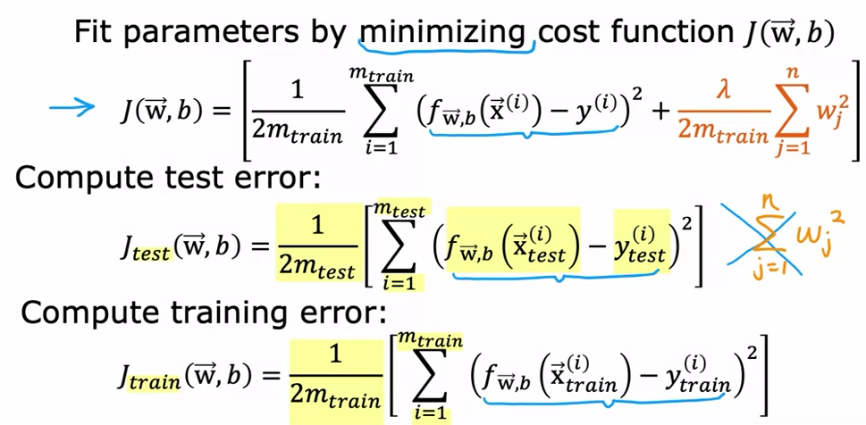
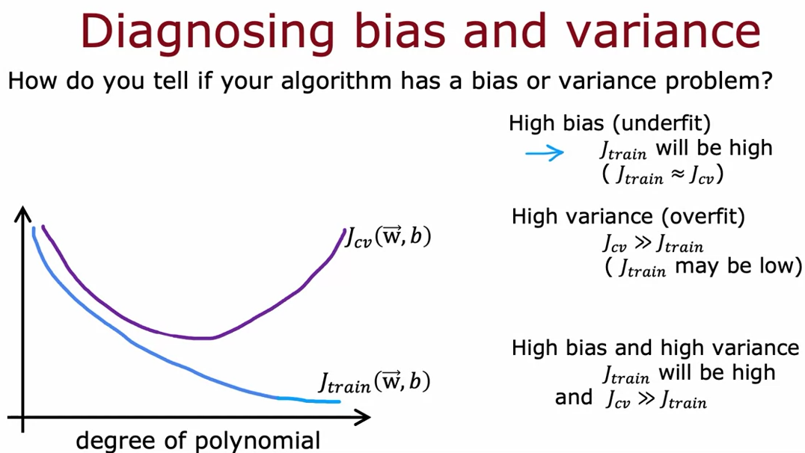
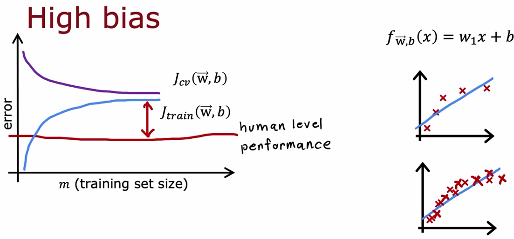
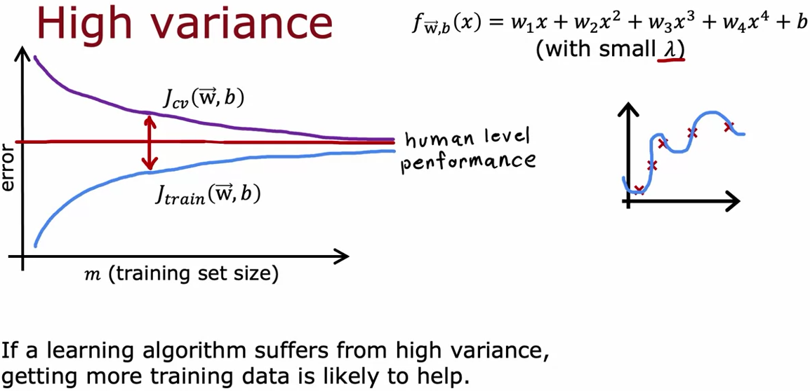
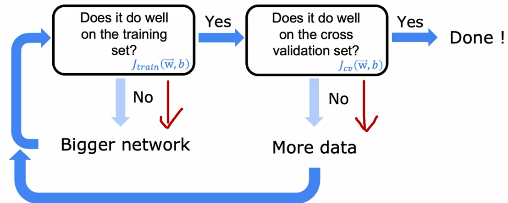

# Advanced learning algorithms - Week 3  
https://www.coursera.org/learn/advanced-learning-algorithms/home/week/3  
  
-when the developed model has unacceptably large errors when making predictions, there is a number of things we can try to fix the model :  
&nbsp;&nbsp;&nbsp; -get more training examples  
&nbsp;&nbsp;&nbsp; -try a smaller set of feature on which you will train the model  
&nbsp;&nbsp;&nbsp; -try adding more features  
&nbsp;&nbsp;&nbsp; -try adding polynomial features  
&nbsp;&nbsp;&nbsp; -try decreasing/increasing $\lambda$ (regularization term)  
  
-this week covers **diagnostics**  
&nbsp;&nbsp; -by *diagnostics* we actually refer to various tests that can be conducted to determine what might, or might not, help improve the performance of our algorithm  
  
## Evaluating a model  
https://www.coursera.org/learn/advanced-learning-algorithms/lecture/26yGi/evaluating-a-model  
  
-do not use all of the data to train the model  
&nbsp;&nbsp;&nbsp; -split the starting dataset into **training set** and **test set**  
&nbsp;&nbsp;&nbsp; -model's parameters will be trained using the **training set**  
&nbsp;&nbsp;&nbsp; -performance of the generated model is then tested on the **test set**  
  
&nbsp;&nbsp;&nbsp; $m_{train}$ - number of training examples in the whole dataset  
&nbsp;&nbsp;&nbsp; $m_{test}$ - number of test examples in the whole dataset  
  
&nbsp;&nbsp;&nbsp; -once we have fit the model we will compute **training error** and **test error** (linear regression example) :  

    

  
&nbsp;&nbsp;&nbsp; -why is this beneficial? If our model performs very well on our training data (low training error), but it performs very poorly on our test data (test error is very high), it means our model is not generalizing well (e.g. model is overfit, ie. emulates training data very tightly)  
  
## Model selection and training/cross validation/test sets  
https://www.coursera.org/learn/advanced-learning-algorithms/lecture/zqXm6/model-selection-and-training-cross-validation-test-sets  
  
-using all of the data from the input dataset to train the model, and then using that same data to determine the error of our model is not representative of the actual generalization error, which is most likely higher than the error computed as described above  
  
-splitting the data into a **training** and a **test* set, training the model using the **training set**, and then computing the error of the model using the **test set** is a step forward  
  
-a further refinement is to actually split the input dataset into 3 subsets - instead of splitting it only into **training set** and **test set**, we will introduce one more subset : **cross validation set**  
  
$m_{cv}$ - number of cross validation examples  
  
-cross-validation set is also called just *validation set*, or *development set*, or *dev set*  
  

    

-when evaluating multiple models, we will use *cross validation error* to determine which model we should choose  
&nbsp;&nbsp;&nbsp; -generalization error is now estimated using the *test set error*  

## Diagnosing bias and variance  
https://www.coursera.org/learn/advanced-learning-algorithms/lecture/L6SHx/diagnosing-bias-and-variance  
  
-high bias - underfit model  
-high variance - overfit model  
  
-underfit models (high bias) usually have very poor performance both on the training set ($J_{train}$) and the cross validation set ($J_{cv}$)  
  
-overfit models (high variance) usually have excellent performance on the training set ($J_{train}$), and very poor performance on the cross validation set ($J_{cv}$)  
  
-well trained model performs pretty well both on the training set ($J_{train}$), ie. cost is low, and has a very comparable performance on the cross validation set ($J_{cv}$)  
  
-here is a nice "cheat sheet" from professor's lecture for determining what is wrong with our model :  

    

  
  
## Regularization and bias/variance  
https://www.coursera.org/learn/advanced-learning-algorithms/lecture/JQZRO/regularization-and-bias-variance  
  
-here we will check out how $\lambda$ (regularization term) affects bias and variance  
  
-the approach to choosing best possible regularization values is similar to the one previously described for choosing best possible model parameters - for a chosen $\lambda$ value you minimize the model cost, compute cross validation set cost ($J_{cv}$), and then compare cross validation set costs for all models  
&nbsp;&nbsp;&nbsp;&nbsp; -whichever model, and its chosen $\lambda$ value, offers the lowest cross validation set cost, is chosen as the best combo  
  
-general logic about the impact of $\lambda$ on cost :  
&nbsp;&nbsp;&nbsp; -big lambda values mean we are less focused on minimizing the training set error (can lead to extreme underfitting) 
&nbsp;&nbsp;&nbsp; -small lambda values mean we are forcing smallest possible training set error (can lead to extreme overfitting)  
  
## Establishing a baseline level of performance  
https://www.coursera.org/learn/advanced-learning-algorithms/lecture/acyFT/establishing-a-baseline-level-of-performance  
  
-prior to solving a problem using our model, we need to have some kind of performance baseline to which we can compare our model  
  
-often times you will be able to set a benchmark using how a human, or some previous non-ML models perform some task, and then use that value as the baseline to which training set and cross validation set errors are compared to  
  
-if a training set error is noticeably higher than the baseline, and the cross validation set error is comparable to the training set error, we are probably dealing with a high bias (*underfit*) model  

-if the training set error is comparable to the baseline, but the cross validation set error is noticeably higher than the training set error, we are most likely dealing with a high variance (*overfit*) model  
  
-the gap between *baselin* and *training set error* tells you if you have a high bias (*underfit*) problem  
-the gap between *training set error* and *cross validation set error* tells you if you have a high variance problem (*overfit*)  
  
## Learning curves  
https://www.coursera.org/learn/advanced-learning-algorithms/lecture/X8i9Z/learning-curves  
  
-this lecture covers how, generally speaking, learning and error curves look like for high bias and high variance cases  
  
### High bias  

    

  
  
-high bias scenarios (underfit) result in $J_{train}$ and $J_{cv}$ being noticeably higher than human level performance for the chosen task (or whichever other baseline is chosen)  
-however, $J_{train}$ and $J_{cv}$ are most often comparable in high bias scenarios  
  
-notice how both error curves flatten out as the number of training examples rises - **adding more training data to high bias (underfit) models DOES NOT HELP**  
  
-high bias of a model implies your model is not sufficiently complex enough to properly mimic system/behaviour we are trying to model  
  
### High variance  

    

  
  
-high variance scenarios often, but not always, result in training set error ($J_{train}$) being stupendously low, often times significantly lower than the baseline chosen for the task  
  
-both $J_{train}$ and $J_{cv}$ flatten as the number of training examples increases  
  
-**increasing number of training examples is likely to help for high variance scenarions**  
  
# Deciding what to do next
https://www.coursera.org/learn/advanced-learning-algorithms/lecture/WbRtr/deciding-what-to-try-next-revisited  
  
-there is a number of things we can try in order to improve the performance of our high bias, or our high variance, model  
  
-to improve a high variance model (OVERFIT) :  
&nbsp;&nbsp;&nbsp;-more training examples  
&nbsp;&nbsp;&nbsp;-try smaller sets of features  
&nbsp;&nbsp;&nbsp;-try increasing $\lambda$ (regularization parameter)  

-to improve a high bias model (UNDERFIT) :  
&nbsp;&nbsp;&nbsp;-try getting additional features  
&nbsp;&nbsp;&nbsp;-try adding polynomial features  
&nbsp;&nbsp;&nbsp;-try decreasing $\lambda$ (regularization parameter)  
  
# Bias, variance, and neural networks  
https://www.coursera.org/learn/advanced-learning-algorithms/lecture/d1EGK/bias-variance-and-neural-networks  
  
-model too complex --> usually leads to high variance (OVERFIT) models  
-model too simple --> usually leads to high bias (UNDERFIT) models  
  
-we will usually look to pick the model with the lowest cross-validation error  
  
-large NN, when trained on small to moderate datasets, are **low bias** machines  
&nbsp;&nbsp;&nbsp;-what is meant by this? *A large enough NN will pretty much always fit the data well*  
  
&nbsp;&nbsp;&nbsp;-here is a general approach to trying to make our network perform as best as possible :  
&nbsp;&nbsp;&nbsp;&nbsp;&nbsp;-does it do well on the training set? - if NOT, we have a high bias problem - to rectify this issue, we can try using a bigger NN  
&nbsp;&nbsp;&nbsp;&nbsp;&nbsp;&nbsp;&nbsp;&nbsp;-if YES, we check does it do well on the cross validation set - if NOT, we have a high variance issue (it does well on training set, but poorly on CV set, hence conclusion we have a high variance issue) - get more data  

-graphical representation of everything explained above :  

    

  
-bear in mind that increasing network size and getting more data aren't one shot solutions - you can not get an infinite amount of data, and you can infinitiely increase the network size with the aim of improving the model  

-two important takeaways :  
&nbsp;&nbsp;&nbsp;1. a large NN will usually to as well, or better, than a smaller one, so long as regularization is chosen appropriately  
&nbsp;&nbsp;&nbsp;2. if your dataset is not too large, your NN can be considered a low bias machine  
  
# Iterative loop of ML development  
https://www.coursera.org/learn/advanced-learning-algorithms/lecture/uOXJM/iterative-loop-of-ml-development  
  

  
