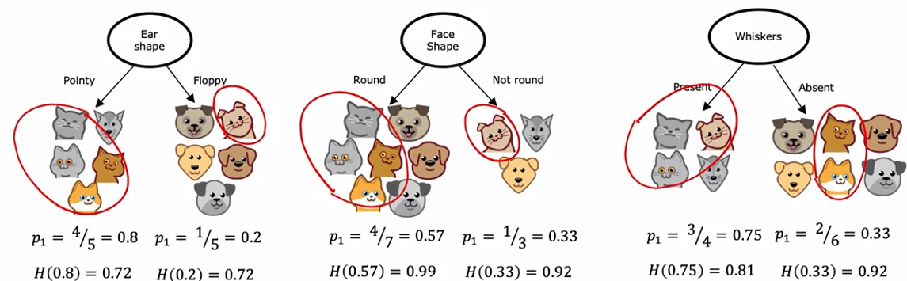
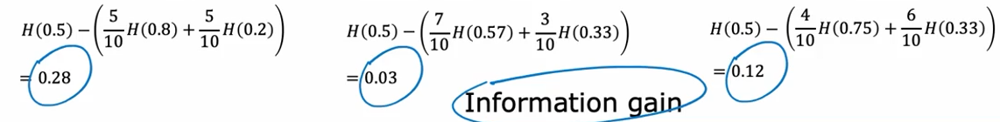
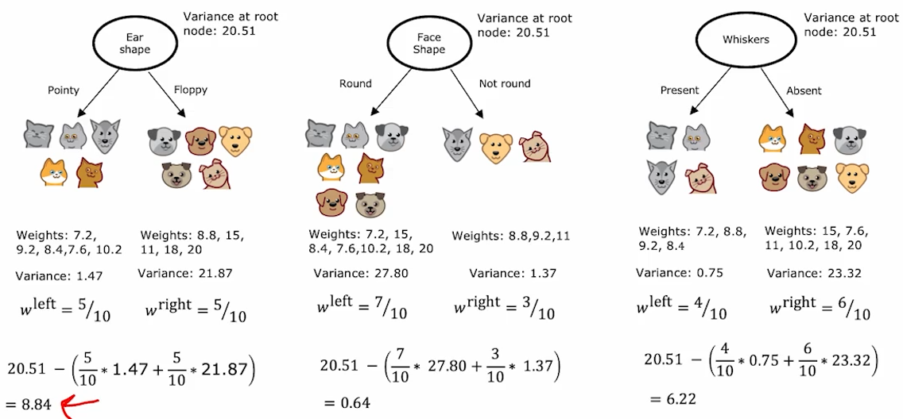

# Advanced Learning Algorithms - W4  
  
## Decision tree model  
https://www.coursera.org/learn/advanced-learning-algorithms/lecture/HFvPH/decision-tree-model  
  
-very popular in competitions and general product applications  
  
## Learning process  
https://www.coursera.org/learn/advanced-learning-algorithms/lecture/5ysdd/learning-process  
  
-learning tree gets constructed by choosing on which features the algorithm will split  
-after splitting for a chosen/sufficient amount of times, we can create leaf nodes, ie. decision nodes which declare "this is cat", "this is dog", etc...  
  
-1. how do we choose which features to split on?  
&nbsp;&nbsp;&nbsp;-our goal is to always maximize **purity** - purity refers to the degree to which splitting separates wanted from non-wanted categories, ie. whether the split enables us to have only wanted category  
  
-2. how/when do we stop splitting?  
&nbsp;&nbsp;&nbsp;-we stop splitting when a node is 100% one class (no impurities)  
&nbsp;&nbsp;&nbsp;-we stop splitting when splitting a node will result in the tree exceeding a predefined maximum depth  
&nbsp;&nbsp;&nbsp;-we stop splitting when improvements in purity score are below a threshold  
&nbsp;&nbsp;&nbsp;-we stop splitting when the number of examples in a node is below a threshold  
  
## Measuring purity  
https://www.coursera.org/learn/advanced-learning-algorithms/lecture/6jL2z/measuring-purity  
  
-entropy is used as a measure of impurity  
  
-$p_{1}$ denotes the fraction of examples that are cats  
-$p_{0}$ denotes the fraction of examples that are NOT cats ($p_{0} = 1 - p_{1}$)  
-remember good old Shannon : https://en.wikipedia.org/wiki/Entropy_(information_theory)  

-remember that entropy is basically an inverted parabola  
-x axis is where our $p_{1}$ values is located  
-y axis represents the entropy (impurity) for the given $p_{1}$ value  
  
-what is the worst scenario? Having an equal split of classes, ie. having half cats and half dogs - this yields greatest entropy, ie. greatest level of impurity  
  
  
Entropy : $H(p_{1}) = -p_{1}log_{2}(p_{1}) - p_{0}log_{2}(p_{0}) = -p_{1}log_{2}(p_{1}) - (1-p_{1})log_{2}(1-p_{1})$  
  
## Choosing a split : information gain  
https://www.coursera.org/learn/advanced-learning-algorithms/lecture/ZSbs2/choosing-a-split-information-gain  
  
-now we will learn how entropy gets used to choose how to split/on what to split  
  
<p style="text-align: center">
    
</p>  
  
-observe the screenshot attached above  
  
-there are three different features we can split on : **ear shape**, **face shape**, and **whiskers**  
-there are 10 subjects in total that we can test for these features, of which 5 are cats and 5 are dogs  
  
-occurence, ratio, fraction, or however you want to call it, of cats for each branch is represented with $p$ value  
-entropy for each $p$ is also visible in the screenshot above  
  
-how will we, using this information, choose which feature to split on?  
-we will use the **weighted averages** of entropy  
**WHY?**  
-because it matters how much examples went into each branch  
&nbsp;&nbsp;&nbsp;&nbsp;-a branch that has a high entropy (ie. high impurity) is worse than a branch with only few examples yet comparable entropy (impurity)  
&nbsp;&nbsp;&nbsp;&nbsp;-but why does this matter? Because it is far more important to have low entropy (impurity) in a branch that handles a lot of examples!  
  
&nbsp;&nbsp;&nbsp;&nbsp;-however, computing entropy using weighted averages is not the end  
&nbsp;&nbsp;&nbsp;&nbsp;-we will actually compute the difference between entropy at the root node and the weighted average entropy of the branches  
&nbsp;&nbsp;&nbsp;&nbsp;-note that entropy of root node in our case is 1 (highest possible) - why? Because of the 10 subjects we are examining, 5 are cats and 5 are dogs, therefore $p(rootNode) = \frac{5}{10} = 0.5$ (maximum impurity)  
  
&nbsp;&nbsp;&nbsp;&nbsp;-this difference between root node entropy and the weighted average entropy of branches is called **information gain**  
  
-information gain computation is shown below :  
<p style="text-align: center">
    
</p>

-given the information gain for splitting on ear shape (0.28), face shape (0.03) and whiskers (0.12), we would choose to split on ear shape since it provides the greatest information gain  
    
-**information gain** - measures reduction in entropy, ie. how much information we gained by choosing a specific feature to split on (for which this information gain computation was done)  
  
-information gain gets used as an improvement threshold - if splitting does not yield an information gain greater than some predefined threshold, we will stop splitting to avoid creating an overburdeneds/overly complex tree  
  
### Information gain - general notation/implementation  
  
-let us now write what the general implementation of information gain looks like (splitting on *ear shape* is used as an example)  
  
$p_{1}^{left}$ - number of examples in the left subtree that really are cats ($\frac{4}{5} = 0.8$)  
$w^{left}$ - fraction of examples, out of all of the examples at the root node, that went to the left subbranch ()$\frac{5}{10}$  
  
-same logic applies for the right subbranch  
$p_{1}^{right} = \frac{1}{5} = 0.2$  
$w^{right} = \frac{5}{10}$  
  
$p_{1}^{root}$ - fraction of examples that are positive (ie. examples that **ARE** cats) in the root node  
  
$informationGain = H(p_{1}^{root}) - (w^{left}H(p_{1}^{left}) + w^{right}H(p_{1}^{right}))$  
  
-what is $w^{left/right}$? It is basically the weighting factor, ie. how many of any examples (whether true class or false class) ended up in the observed subbranch  
  
## Putting it all together  
https://www.wikipedia.org/https://www.coursera.org/learn/advanced-learning-algorithms/lecture/ZSbs2/choosing-a-split-information-gain   
  
-start with all examples at the root node  
-compute information gain for all possible features, and pick the one with the highest information gain  
-split the dataset according to selected feature, thus creating left and right branches of the tree  
-keep repeating process explained in second and third hyphen above until stopping criteria is met :  
&nbsp;&nbsp;&nbsp;&nbsp;-a node is 100% one class  
&nbsp;&nbsp;&nbsp;&nbsp;-splitting a node will result in tree exceeding maximum depth  
&nbsp;&nbsp;&nbsp;&nbsp;-information gain from additiona splits is below a set threshold  
&nbsp;&nbsp;&nbsp;&nbsp;-number of examples in a node is below a threshold  
  
## One hot encoding - overcoming categorical feature dimensionality  
https://www.coursera.org/learn/advanced-learning-algorithms/lecture/RQVdw/using-one-hot-encoding-of-categorical-features  
  
-most often we will encounter a data set where features aren't necessarily only binary (e.g. has, or hasn't, graduated; obese or not obese, etc.)  
  
-in such scenarios, one hot encoding is used  

-**one hot encoding** - process of substituting one categorical feature, that can take on *k* values, by *k* binary features  
  
-what does this mean? If a given feature can assume 4 different categories/values (e.g. car can be red, blue, green or yellow), we will create 4 new variables : *red*, *blue*, *green* and *yellow*  
&nbsp;&nbsp;&nbsp;&nbsp;-each of these "new" variables can assume only binary values  
&nbsp;&nbsp;&nbsp;&nbsp;-since each car can have only one color, only one of these 4 new variables will be set to 1, while others will be 0  
  
-this is how we overcome having to deal with multicategorical features  
  
## Continuous value features  
https://www.coursera.org/learn/advanced-learning-algorithms/lecture/a4v1O/continuous-valued-features  
  
-often times we are dealing with features existing in the continuous realm, not just discrete  
  
-consider weight of a person - a dataset intended to analyze fitness patterns of some app's users is comprised of a number of features, one of them being weight of each user  
&nbsp;&nbsp;&nbsp;&nbsp;-weights vary greatly, and are noted using two decimal places  
&nbsp;&nbsp;&nbsp;&nbsp;-when creating a decision tree used to predict risk of cardiovascular diseases amongst the app's users, weight is an important contributing factor  
&nbsp;&nbsp;&nbsp;&nbsp;-splitting on weight is relatively simple :  
&nbsp;&nbsp;&nbsp;&nbsp;&nbsp;&nbsp;-you will compute the entropy for a lot of splitting points (ie. different weights where the splitting will occur) and determine which splitting point provides us the best entropy (in othe words, which splitting point provides greatest information gain)  
  
-remember the example professor Ng used - you can split on weight by computing the entropy and figuring out the best weight to split at is <=9lbs, because most cats are at, or below, this weight, providing greatest information gain  
  
## Regression trees  
https://www.coursera.org/learn/advanced-learning-algorithms/lecture/XlM5n/regression-trees-optional  
  
-decision trees can be used also to predict a value, not just categories  
  
-before we computed the information gain, ie. how much each split contributes to reduction in impurity in each branch, but since we are trying to construct a regression tree, meaning it is supposed to output a number instead of a category, we need to construct a tree capable of properly representing e.g. weight of a cat or a dog  
  
-**variance** will be used as a measure of the successfulness of splitting  
-for each root node we will also compute its inate variance, ie. the variance of all of the examples entering the node  
  
-if by splitting on a feature we get very high variance, we will assume this split is not good enough (when compared to other splits)  
  
-consider the example professor presented :  
<p style="text-align: center">
    
</p>

-for each branch we compute its variance (e.g. 1.47 for left branch of first split)  
-for each split, when compting variance reduction, we take into account how many examples entered each branch (5 out of 10 possible examples have entered both the left and the right branch for the first split)  
-then, from the root node variance (20.51 for all root nodes) we subtract the above described computation, yielding a value called **reduction in variance**  
  
-what is variance reduction?  
&nbsp;&nbsp;&nbsp;&nbsp;-**variance reduction** - reduction of the root node variance by splitting  
  
-in the example in the image above, splitting on *ear shape* gives us the greatest variance reduction : 8.84  
  
-how will the leafs (end nodes, the ones supposed to give a result) then decide which weight to output? They will simply average weights of all of the examples in that branch  
  
## Using multiple decision trees  
https://www.coursera.org/learn/advanced-learning-algorithms/lecture/3Epc2/using-multiple-decision-trees  
  
-a big disadvantage of using only one decision tree is its sensitivity to small changes in the input data  
  
-a simple solution for this problem is using multiple smaller decision trees  
-set of smaller, individual, trees able to operate on their own, is called **tree ensemble**  
  
-how do you use tree ensembles? You get each tree to "vote" on the outcome, ie. you aggregate results of all tree ensembles, and see which prediction has most votes (e.g. how many individual trees voted some animal is a dog, or a cat, or a raccoon?)  
  
## Sampling with replacement  
https://www.coursera.org/learn/advanced-learning-algorithms/lecture/zZ6pa/sampling-with-replacement  
  
-what is sampling with replacement?  
&nbsp;&nbsp;&nbsp;You have a set of values/features/conditions you are working on.  
&nbsp;&nbsp;&nbsp;Imagine there are four different coins in a pouch.  
&nbsp;&nbsp;&nbsp;You mix up the pouch, and draw one coin from the pouch.  
&nbsp;&nbsp;&nbsp;Note which coin you pulled from the pouch.  
&nbsp;&nbsp;&nbsp;Now return this same coin to the pouch, mix the pouch up, and draw as many times as necessary according to your task.  
&nbsp;&nbsp;&nbsp;*Do not forget : whichever coin you pull out for each iteration, you will always return that same coin to the pouch*.  
  
-but how does sampling with replacement apply to building tree ensembles?  
&nbsp;&nbsp;&nbsp;-we will use our original dataset to construct multiple training subsets  
  
## Random forest algorithm  
https://www.coursera.org/learn/advanced-learning-algorithms/lecture/7MtSD/random-forest-algorithm  
  
-a powerful tree decision algorithm  
  
-*m* - training set size (number of examples)  
-*B* - the number of times we do the sampling replacement (*B* can also be considered the number of times we create individual trees because we must do sampling replacement before each new tree is created)  
  
```
Given a training set of size m

For b = 1 to B:
    Use sampling with replacement to create a new training set of size m.
    Train a decision tree on the newly generated training set.
```  
  
-usually *B* is in range of dozens of trees (64 trees, 100+ trees, etc.)    
-then all of these trees would vote on the final prediction (as quickly explained in the previous chapter)  
  
-having larger rather than smaller *B* (number of trees we create) won't ever cause issues with the performance of the tree ensemble, but it will take longer to train so going beyond a certain reasonable point makes no sense  
  
-decision tree explained in this video/chapter is called **Bagged decision tree**  
 
-we can introduce a change to improve this algorithm, turning bagged decision tree into **random forest algorithm**  
&nbsp;&nbsp;&nbsp;-even though we are already doing sampling with replacement, no matter how much we mix up the initial training set we will often end with same root nodes for a lot of trees (this is true especially as the size of the training set reduces, and vice versa)  
  
&nbsp;&nbsp;&nbsp;-there is one modification we can do to further randomize the choice at each node, thus making trees more different :  
&nbsp;&nbsp;&nbsp;&nbsp;&nbsp;&nbsp;-at each node, when choosing a feature to use to split, if *n* features are available, pick a random subset of features (*k* < *n*) and allow the algorithm to only choose from that subset of features  
  
-why does this approach make sense? You are always looking at which feature will provide the greatest information gain if split is done on that feature - this, due to the inate characteristic data carries, will usually result in only a subset of features used for splitting because only these features provide best information gains. When you take a subset of features, and force the tree to split on one of the features from the subset, some trees will most likely be missing some, or all, of these best variables to split on, which is why such trees will choose to split on whichever next best variable for splitting is in the subset it was given. This increases robustness because the algorithm is forced to figure out the underlying patterns in the data using different variables which describe the subjects in a different way, but tell the same story.  
&nbsp;&nbsp;&nbsp;&nbsp;-example : a car is described using his weight, aerodynamic coefficient, horsepower and average 0-100kmh time. We want the tree to tell us if the car is suited for drag racing or not. We choose to pass only a subset of initial variables - subset has only weight and aerodynamic coefficent. Tree computes information gain, and determines it splitting on aerodynamic coefficient provides greates information gain in terms of determining whether a car is suited, or not suited, for drag racing.  
  
## XGBoost  
https://www.coursera.org/learn/advanced-learning-algorithms/lecture/op26P/xgboost  
  
-one of the most often used decision tree ensemble implementations  
  
-e**X**treme **G**radient **B**oost  
  
-boosted trees have a relatively similar procedure to the one explained above for Random forest, but they differ in one important detail  
  
```
Given a training set of size m

For b = 1 to B:
    Use sampling with replacement to create a new training set of size m.

        Instead of picking from all examples in the initial training set with equa probability (1/m), make it more likely to pick misclassified examples from the previously trained trees.

    Train a decision tree on the newly generated training set.
```  

-what does this mean? This means boosted trees focus on examples that the previously generated tree didn't manage to classify correctly  
-it will pick these examples, with a higher probability than other examples, for the next tree creation  
  
## When to use decision trees?  
https://www.coursera.org/learn/advanced-learning-algorithms/lecture/vh1V7/when-to-use-decision-trees  
  
-when to use decision trees?  
&nbsp;&nbsp;&nbsp;&nbsp;-they work well on tabular data  
&nbsp;&nbsp;&nbsp;&nbsp;-aren't recommended for unstructured data (images, audio, text)  
&nbsp;&nbsp;&nbsp;&nbsp;-they are pretty fast, so iterative development is much quicker  
&nbsp;&nbsp;&nbsp;&nbsp;-small decision trees may be human interpretable, big trees not so much  

-when to use NN?  
&nbsp;&nbsp;&nbsp;&nbsp;-NNs work well on all types of data, including also tabular  
&nbsp;&nbsp;&nbsp;&nbsp;-they may be slower than trees  
&nbsp;&nbsp;&nbsp;&nbsp;-works with transfer learning, cutting down on training time  
&nbsp;&nbsp;&nbsp;&nbsp;-it might be easier to string together multiple NN to make them work together