# CNN - W1 notes  
## Computer vision
https://www.youtube.com/watch?v=ArPaAX_PhIs&list=PLkDaE6sCZn6Gl29AoE31iwdVwSG-KnDzF  
  
## Edge detection examples (Convolution operation)  
https://www.youtube.com/watch?v=XuD4C8vJzEQ&list=PLkDaE6sCZn6Gl29AoE31iwdVwSG-KnDzF&index=2  
  
Convolution, a mathematical operation, will be demonstrated using a simple `vertical edge detection` use case.  
Imagine you have a 6x6x1 grayscale image (6 rows, 6 columns, 1 color channel) and a 3x3 `convolution filter` (*kernel*): 
<p style="text-align: center">
    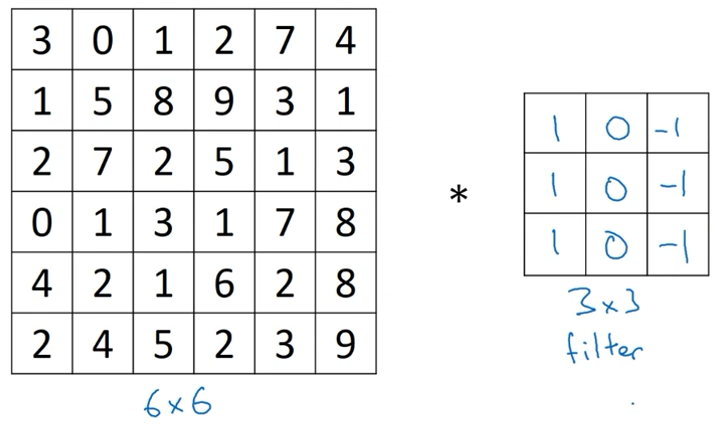
</p>  
  
The `convolution operation` is denoted by the asterisk between the image and the kernel.  
Output of the convolution operation is a 4x4 matrix, ie. 4x4 image. We will call this **end image (EI)**.
  
To compute the first, upper left, element of the **end image** we will "glue" the convolution filter (3x3 matrix) on top of the  
upper left 3x3 section of the original image.  
Element-wise multiplication is done using elements from the original image and the elements of the kernel, in the end adding up results  
of all of the element-wise multiplications :  
<p style="text-align: center">
    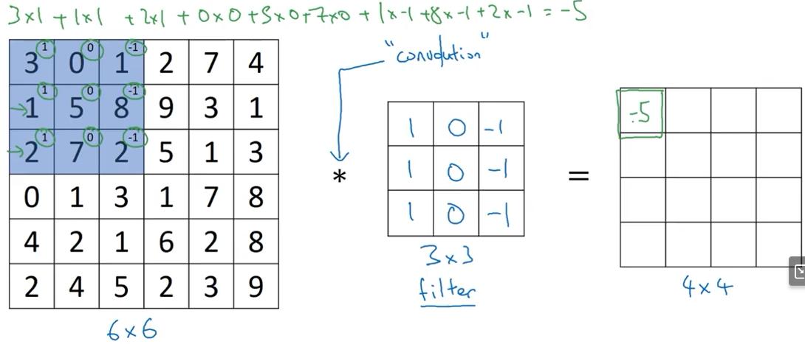
</p>  
  
<br></br>
To compute the second element in the top row of **EI** we will shift the convolution matrix one column to the right :  
<p style="text-align: center">
    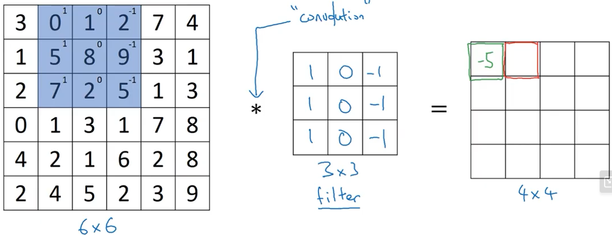
</p>  
Here is how the computation is done :  
  
$0 \cdot 1 + 5 \cdot 1 + 7 \cdot 1 + 1 \cdot 0 + 8 \cdot 0 + 2 \cdot 0 + 2 \cdot (-1) + 9 \cdot (-1) + 5 \cdot (-1) = 5 + 7 - 2 - 9 - 5 = 12 - 2 - 9 - 5 = -4$  
  
<br></br>  

Once convolution is executed on each subsection of the original matrix we get the final result for **EI** :  
<p style="text-align: center">
    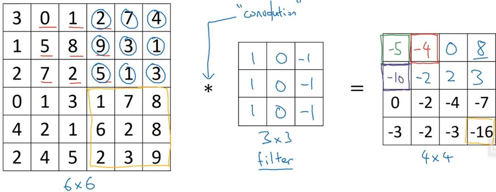
</p>  
  
Here we have demonstrated the usage of convolution for vertical edge detection.  
**Why is this vertical edge detection? What about this makes it detect vertical edges?**  
Consider the below example, where the left half of the picture is bright, while the right half of the image is dark.  
<p style="text-align: center">
    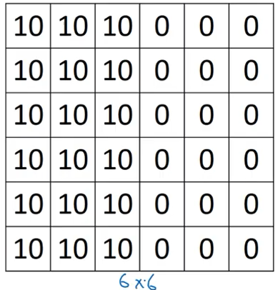
</p>  
This image has a very pronounced, vertical, edge right down the middle of the image.  
  
Convolving this image with the previously shown convolution filter we will get the following result :  
<p style="text-align: center">
    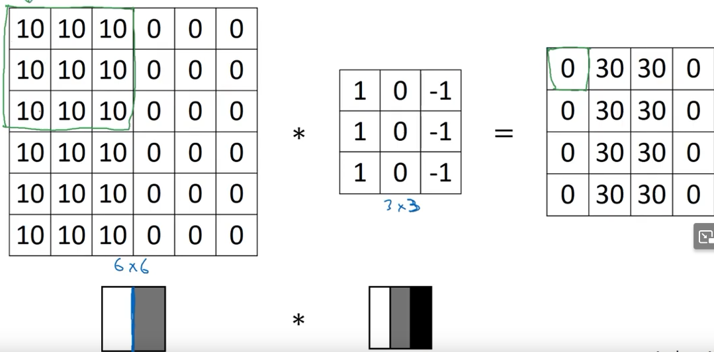
</p>  
Do note you shouldn't be put off by the thickness of the detected edge shown in the final matrix.  
This is a byproduct of using "pictures" with very small dimensions.  
  
```
A vertical edge can be interpreted as a 3x3 matrix (because we are using a 3x3 convolution matrix) with bright pixels on the left (first column), unimportant pixels in the middle, and dark pixels on the right (third column).
```
This nicely demonstrates how shape and amplitudes of a convolution matrix play a vital role in detecting objects.  
<br></br>  
  
## More edge detection  
www.youtube.com/watch?v=XuD4C8vJzEQ&list=PLkDaE6sCZn6Gl29AoE31iwdVwSG-KnDzF&index=3  
  
Here we will dive a bit into difference between positive and negative edges - light to dark vs dark to light transitions  
  
Imagine if we reversed the example image shown at the end of previous lesson :  
<p style="text-align: center">
    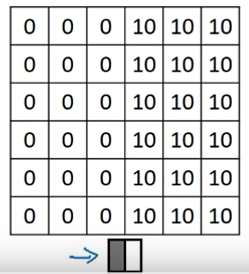
</p>  
This image has the dark section on the left half, and the light section on the right half.  
  
Applying previously used convolution matrix will give a resulting image with negative value amplitudes indicating a dark to light transition :  
<p style="text-align: center">
    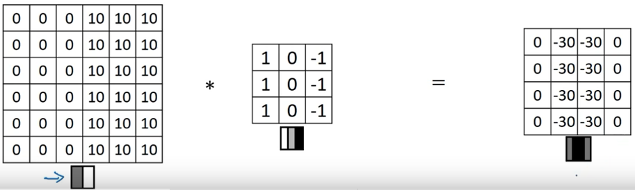
</p>  
  
Note that the shown vertical edge detection matrix configuration isn't a *one and done* - there are other implementations with different amplitudes, such as *Sobel filter* which gives a bit more weight to the central pixels, making it perhaps a bit more robust :  
<p style="text-align: center">
    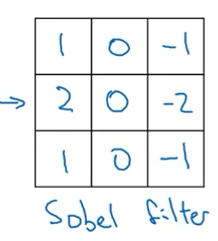
</p>  
  
Another example is the *Scharr filter* :  
<p style="text-align: center">
    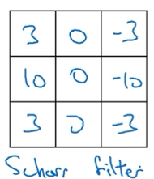
</p>  
  
<br></br>  
  
However... instead of having humans manually entering filter amplitudes by experimenting, we can let the network learn these parameters itself using backpropagation, so that once they are learned using the dataset they give the best possible edge detection.  
  
## Padding  
https://www.youtube.com/watch?v=smHa2442Ah4&list=PLkDaE6sCZn6Gl29AoE31iwdVwSG-KnDzF&index=5  
  
**Padding** is an important addition to the previously demonstrated convolution operation.  
  
During the previuos two lessons you wondered why did the output image have a 4x4 dim?  
Dimensions of output image are a consequence of dimensions of the input image and the dimensions of the convolution kernel.  
  
If `n x n` are the dimensions of our input image, and `f x f` are the dimensions of the used convolution filter, dimensions of output can be computed using :  
$(n-f+1) \times (n-f+1)$  
  
This kind of convolution has two big downsides :  
&nbsp;&nbsp;&nbsp;-because the conv.matrix is always smaller than the input image it ultimately leads to **shrinkage** - output of convolution is always smaller than the input image  
  
&nbsp;&nbsp;&nbsp;-pixels on the edges are used a lot less than the ones closer to the center - pixels sitting at top left, top right, bottom left and bottom right are utilized only for one convolution operation, while the ones sitting in the middle are found in multiple convolution operations  
&nbsp;&nbsp;&nbsp;&nbsp;&nbsp;-this ultimately leads to possible loss of vital information in the less used pixels  
  
How do we fix this?  
**We will add padding to the input image**  
By convention padding is always **0**.  
  
There are two "types" of convolution :  
&nbsp;&nbsp;&nbsp;&nbsp;-valid convolutions  
&nbsp;&nbsp;&nbsp;&nbsp;-same convolutions  
  
-**Valid** convolution - no padding is used  
-**Same** convolution - pad so that output image is the same as input image size  
&nbsp;&nbsp;&nbsp;&nbsp; $n+2p-f+1 = n$  
&nbsp;&nbsp;&nbsp;&nbsp;-rearranging the above term gives us : $p = \frac{f-1}{2}$  
  
## Strided convolution  
https://www.youtube.com/watch?v=tQYZaDn_kSg&list=PLkDaE6sCZn6Gl29AoE31iwdVwSG-KnDzF&index=6  
  
Strided convolution - moving the convolution filter by more than one column at a time  
  
Imagine we have a 7x7 input image, and a 3x3 convolution filter as shown below :  
<p style="text-align: center">
    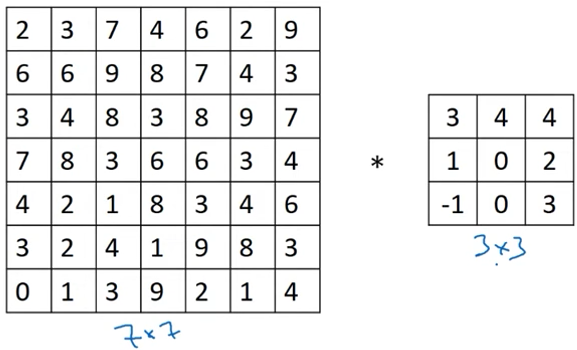
</p>  
  
We have applied convolution filter to the start of the image :  
<p style="text-align: center">
    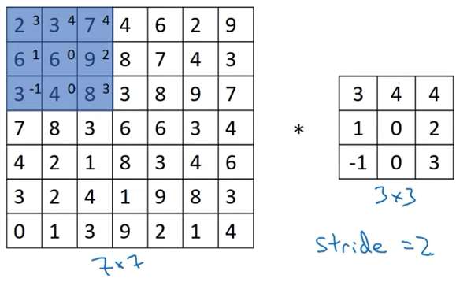
</p>  
  
Because we have defined *stride=2*, instead of shifting the convolution layer to the right by one column, we will shift it by 2 columns :  
<p style="text-align: center">
    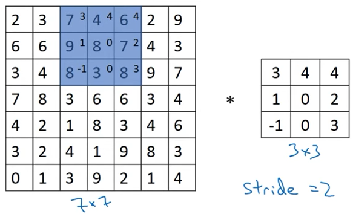
</p>  
  
The same holds true when jumping rows - we will jump by 2 rows, not 1 :  
<p style="text-align: center">
    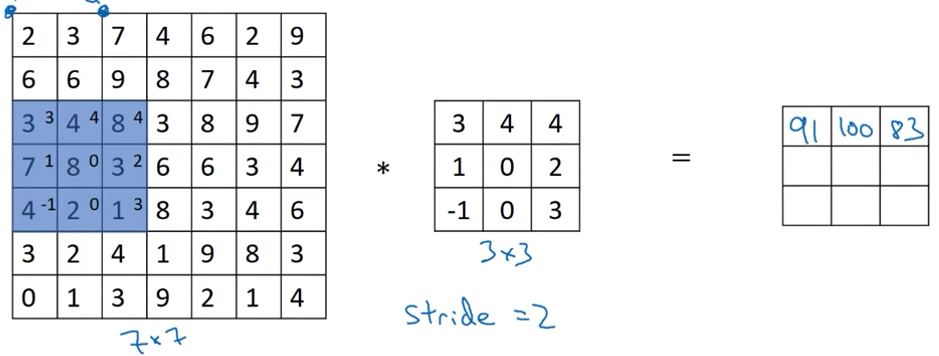
</p>  
This of course means that the resulting output image will be smaller because the convolution layer does not need the same number of steps to finish navigating the whole input image.  
  
Expression used to compute output image dimension :  
$(\frac{n+2p-f}{s}+1) \times (\frac{n+2p-f}{s}+1)$  
  
If the fraction above is **NOT** an integer, we will *round down*.  
  
By convention, ML projects usually do not bother with mirroring the convolution matrix along both its x and y axis - this is something that would have to be done if we were to fully align ourselves with the mathematical definition of convolution.  
What is called *convolution* in ML would actually be called *cross-corelation* by the mathematicians.  
  
## Convolutions over volumes  
https://www.youtube.com/watch?v=KTB_OFoAQcc&list=PLkDaE6sCZn6Gl29AoE31iwdVwSG-KnDzF&index=7  
  
