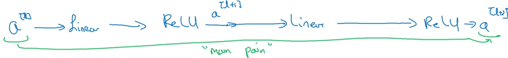
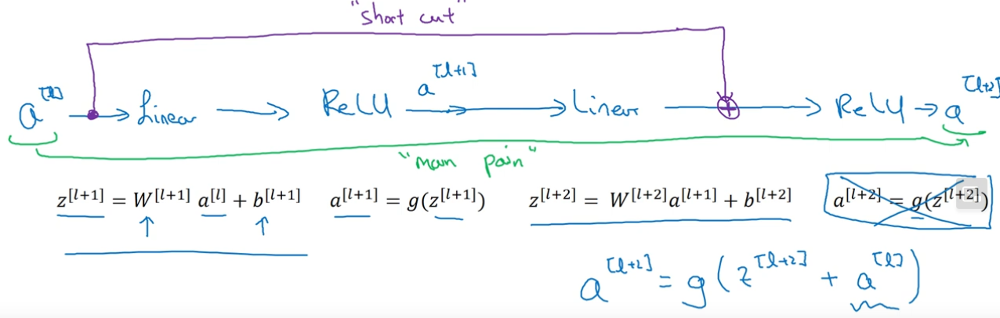

# W2  
## Classic networks  
https://www.youtube.com/watch?v=dZVkygnKh1M&list=PLkDaE6sCZn6Gl29AoE31iwdVwSG-KnDzF&index=13  
  
-professor here does a nice job of provoding an overview that is through enough, yet not too in depth  
-LeNet 5, AlexNet, VGG-16  
  
## Resnets  
https://www.youtube.com/watch?v=ZILIbUvp5lk&list=PLkDaE6sCZn6Gl29AoE31iwdVwSG-KnDzF&index=14  
  
Very deep networks are sometimes difficult to train because of vanishing and exploding gradients.  
Skip connections allow us to take activation from one layer and jump to some very deep layer, skipping all layers in between.  
  
Resnets - Residual networks  
  
-resnets are built ouf of *residual blocks*  
  
-consider a conventional network - in order to reach layer *l+1* you need to apply some linear operation to activation from layer *l* ($a^{[l]}$), and then apply ReLU nonlinearity, giving us $a^{[l+1]}$  
&nbsp;&nbsp;&nbsp;-now we again linear operation to $a^{[l+1]}$ and then ReLU nonlinearity, finally giving us $a^{[l+2]}$  
&nbsp;&nbsp;&nbsp;-this path is called the **main path** :  

    

  
  
-instead of traversing the main path we introduce a **short path** that jumps straight from $a^{[l]}$ to point before last ReLU call is made :  

    

  
  
-the idea of resnets is that we want to keep the network, while it is learning, aware of the original input signal  
&nbsp;&nbsp;&nbsp;-keep in mind that the input signal is very quickly driven to unrecognizability due to the applied activation functions  
  
## Why Resnets work  
https://www.youtube.com/watch?v=RYth6EbBUqM&list=PLkDaE6sCZn6Gl29AoE31iwdVwSG-KnDzF&index=15  
  
-prof.Ng used an "extreme" example, showcasing how intense regularization will squash weight values of the observed layer, leaving only the value of some previous layer passed through the skip line  
  
-this extreme example explains how previous values help the network train better irregardless of its depth  
  
-however, keep in mind this is an extreme example - you shouldn't regularize that far, but it shows that when using residual blocks (ie. passing "older" values via skip connection) helps to avoid depth hurting the model because the network will, at worst, learn the identity function  
  
-**NOTE** : adding a previous layer output to some later layer output assumes they have identical dimensions  
&nbsp;&nbsp;&nbsp;&nbsp;-this is true if same convolution dimensions are used for both layers  
&nbsp;&nbsp;&nbsp;&nbsp;-if different convolution dimensions are used we have to do some padding/reconfiguration parkour - an additional matrix, $W_{s}$, is added so that it multiplies the matrix passed via skip connection :  
&nbsp;&nbsp;&nbsp;&nbsp;&nbsp;&nbsp;&nbsp;&nbsp;- $W_{s}$ is 256x128 and multiplies $a^{[l]}$  
  
## Network in network (and 1x1 convolutions)  
https://www.youtube.com/watch?v=c1RBQzKsDCk&list=PLkDaE6sCZn6Gl29AoE31iwdVwSG-KnDzF&index=16  
  
-do not overthink this  
-the main idea of 1x1 convolution filters is combining filters  
-imagine a CNN uses several filters : one to detect vertical edges, one to detect horizontal edges, one to detect circle arcs, etc. - we use 1x1 convolution to combine outputs of all of these filters into a matrix that has less channels (*depth*) than the original CNN output  
  
-this has a number of benefits :  
&nbsp;&nbsp;&nbsp;-dimensionality reduction (number of channels is reduced)  
&nbsp;&nbsp;&nbsp;-this channel blending allows for cross-channel interaction (this makes sense becuase even though you can detect features independently, they have some kind of in-scene interaction)  
&nbsp;&nbsp;&nbsp;-non-linearity - mixing *n* channels via a 1x1 convolution matrix is comparable to pushing all of the *n* values through a single neuron that then applies a non-linear function such as ReLU (without ReLU this would be a simple linear operation - ReLU zeros out all negative values, therefore leading to feature selection and learning)  
  
-this idea is also called **network in network**  
  

