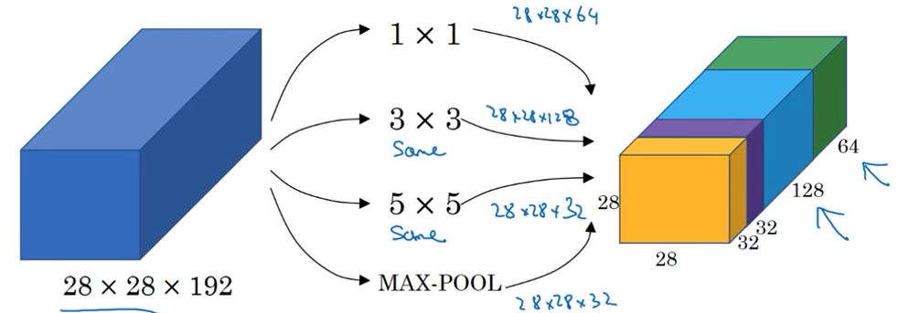
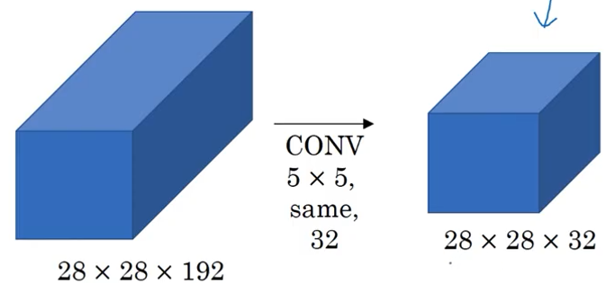
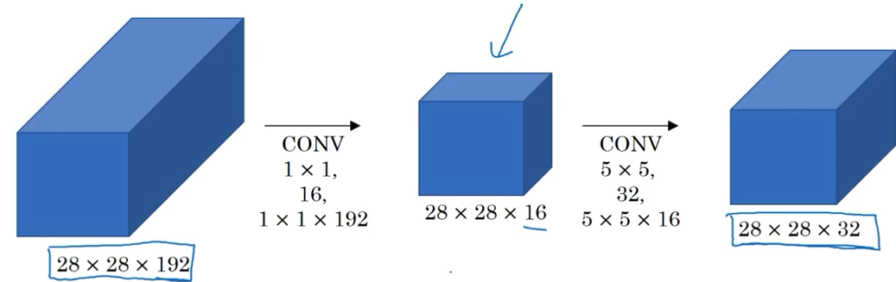
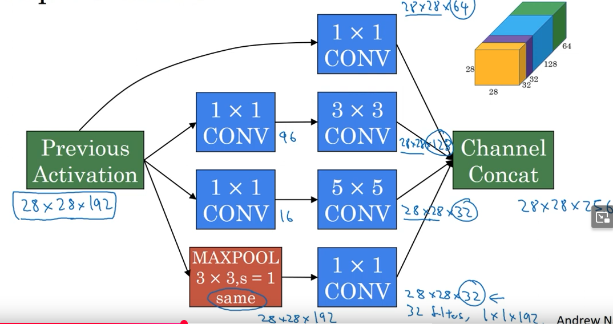
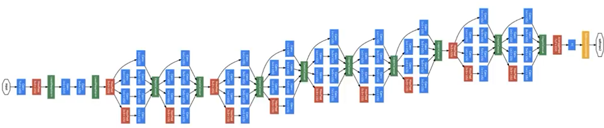
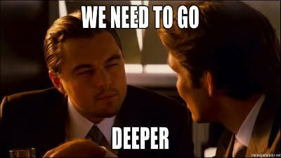

# W2  
## Classic networks  
https://www.youtube.com/watch?v=dZVkygnKh1M&list=PLkDaE6sCZn6Gl29AoE31iwdVwSG-KnDzF&index=13  
  
-professor here does a nice job of provoding an overview that is through enough, yet not too in depth  
-LeNet 5, AlexNet, VGG-16  
  
## Resnets  
https://www.youtube.com/watch?v=ZILIbUvp5lk&list=PLkDaE6sCZn6Gl29AoE31iwdVwSG-KnDzF&index=14  
  
Very deep networks are sometimes difficult to train because of vanishing and exploding gradients.  
Skip connections allow us to take activation from one layer and jump to some very deep layer, skipping all layers in between.  
  
Resnets - Residual networks  
  
-resnets are built ouf of *residual blocks*  
  
-consider a conventional network - in order to reach layer *l+1* you need to apply some linear operation to activation from layer *l* ($a^{[l]}$), and then apply ReLU nonlinearity, giving us $a^{[l+1]}$  
&nbsp;&nbsp;&nbsp;-now we again linear operation to $a^{[l+1]}$ and then ReLU nonlinearity, finally giving us $a^{[l+2]}$  
&nbsp;&nbsp;&nbsp;-this path is called the **main path** :  

    

  
  
-instead of traversing the main path we introduce a **short path** that jumps straight from $a^{[l]}$ to point before last ReLU call is made :  

    

  
  
-the idea of resnets is that we want to keep the network, while it is learning, aware of the original input signal  
&nbsp;&nbsp;&nbsp;-keep in mind that the input signal is very quickly driven to unrecognizability due to the applied activation functions  
  
## Why Resnets work  
https://www.youtube.com/watch?v=RYth6EbBUqM&list=PLkDaE6sCZn6Gl29AoE31iwdVwSG-KnDzF&index=15  
  
-prof.Ng used an "extreme" example, showcasing how intense regularization will squash weight values of the observed layer, leaving only the value of some previous layer passed through the skip line  
  
-this extreme example explains how previous values help the network train better irregardless of its depth  
  
-however, keep in mind this is an extreme example - you shouldn't regularize that far, but it shows that when using residual blocks (ie. passing "older" values via skip connection) helps to avoid depth hurting the model because the network will, at worst, learn the identity function  
  
-**NOTE** : adding a previous layer output to some later layer output assumes they have identical dimensions  
&nbsp;&nbsp;&nbsp;&nbsp;-this is true if same convolution dimensions are used for both layers  
&nbsp;&nbsp;&nbsp;&nbsp;-if different convolution dimensions are used we have to do some padding/reconfiguration parkour - an additional matrix, $W_{s}$, is added so that it multiplies the matrix passed via skip connection :  
&nbsp;&nbsp;&nbsp;&nbsp;&nbsp;&nbsp;&nbsp;&nbsp;- $W_{s}$ is 256x128 and multiplies $a^{[l]}$  
  
## Network in network (and 1x1 convolutions)  
https://www.youtube.com/watch?v=c1RBQzKsDCk&list=PLkDaE6sCZn6Gl29AoE31iwdVwSG-KnDzF&index=16  
  
-do not overthink this  
-the main idea of 1x1 convolution filters is combining filters  
-imagine a CNN uses several filters : one to detect vertical edges, one to detect horizontal edges, one to detect circle arcs, etc. - we use 1x1 convolution to combine outputs of all of these filters into a matrix that has less channels (*depth*) than the original CNN output  
  
-this has a number of benefits :  
&nbsp;&nbsp;&nbsp;-dimensionality reduction (number of channels is reduced)  
&nbsp;&nbsp;&nbsp;-this channel blending allows for cross-channel interaction (this makes sense becuase even though you can detect features independently, they have some kind of in-scene interaction)  
&nbsp;&nbsp;&nbsp;-non-linearity - mixing *n* channels via a 1x1 convolution matrix is comparable to pushing all of the *n* values through a single neuron that then applies a non-linear function such as ReLU (without ReLU this would be a simple linear operation - ReLU zeros out all negative values, therefore leading to feature selection and learning)  
  
-this idea is also called **network in network**  
  
## Inception Network Motivation  
https://www.youtube.com/watch?v=C86ZXvgpejM&list=PLkDaE6sCZn6Gl29AoE31iwdVwSG-KnDzF&index=17  
  
-choosing which layer types will be used, and where they will be placed, is one of several decisions during CNN design  
  
-inception networks allow us to use everything at once at the expense of a more complex network  
  
-imagine a scenario where we want to test out several different convoluton filters, as well as a max-pooling layer :  

    

  
(green matrix is output of 1x1 filter, blue is 3x3's output, 5x5 is represented by violet, and max_pooling layer is the yellow/orange one)  
  
-note that max_pooling layer might seem odd a bit because here it does not reduce dimensionality, which is what is usually used for (it will become clear later)  
  
-all of the colored blocks are exactly the points of inception networks  
&nbsp;&nbsp;&nbsp;&nbsp;-instead of picking what filter sizes and pooling we want, do them all and get one big output (28x28x256 colored matrix) made up of several independent filter outputs, letting the network learn whatever parameters it needs for whatever combination is determined most appropriate  
  
-paragraph above sounds wonderful, too good to be true, right? Well, that's because it is too good to be true  
  
### The problem of computational cost  
-here we will focus on the 5x5 filter example  

    

  
  
Summary :  
&nbsp;&nbsp;-input is a 28x28x192 image  
&nbsp;&nbsp;-we are applying 32 filters, each 5x5, with same padding (*same padding* = output has same HxW dimensions)  
&nbsp;&nbsp;-becuse we are using 32 filters output will have 32 dimensions  
&nbsp;&nbsp;-because we are using *same* padding, output has same HxW dimensions  
  
&nbsp;&nbsp;-each filter is 5x5x192 - 5x5 because that is the filter's chosen size, 192 because it must match channel number of the input  
&nbsp;&nbsp;-in total, 28x28x32 values will be computed; for each individual values we must do 5x5x192 computations  :  
&nbsp;&nbsp;&nbsp;&nbsp;&nbsp;28x28x32 x 5x5x192 ~= 120000000  
  
Quite expensive, right?  
  
### Reducing computational cost  
-we will use a 1x1 convolution to reduce number of channels  
-then on the output with reduced number of channels we will apply our real filters  
  
-the 1x1 convolutions are used to achieve cross-channel interaction, ie. behaviour and pattern intertwining of the existing channels  
-then we apply our 5x5x32 filters  
-this method relies on the fact that probably not all channels are carrying vital information, and that creating a new matrix with signifitanly less channels, that are created by cross-channel correlation, we will still be able to capture the innate pattern of data  
  

    

  
  
-the 1x1 convolution matrix is often times called **bottleneck layer**  
-to apply the 1x1 convolution you need 28x28x16 (the desired output) x 1x1x192 (filter dimensions and number of channels) ~=2.4million  
-to apply 5x5 filters to the result of 1x1 convolution we need 28x28x32 (desired number of output values) x 5x5x16 (filter dimensions) ~=10million  
  
## Inception network (full implementation)  
https://www.youtube.com/watch?v=KfV8CJh7hE0&list=PLkDaE6sCZn6Gl29AoE31iwdVwSG-KnDzF&index=18  
  
-for all normal filters we will apply the 1x1 convolution, and then the filters  
-for pooling we will first do the pooling using same padding (ie. input dimensions are preserved in the output), and then we will apply the 1x1 convolution (e.g. if after max pool layer we have 28x28x192 matrix, and want a 28x28x32 matrix after applying 1x1 convolution, our 1x1 convolution needs to use 32 1x1 matrices, each 192 channels deep)  
-once all filters are computed we will simply concatenate the filter outputs, ie. glue all output matrices together into one matrix  
  
-screenshot from lecture showing inception module :  

    

  
  
-here is an inception network (made up of several inception modules) :  

    

  
  
-some inception modules have what's called a **side branch**  
&nbsp;&nbsp;&nbsp;-a side branch takes some hidden layer and tries to use that layer to make a prediction (has FC layers and a softmax layer to predict output label)  
&nbsp;&nbsp;&nbsp;-it helps ensure that features computed even in hidden units buried deep in network give a reasonably good prediction

I have found my people - the memers.  
They have been among us since ages long forgotten, sometimes hiding, sometimes openly memeing.  
They are... ML researchers :D  
The "Going Deeper with Convolutions" paper cites this meme :  

    

  
  
