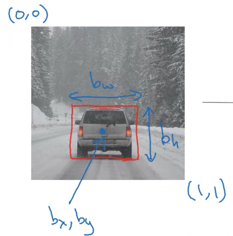
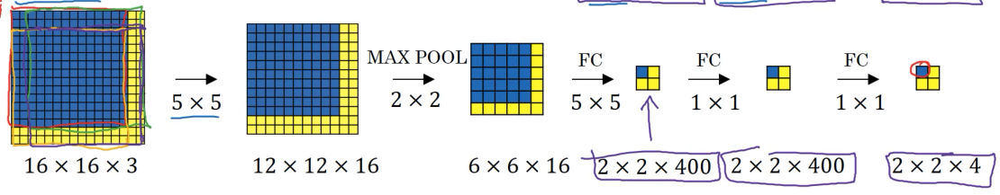

# W3  
## Object localization  
https://www.youtube.com/watch?v=GSwYGkTfOKk&list=PLkDaE6sCZn6Gl29AoE31iwdVwSG-KnDzF&index=23  
  
-classification with localization is usually limited to inputs with only one releavant object in the image  
  
-*detection* usually refers to an input image with multiple objects, whether same or different category, that need to be accurately localized  
  
-a standard classification network does what've previously demonstrated - an image is fed to the network, which then detects whatever it was trained to detect : cars, pedestrians, trucks, bicycles, etc.  
-output of such network is then fed to a softmax layer whose number of outputs (neurons) matches the number of categories we are trying to predict  
  
-if we want to do localization, ie. plot a bounding box around each category detected in an image, we need a few more neurons besides the ones in our softmax layer  
-4 additional outputed layer parametrize the bounding box of the detected object : $b_{x}, b_{y}, b_{H}, b_{W}$  
-upper left corner pixel of the image is marked as $(0,0)$ coordinate, and the lower right corner pixel is marked as $(1,1)$ coordinate  
-coordinates $b_{x}, b_{y}$ represent center point of the detected object, while $b_{W}$ and $b_{H}$ represent width and height of bounding box around the detected object :  

    

  
  
-since we are usually trying to detect multiple different classes of objects in a single scene, output vector *y* needs to be adjusted a bit to output all of the necessary data  
-output vector *y* will output :  
&nbsp;&nbsp;&nbsp;- $p_{c}$ - a bool flag indicating whether objects of interest are present (e.g. cars, pedestrians, trucks, ...), or whether the scene is empty an only has a background  
&nbsp;&nbsp;&nbsp;- $b_{x}, b_{y}, b_{H}, b_{W}$ - bounding box coordinates of the detected object  
&nbsp;&nbsp;&nbsp;- $C_{1}, C_{2}, C_{3}$ - indicates which class of objects has been detected ($C_{1}$ could in our example represent cars, $C_{2}$ would represent pedestrians, and $C_{3}$ would represent trucks)  
-putting it all together :  
$y = [p_{c}, b_{x}, b_{y}, b_{H}, b_{W}, C_{1}, C_{2}, C_{3}]$ (note that professor wrote *y* vector as a column vector, but I am too lazy to look up how I can do this in .md files)  
  
-computing loss, ie. the error, of our model simply means looking up the element-wise squared error because all ground truth output vectors will be defined in same manner as the prediction (y-hat) output vectors  
-if $p_{c} = 1$ (==1 means one of the known labels was found) :  
&nbsp;&nbsp;&nbsp; $(y^{hat}_{1} - y^{groundTruth}_{1})^{2} + (y^{hat}_{2} - y^{groundTruth}_{2})^{2} + ... + (y^{hat}_{8} - y^{groundTruth}_{8})^{2}$  
-if $p_{c} = 0$ (==0 means none of the wanted labels were found) :  
&nbsp;&nbsp;&nbsp; $(y^{hat}_{1} - y^{groundTruth}_{1})^{2}$ - this is because for scenario $p_{c} = 0$ other values aren't important  
-each $y_{i}$ value represents $i-th$ value for vectory *y* representing some dataset example - $y_{1}$ refers to $p_{c}$ value, $y_{2}$ refers to $b_{x}$ value, etc.  
  
-above defined output vector *y* assumes only one object is present in image  
  
## Convolutional implementation of sliding windows  
https://www.youtube.com/watch?v=XdsmlBGOK-k&list=PLkDaE6sCZn6Gl29AoE31iwdVwSG-KnDzF&index=26  
  
-this screenshot shows the gist of convolution vs sliding windows :  

    

  
  
-sliding windows use the approach shown on the left-most square - the filter kernel is applied on chunks of the input image until all possible positions are exhausted  
  
-such approach is computationally very expensive because all possible sliding window positions share almost all of the values that will be used to compute filter values  
  
-convolution avoids this, and instead applies our filters at once using the whole area of the image, turning the image and the filters into 1D col vectors  
  
-by applying the 5x5x16 filters we get the 12x12x16 image  
  
-then a 2x2x16 max pool layer is applied, further shrinking the image to 6x6x16  
  
-now we apply a 16 5x5x400 filters in our FC layer, getting a 2x2x400 output  
-another FC layer, this time using 400 1x1x400 filters, yielding again a 2x2x400 output  
  
-finally, last FC shinks the output to 2x2x4 using 400 1x1x4 filters  
  
-through all of this shrinkage relations between subsections of the image are kept, meaning that the upper left square represents upper left position of the sliding window on the original image, upper right square represents the upper right position of the sliding window on the original image, etc.  
  
## Intersection over Union  
https://www.youtube.com/watch?v=ANIzQ5G-XPE&list=PLkDaE6sCZn6Gl29AoE31iwdVwSG-KnDzF&index=27  
  
-everything laid out in the previous video won't always result in a bounding box position that is 100% on the mark  
  
-IoU - Intersection over Union computation solves this issue  
  
-it looks at the true coordinates of the bounding box and the predicted coordinates of the bounding box  
  
-these two boxes should have some amount of overlap (intersection), and some amount of non-overlapping areas  
  
-intersection is the area where both bounding boxes cross, intersect  
-union represents the total area these two boxes occupy  
  
-IoU computation will compute $\frac{sizeOfIntersection}{sizeOfUnion}$  
  
-if this computation is greater than some user defined parameter (e.g. => 0.5), we determine the predicted bounding box is correct  
  
## Nonmax suppression  
www.youtube.com/watch?v=ANIzQ5G-XPE&list=PLkDaE6sCZn6Gl29AoE31iwdVwSG-KnDzF&index=28   
  

