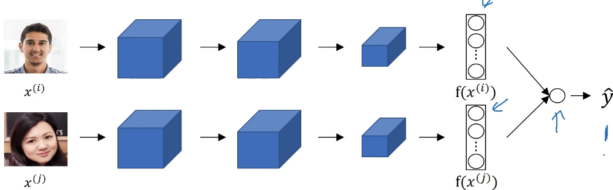
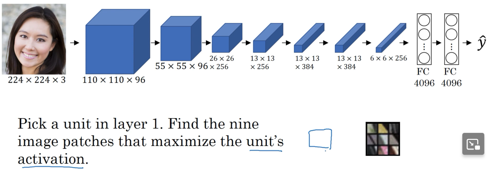
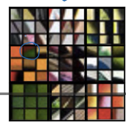

# W4  
## What is face recognition?  
https://www.youtube.com/watch?v=-FfMVnwXrZ0&list=PLkDaE6sCZn6Gl29AoE31iwdVwSG-KnDzF&index=32  
-verification - you input an image and a name/ID  
&nbsp;&nbsp;&nbsp;-the system should output whether the inputted image matches that of the name/ID  
  
-recognition - you input an image  
&nbsp;&nbsp;&nbsp;-the system has a database of K persons  
&nbsp;&nbsp;&nbsp;-output ID if the image belongs to any of the K persons in the database  
  
-recognition is harder because its accuracy must be very high  
  
## One-shot learning  
https://www.youtube.com/watch?v=96b_weTZb2w&list=PLkDaE6sCZn6Gl29AoE31iwdVwSG-KnDzF&index=33  
  
-for most face recognition applications you need to be able to recognize a person using one image/one example  
  
-a system has only one picture of each person in its database and needs to be able to let that person through  
  
-instead of training a DNN using only one example per person, and getting a NN that performs veeeeery poorly, we will learn a **similarity** function  
  
-a similarity function, d(img1, img2), compares two images, img1 being the input from a camera on the enterance, and img2 being image stored in database  
-for each pair of images similarity function will output the degree of difference between these two images  
-if the difference is **less** than some value ($\tau$), we can conclude the images match (ie. same person is in both images)  
-if the difference is greater than some value ($\tau$), we can conclude the images don't match (ie. they show different people)  
  
## Siamese network  
https://www.youtube.com/watch?v=6jfw8MuKwpI&list=PLkDaE6sCZn6Gl29AoE31iwdVwSG-KnDzF&index=34  
  
-imagine you have an ordinary network, except you ignore the usually used softmax output layer that is used to determine  
  
-remember : every network we've so far demonstrated/implemented usually ends up with softmax layer (or a linear layer if regression problem) used to determine which output label is most appropriate for our input  
&nbsp;&nbsp;&nbsp;-in order to make facial recognition work well we will use *Siamese networks* - two identical networks but without the final, "decision", layer made up of softmax/linear neurons  
  
-but why do we do that? Without the final layer we will get the raw NN output, the *feature vector* describing the inputted image  
  
-using siamese networks, we can input the image from database in one network, and the image from the entrance camera into the other network, thus getting two feture vectors  
-then we can compare these feature vectors to determine how similar they are  
  
-for each inputted image $x^{i}$ the network will output encoding for that image, ie. a vector representing that image, $f(x^{i})$  
  
-parameters of this NN define the encoding, ie. what the output vector that represents that image will be  
-the goal is to learn network parameters so that  
&nbsp;&nbsp;&nbsp;-if $x^{i}, x^{j}$ are the same person, $||f(x^{i}) - f(x^{j})||^{2}$ is small  
&nbsp;&nbsp;&nbsp;-if $x^{i}, x^{j}$ are diffenet person, $||f(x^{i}) - f(x^{j})||^{2}$ is big  
  
## Triplet loss  
https://www.youtube.com/watch?v=d2XB5-tuCWU&list=PLkDaE6sCZn6Gl29AoE31iwdVwSG-KnDzF&index=35  
  
-one way to learn parameters of NN outlined in previous video is to apply gradient descent to *triplet loss*  
  
-to apply triplet loss we need to compare pairs of images  
-given two similar images we want their encoding to be very similar  
-given two different images we want their encoding to be very different  
  
-in the observed pair of images one image is called **anchor**, and the other is either **positive** or **negative**  
-**positive** example represents the same person as in the **anchor** image  
-**negative** example represents a different person to the one in **anchor** image  
  
-we want the difference in encoding between **anchor** and **positive** to be as small as possible  
-when **anchor** is compared to **negative** example we want the encoding to differ as much as possible  
  
-so why is this method then called **triplet loss**?  
&nbsp;&nbsp;&nbsp;-because we are always looking at three images : *anchor*, *positive*, and *negative* image  
  
-anchor - A  
-positive - P  
-negative - N  
  
-we are looking to train a network where :  
&nbsp;&nbsp;&nbsp; $d(A,P) = ||f(A) - f(P)||^{2} <= d(A,N) = ||f(A) - f(N)||^{2}$  
&nbsp;&nbsp;&nbsp;&nbsp;&nbsp; -distance of *anchor* and *positive* encoding is smaller than distance of *anchor* and *negative* encoding  
  
-we will rewrite the expression above a bit, introducing a hyperparameter $\alpha$ called *margin*:  
&nbsp;&nbsp;&nbsp; $d(A,P) = ||f(A) - f(P)||^{2} + \alpha <= d(A,N) = ||f(A) - f(N)||^{2}$  
&nbsp;&nbsp;&nbsp;-margin makes sure the network won't try to "cheat" its way through learning proceess by learning zeros for both sides of the expression  
&nbsp;&nbsp;&nbsp;-in addition to this, margin makes sure there is enough margin between the distance computed for `anchor<->positive` example and the distance computer for `anchor<->negative` example  
&nbsp;&nbsp;&nbsp;&nbsp;&nbsp;&nbsp;&nbsp;&nbsp;-why is that? Because if $d(A,P) = 0.50$ and $d(A,N) = 0.51$ without *margin* the expression holds true - yes, $d(A,P)$ really is smaller than $d(A,N)$, but such small difference between a good and bad example is bound to make the system error prone  
  
-loss is defined on a triplet of images :  
$L(A,P,N) = max(||f(A) - f(P)||^{2} - ||f(A) - f(N)||^{2} + \alpha, 0)$  
&nbsp;&nbsp;&nbsp;-I didn't really like the professors explanation on importance of the $max()$ operator here  
&nbsp;&nbsp;&nbsp;-if the model already satisfies the margin requirement the value becomes negative  
&nbsp;&nbsp;&nbsp;-by wrapping the model in $max(..., 0)$ loss will be 0 if margin is satisfied (ie. images are different enough), and the loss will be positive if margin is violated  
  
-cost for all triplet sets :  
$J = \sum_{i = 1}^{m} = L(A^{i}, P^{i}, N^{i})$  
  
-for a training set made up of 10000 images representing 1000 people we'd construct as many triplets for each persons and use them to train the network  
  
-triplet construction is another problem - if you randomly construct them it will be very easy to satisfy the expression $d(A,P) + \alpha <= d(A,N)$  
-this is why we must choose triplets that are "hard" to train on, ie. P and N images that are similar but not identical (e.g. comparing different races will easily satisfy the condition, comparing different species will easily satisfy the condition, comparing P and N images that have big age gap will easily satisfy the condition)  
  
## Face verification  
https://www.youtube.com/watch?v=0NSLgoEtdnw&list=PLkDaE6sCZn6Gl29AoE31iwdVwSG-KnDzF&index=36  
  
-face verification can also be solved using the good old binary classification  
  
-you will take the vector encodings of siamese networks and feed them to a binary classifier layer/neuron that will be trained then to decide whether these encodings are similar enough to be voted identical  
  
-here is a schematic of the network with binary classifier at the far right :  

    

  
  
## What are deep ConvNets actually learning?  
https://www.youtube.com/watch?v=ChoV5h7tw5A&list=PLkDaE6sCZn6Gl29AoE31iwdVwSG-KnDzF&index=38  
  
-imagine we have an AlexNet-esque network  
-we will pick a unit in layer 1 to further analyze what it does, ie. we will look for image patches that give maximum unit output  
  

    

  
  
-you can see a 3x3 box of patterns in the bottom right section of the screenshot above  
-this matrix represents image patches that maximized the observed unit's activation  
-since the image patches all show a ~45° degree angle aligned along the NW-SE axis we can infer that the observed unit captures 45° lines  
  
-we can repeat this process for other units, yielding a more convoluted (hehe, get it, convoluted? hehe) unit activation map :  

    

  
  
-however, everything written above is for layer 1 - so what about deeper layers?  
  
-units in deeper layers will see a larger portion of the image  
-this means units in deeper layers can have a big impact  
  
## Neural Style Transfer - cost function  
https://www.youtube.com/watch?v=xY-DMAJpIP4&list=PLkDaE6sCZn6Gl29AoE31iwdVwSG-KnDzF&index=40  
  
-remember :  
&nbsp;&nbsp;&nbsp;-**C** represents the **C**ontent image, ie. the image to which we want to fit a certain style **S** to get a generated image **G**  
  
-cost function : $J(G) = \alpha J_{content}(C, G) + \beta J_{style}(S, G)$  
-generated image cost function is made up of two cost portions : the *content* cost (measures how similar *content* image and *generated* image are) and the *style* cost (measures how similar *style* image and *generated* image are)  
  
-cost components are weighted using $\alpha$ and $\beta$ hyperparameters to specify relative weights of each cost component  
  
### General algorithm of neural style transfer  
**Find the generated image G**  
1. Initiate G randomly  
&nbsp;&nbsp;&nbsp; G : 100x100x3  
&nbsp;&nbsp;&nbsp;-yes, you will literally have a random, white noise image  
2. Use gradient descent to minimize J(G)  
&nbsp;&nbsp;&nbsp; $G = G - \frac{\partial}{\partial{G}}J(G)$  
  
## Content cost function  
https://www.youtube.com/watch?v=b1I5X3UfEYI&list=PLkDaE6sCZn6Gl29AoE31iwdVwSG-KnDzF&index=40  
  
-the chosen layer *l* that computes content cost mustn't be too shallowly or too deeply positioned - both extremes will negatively impact end result  
-using a pretrained ConvNet usually makes the whole process a lot quicker  
  
-let $a^{[l][C]}$ and $a^{[l][G]}$ be the activation of layer *l* on the images  
-if $a^{[l][C]}$ and $a^{[l][G]}$ are similar, both images have similar content - so we will define *content* cost simply as a measure of how different the generated and the content images are :  
$J_{content}(C,G) = ||a^{[l][C]} - a^{[l][G]}||^{2}$  
  
## Style cost function  
https://www.youtube.com/watch?v=b1I5X3UfEYI&list=PLkDaE6sCZn6Gl29AoE31iwdVwSG-KnDzF&index=41  
  
-again we are using some layer *l* whose position not too shallow nor too deep  
-we can define style as correlation between activations across channels  
  
-each channel can represent a certain characteristic of a style : surface patterns, colors gradients, smoothness, etc.  
  
-so why are we then looking at correlation between channels?  
&nbsp;&nbsp;&nbsp;-because this correlation is exactly what tells us how the image looks  
&nbsp;&nbsp;&nbsp;-imagine channel *A* (so output of neuron *A*) detects circular objects with spokes, and imagine channel *B* (so output of neuron *B*) triggers on shiny, metallic surfaces that are round  
&nbsp;&nbsp;&nbsp;-these two channels will together provide a high degree of certainty that the detected object is a car wheel - therefore these two channels are highly correlated, ie. whenever a part of an image has a circular object with spokes (neuron *A* - channel *A*) that part of the image will also trigger neuron *B*, and vice versa  
  
-for each image we will use some layer *l* to compute the *style* matrix of the image  
-let $a^{[l]}_{i,j,k} = activation at (i,j,k)$  
  
-style matrix for the style image :  
$G^{[l][S]}_{KK'} = \sum_{i=1}^{n_{H}^{[l]}}\sum_{j=1}^{n_{W}^{[l]}}a^{[l]}_{ijK}a^{[l]}_{ijK'}$  
&nbsp;&nbsp;&nbsp;- $KK'$ represents observed channels  
&nbsp;&nbsp;&nbsp;-the above written equation states how correlated observed channels $K$ and $K'$ are  
&nbsp;&nbsp;&nbsp;-the equation basically moves over *x* and *y* positions (the sum operators) in each layer, and compares activation on the matching *x* and *y* coordinates for $K$ and $K'$ channels  
  
-this isn't actually correlation (because we are not subtracting the mean)  
-instead it is called *unnormalized cross covariance*  
  
-style image for the generated image :  
$G^{[l][G]}_{KK'} = \sum_{i=1}^{n_{H}^{[l]}}\sum_{j=1}^{n_{W}^{[l]}}a^{[l]}_{ijK}a^{[l]}_{ijK'}$  
  
-so now we have two style matrices - one capturing the style of *style* image and one capturing style of *generated* image  
  
-the style cost function, on some layer *l*, for *S* and *G*, will be :  
$J_{style}^{[l]}(S,G) = \frac{1}{n_{H}^{[l]}n_{W}^{[l]}n_{C}^{[l]}}||G^{[l][S]}-G^{[l][G]}||^{2} = \frac{1}{n_{H}^{[l]}n_{W}^{[l]}n_{C}^{[l]}}\sum_{K}^{}\sum_{K'}^{}(G^{[l][S]}_{KK'}-G^{[l][G]}_{KK'})^{2}$  
  
-finally, the end results will be a lot better if cost function for multiple layers is used (instead of just one) :  
$J_{style}(S,G) = \sum_{l}\lambda^{[l]}J_{style}^{[l]}(S,G)$  
-what does $\lambda$ above do? It allows us to finely tune which layers we want to use for cost computation, ie. turning off some, fully enabling others, and partially using some others  
  
-finally we reach the overall cost function :  
$J(G) = \alpha J_{content}(C,G) + \beta J_{style}(S,G)$