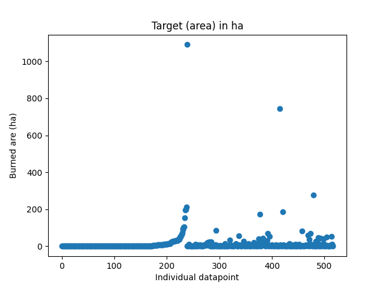
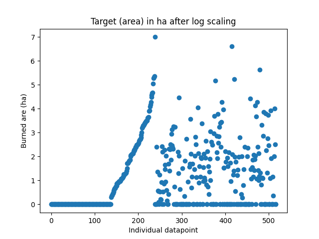

# Feature scaling vs Feature transformation  
  
Recently you dealt with training a DNN for a dataset you found on forest fires : https://archive.ics.uci.edu/dataset/162/forest+fires  
Here is your repo for the solution : https://github.com/josipursan/ML/tree/main/Playground/NN_forest_fires  
  
Mean normalization was done on input features.  
However, this didn't help the performance of the network that much.  
A number of architectural changes were attempted :  
&nbsp;&nbsp;&nbsp;-adding/removing hidden layers  
&nbsp;&nbsp;&nbsp;-adding/removing neurons in the hidden layers  
&nbsp;&nbsp;&nbsp;-learning rate exponential decay scheduler to speed up the initial learning phase  
&nbsp;&nbsp;&nbsp;-plateau learning rate scheduler in an attempt to nudge the model with more certainty towards global minimum once the loss improvement tapers off after ~800-1000 epochs  
&nbsp;&nbsp;&nbsp;-a huge number of epochs (50000)  
&nbsp;&nbsp;&nbsp;-tuning $\alpha$ by hand  
  
None of these worked.  
At best, a model consisting of 3 hidden layers, and one input and one output layer, with the first hidden layer having 64 neurons, second 48 neurons, and third hidden layer 16 neurons, gave best model performance (in terms of loss), tapering off loss gains after ~800 epochs and getting stuck in a loop of loss values ranging values 15 to 30.  
Various $\alpha$ values, ranging 0.00033 to 0.0008, were tested, but all yielded similarily performing models.  
Testing the model simultaneously using a dev set for validation revealed how insufficient the model actually was, even if you threw a lot of epochs at it to try and get the loss as low as possible.  
  
So, what was the issue?  
You had to transform the target variable.  
What was the target variable? Refer to https://archive.ics.uci.edu/dataset/162/forest+fires  
Target variable was *area*, ie. burned area of the forest (dimension : ha).  
What was the issue with it?  
It is highly skewed - most entries are actually 0.  
The plot below shows how the original data looks like :  

    

  
  
Applying *log* function to the data (specifically *log1p* from *numpy* to avoid NaN values for zeros) created this plot :  

    

  
  
Applying a function, such as *log*, to a dataset will not change the innate pattern.  
Feature scaling will simply rescale the scale of the data, but it will not meddle with the shape of the distribution.  
Whenever you have a dataset, such as the burned area, where a single value (zero in this case) dominates the dataset, you are dealing with a highly skewed dataset.  
Therefore, whenever the observed target, or a feature, is highly asymmetric, is homoscedastic (variance grows with magnitude of each entry), you need to apply some **transformation**.  
  
Once *log* function was applied to the target variable, the model started behaving immensely better irregardless of the used architecture.  
  
A lesson well learned - I was negligent with the target variables.  
I operated under the false assumption that transforming and scaling inputs is the only thing that matters.