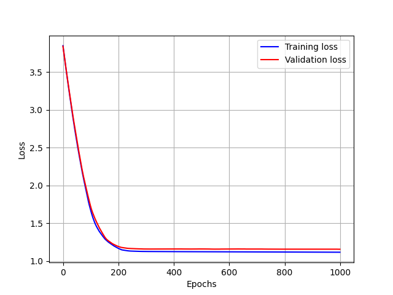
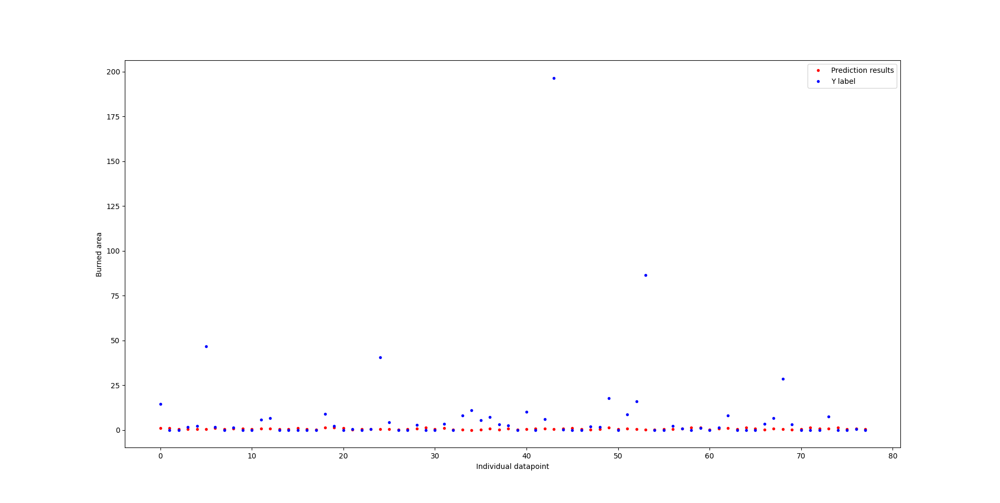

# Report  
This document contains an overview of what was done, why, and how, as well as remarks on what could've been done better.  
  
## Dataset and data prep  
Stock dataset consists of 517 entries.  
A detailed breakdown of the dataset is available in *StockDataDistributions.md* file.  
  
`MinMaxScaler` from `sklearn` was used to apply scaling to chosen features.  
`log1p` function from `Numpy` was used to apply `log` transformation to the chosen features.  
  
Model training and performance was executed using various combinations :  
&nbsp;&nbsp;&nbsp;-only `MinMaxScaler`  
&nbsp;&nbsp;&nbsp;-only `log1p`  
&nbsp;&nbsp;&nbsp;-both `MinMaxScaler` and `log1p`  
&nbsp;&nbsp;&nbsp;-`log1p` only on ground truth subsets  
&nbsp;&nbsp;&nbsp;-no scaling or transformation (raw data)  

## Model  
TensorFlow (v2.19.0) was used to construct all attempted network architectures.
  
Considering the nature of the dataset, and the fact that we are trying to predict burned area (continuous variable) following, common, characteristics were used to test performance of various network architectures :  
&nbsp;&nbsp;&nbsp;&nbsp;-`Sequential` layering  
&nbsp;&nbsp;&nbsp;&nbsp;-`Dense` layers  
&nbsp;&nbsp;&nbsp;&nbsp;-`relu`/`leaky_relu` for input and hidden layers  
&nbsp;&nbsp;&nbsp;&nbsp;-`linear` for output layer  
&nbsp;&nbsp;&nbsp;&nbsp;-`MeanAbsoluteError`/`MeanSquaredError` as the loss metric  
&nbsp;&nbsp;&nbsp;&nbsp;-`Adam` optimizer  
&nbsp;&nbsp;&nbsp;&nbsp;-`HeNormal` kernel initializer  
  
Built in learning rate schedulers `ReduceLROnPlateau` and `EarlyStopping` were also used.  
`ReduceLROnPlateau` with the intention of bringing validation loss as low as possible.  
This specific scheduler was used because each model had miniscule, or no, improvements after a different number of epochs - the intention was to try and nudge the model by lowering $\alpha$ due to the belief that  
model wasn't improving because of high $\alpha$ value.  
This, however, was not the case - all models, after 200-500 epochs, converged to a range of validation_loss values that stayed constant, no matter how aggressively or loosely $\alpha$ was set and scheduled.  
Such behaviour indicates exhaustion of learning capacity.  

`EarlyStopping` was used to try and get the best possible performing model.  
  
## Performance of the tested models  
Model's architecture was varied plenty of times, both manually and automatically (using a small piece of code for generating and constructing random network architectures).  
A wide range of neurons in each hidden layer was tested (8-128), as well as a wide range of hidden layers (1-15).  
Each manually tested architecture was trained using 100-300 epochs to keep the training time down due to the iterative nature of this process.  
Automatically generated architectures, as well as those that seemed promising while manually changing the architecture, were trained using 700-1200 epochs, with some odd runs  
going to 10000 epochs.  
  
All models had comparable performance, except for the extreme architectures (e.g. 1 hidden layer with 1 neuron) which exhibited far greater MSE and MAE values.  
Irregardles of the number of layers, and neurons per layer, models performed comparatively on the `test_set`.  

Line plots comparing model's loss on training set and dev set :  
<p style="text-align: center">
    
</p>  
  
Scatter plot showing prediction results (red) and ground truth values (blue).:  
<p style="text-align: center">
    
</p>  
  
`test_set` was used as input to the trained model in order to obtain predictions.  
`test_set_targets` represents the ground truth values for `test_set`.  
MAE, MSE and $R^{2}$ (`sklearn`, v1.6.1) were used to evaluate model's performance on `test_set` .  
Usual values for the above listed error measures :  
```terminal
MAE : 7.494132041931152
MSE : 661.7797241210938
R_squared : -2821.96484375
```  
Above shown plots, as well as error metrics, were obtained using :  
&nbsp;&nbsp;&nbsp;-input layer : 12 neurons, `leaky_relu`, `HeNormal` initalizer  
&nbsp;&nbsp;&nbsp;-hidden layer : 16 neurons, `leaky_relu`, `HeNormal` initalizer  
&nbsp;&nbsp;&nbsp;-output layer : 1 neuron,  `linear` activation function  
&nbsp;&nbsp;&nbsp;-1000 epochs  
&nbsp;&nbsp;&nbsp;-LR = 0.00001  
  
Note that validation loss slightly crept up from ~epoch 350.  

## Remarks
In spite of a large number of different DNN architectures that were subjected to various training processes, using substantially preprocessed input data, all attempts of achieving reasonable `prediction` performance fell short of reaching that goal.  
MAE of around 7.5 indicates that the mean average error of each prediction is around 7.5ha (1ha = 10000 $m^{2}$).  
  
Such problematic, obstinate training and performance behaviour has roots in :  
&nbsp;&nbsp;&nbsp;-small dataset - only 517 entries  
&nbsp;&nbsp;&nbsp;-features that are highly skewed and tail heavy (example : `rain`)  
&nbsp;&nbsp;&nbsp;-target feature exhitibing binary-like distribution - target feature has 274 zero entries  
  
With only 517 entries, this dataset is not suited for training DNNs.  
Highly skewed, binary-like, target variable further exacerbates this problem.  
MAE now makes more sense, especially when taking into account a couple of target variable values are highly skewing model's ability to properly learn the data.  
Despite target value having a ~50%/50% split between zero and non-zero values, hist shown in `StockDataDistribution.md` shows there is potential for some kind of `imbalanced class` smoothing, ie. boosting the presence of entries that yield relevant burned area values.  
  
## The way forward  
If this dataset was of high importance, with no supplemental data, and no opportunity to collect more events characterized by more parameters than the ones available in this dataset, several routes exist to achieve better performance :  
&nbsp;&nbsp;&nbsp;-use decision trees (e.g. XGBoost)  
&nbsp;&nbsp;&nbsp;-data augmentation - focus on creating more *large area burn* events in the dataset  
&nbsp;&nbsp;&nbsp;-split the model into a binary classifier and a regressor  
&nbsp;&nbsp;&nbsp;&nbsp;&nbsp;&nbsp;-binary classifier would, given a set of inputs, output the probability of a fire  
&nbsp;&nbsp;&nbsp;&nbsp;&nbsp;&nbsp;-regressor would, given a set of inputs, try and predict the burned area  
&nbsp;&nbsp;&nbsp;&nbsp;&nbsp;&nbsp;-regressor would probably highly benefit from being trained only on the entries that have non-negligible target variable values (ie. avoid having all of the zero values, only use non-zero values)  
&nbsp;&nbsp;&nbsp;-convert the target variable from `ha` to `m^2`  
  
I am leaving this project as is (for now).