# Stock data distributions
A dive into the stock data - histogram, scatter plots, value ranges, distribution shapes, and the necessary preprocessing  
steps to make the model train and perform the best it can.  
  
|Var.name| min | max |        mean        |median|     skew      |      variance     |      std.dev     |        kurtosis      |
|--------|-----|-----|--------------------|------|---------------|-------------------|------------------|----------------------|
X        |  1  |  9  |4.669245647969052   |  4.0 |0.8677 (right) |5.353567840702922  |2.3137778287257666|-3.01752799091 (platy)|
Y        |  2  |  9  |4.299806576402321   |  4.0 |0.7312 (right) |1.5126550012744964 |1.2299004029898097|-3.01753772923 (platy)|
FFMC     |18.7 | 96.2|90.64468085106384   |  91.6|-0.5191 (left) |30.471623783605477 |5.520110848851269 |-3.01778427949 (platy)|
DMC      | 1.1 |291.3|110.87234042553192  | 108.3|0.1204 (right) |4101.951888504041  |64.04648224925425 |-3.01753316320 (platy)|
DC       | 7.9 |860.6|547.9400386847195   | 664.2|-1.4059 (left) |61536.83546744037  |248.06619170584364|-3.01753147285 (platy)|
ISI      | 0.0 |56.1 |9.021663442940039   |   8.4|0.4090 (right) |20.78883211131603  |4.559477175216039 |-3.01761298568 (platy)|
temp     | 2.2 |33.3 |18.88916827852998   |  19.3|-0.2122 (left) |33.71689795030963  |5.806625349573505 |-3.01753290534 (platy)|
RH       | 15  | 100 |44.28820116054158   |  42.0|0.4207 (right) |266.25980237806067 |16.31746923937841 |-3.01753403966 (platy)|
wind     | 0.4 | 9.4 |4.017601547388782   |   4.0|0.0294 (right) |3.2100190424782213 |1.7916526009464617|-3.01753259796 (platy)|
rain     | 0.0 | 6.4 |0.021663442940038684|   0  |0.2195 (right) |0.08759180123851079|0.295959120890894 |-3.01911469054 (platy)|

If mean > median, you have a long right tail (positive skew)  
If mean < median, you have a long left tail (negative skew) (these are rule-of-thumb estimates, skew and kurtosis should always be computed)  
  
Skew - represents distribution's degree of asymmetry  
&nbsp;&nbsp;&nbsp;-a distribution may be right or left skewed  
&nbsp;&nbsp;&nbsp;-right-skew is also called positive skew because the tail extends in the positive direction of the x axis  
&nbsp;&nbsp;&nbsp;-left skew is also called negative skew because the tail extens in the neative direction of the x axis  
**Pearson's second skeweness coefficient (median skeweness)**  
$skew = \frac{3(mean - median)}{std.dev}$  
&nbsp;&nbsp;&nbsp;-close to 0, or 0, indicates no or little skew  
&nbsp;&nbsp;&nbsp;-positive value indicates a right skewed (positive skew) distribution  
&nbsp;&nbsp;&nbsp;-negative value indicates a left skewed (negative skew) distribution  
&nbsp;&nbsp;&nbsp;-there are other formulas for computing skeweness  
  
Kurtosis - a measure of tailedness of the distribution  
&nbsp;&nbsp;&nbsp;-indicates how fat or thin the tails are, ie. how much of the dataset is in the tails  
&nbsp;&nbsp;&nbsp;-kurtosis is often called *excessive kurtosis* because any kind of deviation from the kurtosis of normal distribution, which is 3, can be considered excessive kurtosis :  
&nbsp;&nbsp;&nbsp;&nbsp;&nbsp;&nbsp;&nbsp; $excessiveKurtosis = 3 - kurtosis$  
&nbsp;&nbsp;&nbsp;-there are 3 kinds of kurtosis - mesokurtosis, platykurtosis, leptokurtosis  
&nbsp;&nbsp;&nbsp;-mesokurtosis (*meso* is greek for *middle, intermediate*) - normal tailedness, not excessive tailedness (normal distribution is an example of mesokurtic distribution)  
&nbsp;&nbsp;&nbsp;-platykurtosis (*platy* is greek for *flat, broad*) - flattened, squished, normal distribution; a distribution yielding a *negatve excessive kurtosis* value is platykurtic; visually they look quite plateauish on top  
&nbsp;&nbsp;&nbsp;-leptokurosis (*lepto* is greek for *slight, thin, fine*) - characterized by a very thin, peaky top, and very fat tails; distributions yielding a *positive excessive kurtosis* value are leptokurtic  

Variance - how much values of data set vary from each other  
Std.dev - how much values of data set vary from the mean  
Both show dataset spread.  
  
## X - xaxis coordinate in the park  
Histogram showing *X* variable distribution :  

    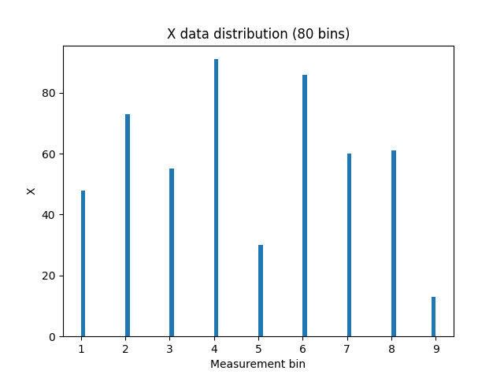

  
  
  
Scatter plot showing *X* values for each datapoint :  

    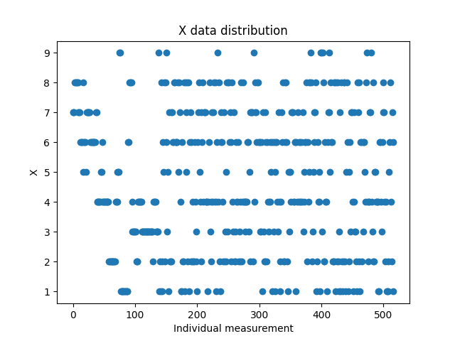

  
  
Variable *X* takes on values [1-9].  
|Var.name| min | max |        mean        |median|     skew      |      variance     |      std.dev     |        kurtosis      |
|--------|-----|-----|--------------------|------|---------------|-------------------|------------------|----------------------|
X        |  1  |  9  |4.669245647969052   |  4.0 |0.8677 (right) |5.353567840702922  |2.3137778287257666|-3.01752799091 (platy)|  
  
Variable *X* has a small range of possible values.  
Both histo and scatter show existing values are pretty uniformly spread out.  
Mean and median are pretty close to eachother.  
A very slight right (positive) skew exists.  
Kurtosis confirms this further, inidcating a platy distribution - flat, wide top (peak) and thin tails.  
  
**VERDICT :** Still a bit on the edge whether this variable should be used at all.  
If used, scale it and check the model behaves. Only then consider some transformation, although I don't think it is necessary considering histo and scatter plots.  
  
## Y - yaxis cordinate in park  
Histogram showing *Y* variable distribution :  

    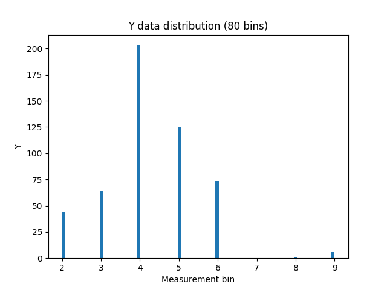

  
  
  
Scatter plot showing *Y* values for each datapoint :  

    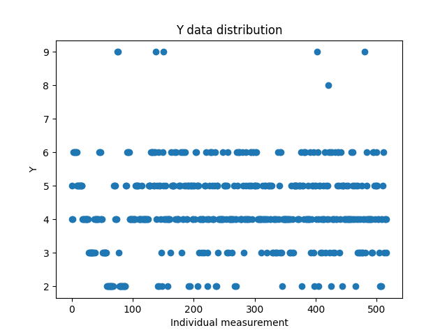

  
  
A drastically different situation compared to variable *X*.  
  
  
Y variable takes on values [2,9] (no entries are == 1).  
|Var.name| min | max |        mean        |median|     skew      |      variance     |      std.dev     |        kurtosis      |
|--------|-----|-----|--------------------|------|---------------|-------------------|------------------|----------------------|
Y        |  2  |  9  |4.299806576402321   |  4.0 |0.7312 (right) |1.5126550012744964 |1.2299004029898097|-3.01753772923 (platy)|

Just like *X*, *Y* also has a very small possible range of values.  
Besides the few outliers with values 8 and 9, variable *Y* is relatively uniformly spread out in range [2,6].  
Mean and median are pretty clsoe to eachother.  
A slight right skew is present.  
A prominent peak for Y = 4.  
Tails are comparable.  
Kurtosis indicates a platy*ish* distribution, ie. thin tails.  
  
**VERDICT :** Try a transformation to condense the dataset a bit, maybe even some scaling method, and see how it influences the model.  
  

## FFMC - Fine Fuel Moisture code  
Histogram showing *FFMC* variable distribution :  

    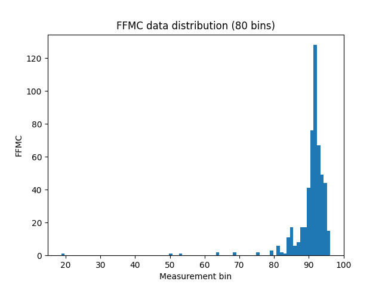

  
    
Scatter plot showing *FFMC* values for each datapoint :  

    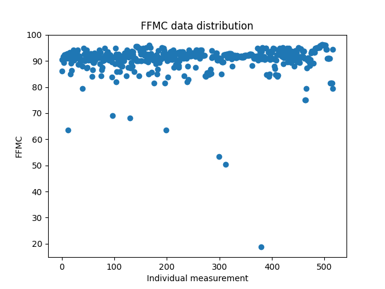

  
  
FFMC takes on a wide range of values, [18.7, 96.2].  
Most datapoints, however, sit around 90.  
|Var.name| min | max |        mean        |median|     skew      |      variance     |      std.dev     |        kurtosis      |
|--------|-----|-----|--------------------|------|---------------|-------------------|------------------|----------------------|
FFMC     |18.7 | 96.2|90.64468085106384   |  91.6|-0.5191 (left) |30.471623783605477 |5.520110848851269 |-3.01778427949 (platy)|  
  

Pretty nice, normal*ish*, distribution.  
Mean and median are pretty close.  
A slight leftwards skew is present.  
Kurtosis again indicates a platy*ish* distribution, ie. thin tails.  
  
**VERDICT :** considering there is a considerable band of values contributing to a slight negative skew, and the fact that FFMC takes on a pretty wide range of values, try both scaling and transformation.  
  
  
## DMC - Duff Moisture Code  
Histogram showing *DMC* variable distribution :  

    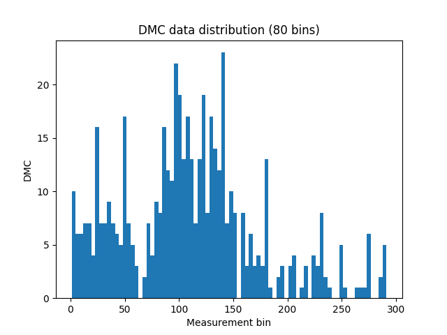

  
    
Scatter plot showing *DMC* values for each datapoint :  

    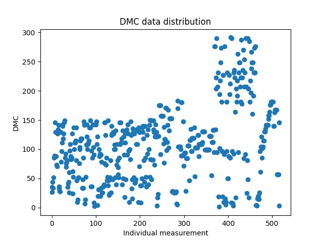

  
  
  
Takes on a wide range of values, [1.1, 291.3].  
|Var.name| min | max |        mean        |median|     skew      |      variance     |      std.dev     |        kurtosis      |
|--------|-----|-----|--------------------|------|---------------|-------------------|------------------|----------------------|
DMC      | 1.1 |291.3|110.87234042553192  | 108.3|0.1204 (right) |4101.951888504041  |64.04648224925425 |-3.01753316320 (platy)|  
  
Considering range of values the datapoints take on, mean and median are pretty close to eachother.  
A very slight right, positive, skew is present. Histogram nicely shows why there is a minimal skew.  
Kurtosis again indicates a playt*ish* distribution, ie. thin tails.  
Standard deviation and variance are non negligible - datapoints aren't tightly coupled around a singular point.  
Instead they are, more or less, proprotionally spread out in range [0,150].  
A noticeable group of outliers takes on values [160, 290].  
Both histogram and the scatter plot show this variable is likely a good candidate for scaling and transformation.  
  
**VERDICT :** scale and transform. Consider using different transformations and then evaluating their impact on network's ability to train and generalize.  
  
## DC - Drought Code
Histogram showing *DC* variable distribution :  

    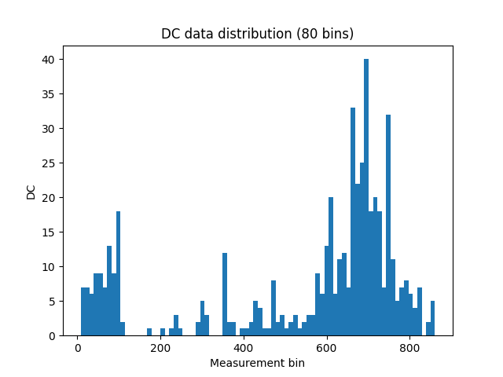

  
    
Scatter plot showing *DC* values for each datapoint :  

    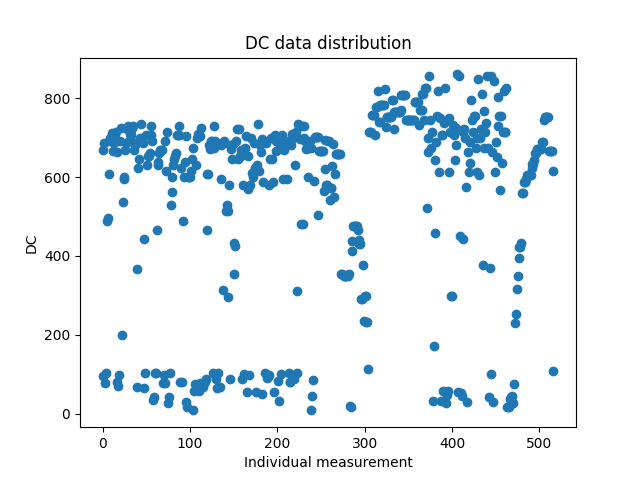

  
  
Takes on a wide range of values [7.9, 860.6].  
|Var.name| min | max |        mean        |median|     skew      |      variance     |      std.dev     |        kurtosis      |
|--------|-----|-----|--------------------|------|---------------|-------------------|------------------|----------------------|
DC       | 7.9 |860.6|547.9400386847195   | 664.2|-1.4059 (left) |61536.83546744037  |248.06619170584364|-3.01753147285 (platy)|  
  
A considerable difference between mean and median, median being greater than mean.  
Mean being smaller than median indicates a left skew, which is supported by the computation.  
The distribution is noticeably left skewed (negative skew).  
Datapoints are quite spread out, which is supported by variance and standard deviation.  
Kurtosis, again, indicates a platy*ish* distribution, ie. thin tails.  
A fine candidate for scaling, and especially transformation.  
  
**VERDICT :** scaling and transformation (note that only scaling was applied prior to this analysis).  
  
## ISI - Initial Spread Index
Histogram showing *ISI* variable distribution :  

    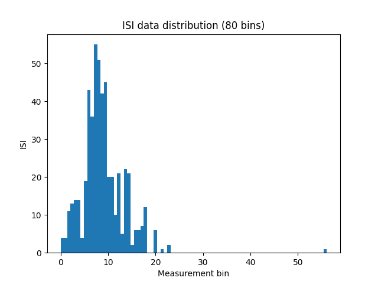

  
    
Scatter plot showing *ISI* values for each datapoint :  

    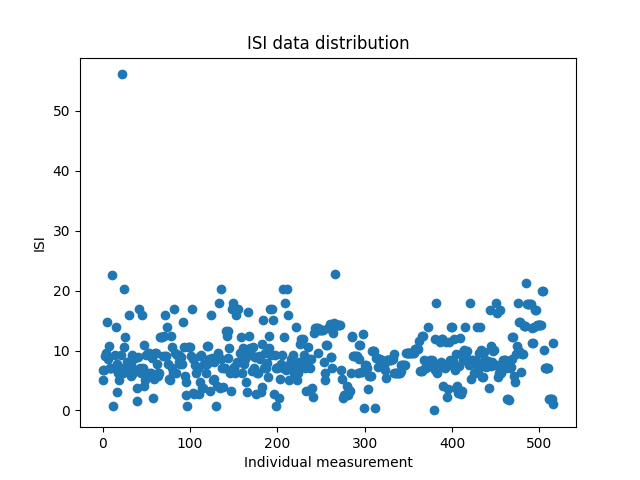

  
  
Pretty tight range of values, a slight band of values ([11,20]) worth labelling as "outliers".  
|Var.name| min | max |        mean        |median|     skew      |      variance     |      std.dev     |        kurtosis      |
|--------|-----|-----|--------------------|------|---------------|-------------------|------------------|----------------------|
ISI      | 0.0 |56.1 |9.021663442940039   |   8.4|0.4090 (right) |20.78883211131603  |4.559477175216039 |-3.01761298568 (platy)|
  
Histo shows a small positive skew, confirmed by Pearson's second skeweness coefficient.  
Kurtosis again shows a platy distribution - thin tails.  
Variance and std.dev. seem ok - supported by the scatter plot which shows relatively good grouping.  
  
**VERDICT :** scaling might be a good start, try transformation to see how it will impact the model.  
  
## temp  
Histogram showing *temp* variable distribution :  

    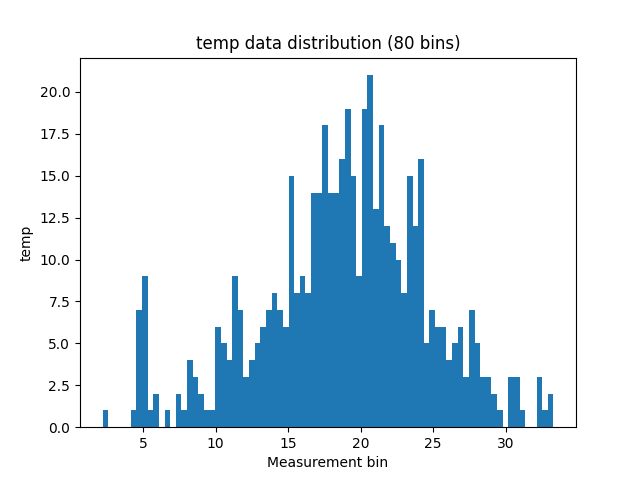

  
    
Scatter plot showing *temp* values for each datapoint :  

    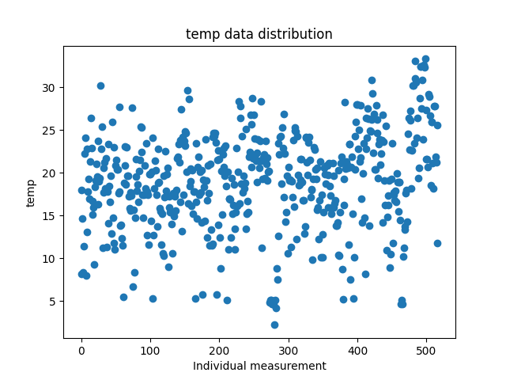

  
  
A nice range of values, good diverse set of values [2.2, 33.3].  
|Var.name| min | max |        mean        |median|     skew      |      variance     |      std.dev     |        kurtosis      |
|--------|-----|-----|--------------------|------|---------------|-------------------|------------------|----------------------|
temp     | 2.2 |33.3 |18.88916827852998   |  19.3|-0.2122 (left) |33.71689795030963  |5.806625349573505 |-3.01753290534 (platy)|
  
Very nice distribution, diverse distribution.  
Mean and median almost identical.  
A very slight left skew is confirmed by Pearson's second skeweness coefficient, further confirmed by histogram.  
The left skew is probably a consequence of peak sitting around bin 5 on x axis.  
Variance and std.dev. are not that high, but considering possible range of values, and the scatter plot, datapoints are relatively well spread out throught the possible range of values.  
Kurtosis shows a platy distribution, ie. thin tails.  
  
**VERDICT :** an excellent candidate for scaling and transformation. Model's architecture will probably benefit from squeezing all of the "outliers".  
  
## RH - Relative humidity
Histogram showing *RH* variable distribution :  

    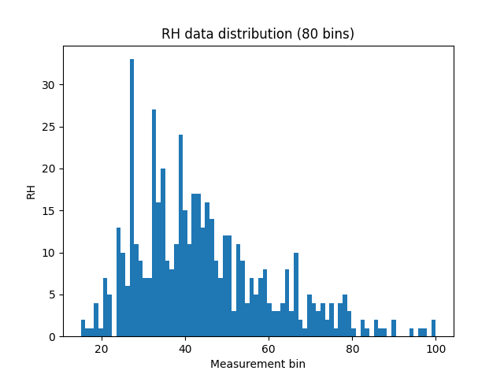

  
    
Scatter plot showing *RH* values for each datapoint :  

    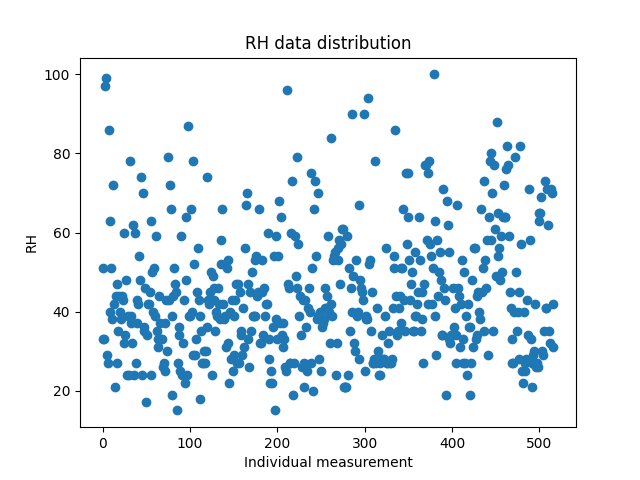

  
  
RH takes on values [15,100].  
|Var.name| min | max |        mean        |median|     skew      |      variance     |      std.dev     |        kurtosis      |
|--------|-----|-----|--------------------|------|---------------|-------------------|------------------|----------------------|
RH       | 15  | 100 |44.28820116054158   |  42.0|0.4207 (right) |266.25980237806067 |16.31746923937841 |-3.01753403966 (platy)|
  
Mean and median are closely matched.  
A positive, right, skew is visible on the histogram, and confirmed by Pearson.  
Non-negligible variance and std.dev. are visible on the histogram as well.  
Kurtosis indicates a platy distribution with thin tails.  
  
**VERDICT :** scaling and transformation; Especially focus on the transformation to try and squeeze the right-hand tail.  
  
## wind
Histogram showing *wind* variable distribution :  

    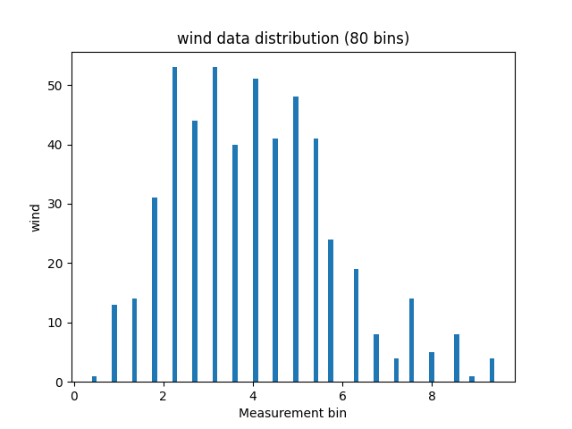

  
    
Scatter plot showing *wind* values for each datapoint :  

    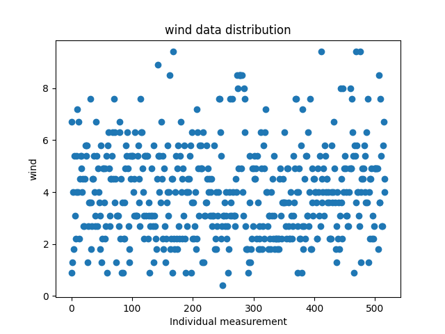

  
  
A small range of values for wind [0.4, 9.4].  
|Var.name| min | max |        mean        |median|     skew      |      variance     |      std.dev     |        kurtosis      |
|--------|-----|-----|--------------------|------|---------------|-------------------|------------------|----------------------|
wind     | 0.4 | 9.4 |4.017601547388782   |   4.0|0.0294 (right) |3.2100190424782213 |1.7916526009464617|-3.01753259796 (platy)|
  
Central plateau visible on the histogram with a right-hand tail more prominent than the left-hand one.  
This is confirmed by kurtosis.  
A very slight right skew is also confirmed by Pearson.  
Mean and median are pretty much identical.  
  
**VERDICT :** a fine candidate for scaling and transformation with the goal of squeezing the whole dataset.  
  
## rain
Histogram showing *rain* variable distribution :  

    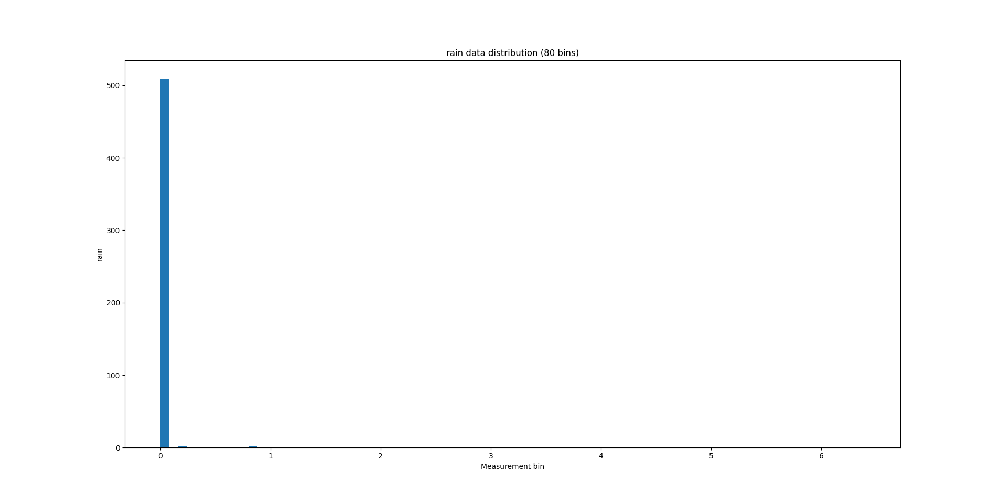

  
    
Scatter plot showing *rain* values for each datapoint :  

    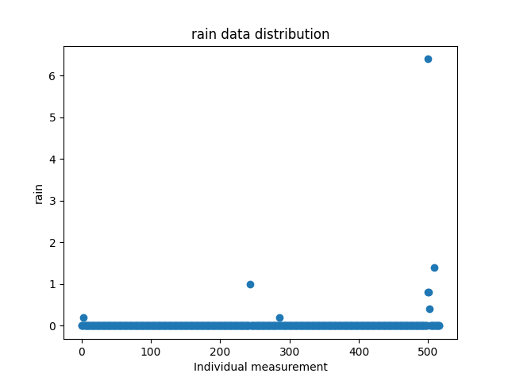

  
  
Small range of values [0, 6.4]. Most values are actually 0.  
|Var.name| min | max |        mean        |median|     skew      |      variance     |      std.dev     |        kurtosis      |
|--------|-----|-----|--------------------|------|---------------|-------------------|------------------|----------------------|
rain     | 0.0 | 6.4 |0.021663442940038684|   0  |0.2195 (right) |0.08759180123851079|0.295959120890894 |-3.01911469054 (platy)|
  
Looking at the histogram I'd call this a leptokurtic distribution - one peaky top, and fat tails.  
However, computing kurtosis indicates a platy distribution, which is a consequence of using the *standard biased estimator* (ie. the equation you used to compute kurtosis) - it is biased towards normality and is very unreliable for extreme/degenerated distributions, especially for those with sparse non-zero values  
&nbsp;&nbsp;&nbsp;&nbsp;-most kurtosis estimators assume, roughly speaking, a bell-shaped distribution  
&nbsp;&nbsp;&nbsp;&nbsp;-should've used a different kurtosis estimator  
Should probably recheck my kurtosis equation.  
This is a pretty problematic dataset since all values are 0, only 7 entries are != 0.  
  
**VERDICT :** definitely transform, maybe even scaling before transformation.  
  
## target variable - burned area
Histogram showing *target* variable distribution :  

    

  
    
Scatter plot showing *target* values for each datapoint :  

    

  
  

Target variable (burned area) takes on values in range [0, 1090.84].  
Mean is 12.847292069632493.  
Median is 0.52.  
Variance is 4052.063224823444.  
Standard deviation is 63.65581846794089.  
  
Target variable has 274 zero entries.  