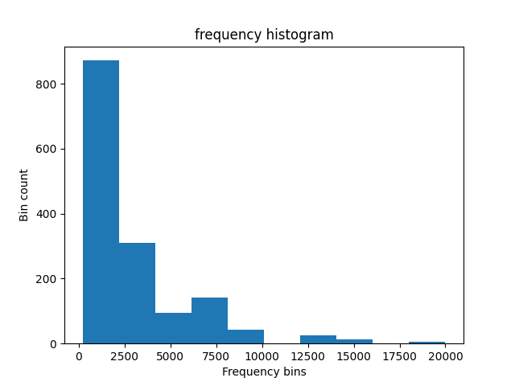
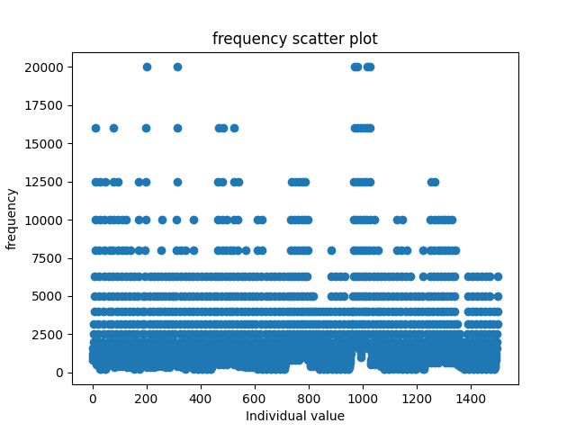
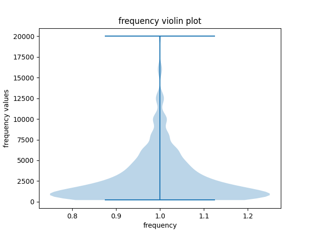

# StockDataAnalysis - airfoil self-noise  
UCI ML Repo link : https://archive.ics.uci.edu/dataset/291/airfoil+self+noise  
  
## Stats table - general info about dataset's features
|              Var.name             | minVal |  maxVal  |   mean  |  median | skew |  variance  | std.dev |kurtosis|excessiveKurtosis|
|-----------------------------------|--------|----------|---------|---------|------|------------|---------|--------|-----------------|
|             frequency             |200.0000|20000.0000|2886.3806|1600.0000|2.1371|9938717.3837|3152.5731| 5.7087 |     -2.7087     |
|            attack-angle           | 0.0000 |  22.2000 |  6.7823 |  5.4000 |0.6892|   35.0242  |  5.9181 | -0.4130|      3.4130     |
|            chord-length           | 0.0254 |  0.3048  |  0.1365 |  0.1016 |0.4575|   0.0087   |  0.0935 | -1.0380|      4.0380     |
|        free-stream-velocity       | 31.7000|  71.3000 | 50.8607 | 39.6000 |0.2359|  242.5116  | 15.5728 | -1.5640|      4.5640     |
|suction-side-displacement-thickness| 0.0004 |  0.0584  |  0.0111 |  0.0050 |1.7022|   0.0002   |  0.0132 | 2.2189 |      0.7811     |

## Frequency  
Frequency histogram plot :  

    

  
  
Frequency scatter plot :  

    

  
  
Frequency violin plot :  

    

  
  
Variable *frequency* take on a wide range of values : [200-20000]  
Mean is greater than median indicating a long right tail, ie. positive skew.  
&nbsp;&nbsp;&nbsp;This is further reinforced by the plots above.  
  
Histogram, scatter plot, and skew, point to a very bottom heavy distribution.
Approximately 1200 frequency measurements bin to frequency values [0-3750].  
  
**Verdict** :  
&nbsp;&nbsp;&nbsp;-clip before training - clip using high percentile (e.g. 99th) to remove the problematic outliers  
&nbsp;&nbsp;&nbsp;-try log scaling (consider power transforms after checking out how log scaled data performs in training)  
&nbsp;&nbsp;&nbsp;-after transforming scale to [0, 1] - remember to fit the scaler **ONLY** on the training set, and to then apply that same scaler to dev and test sets (this is a mistake you made during *NN_forest_fires* project)  
  