# StockDataAnalysis - airfoil self-noise  
UCI ML Repo link : https://archive.ics.uci.edu/dataset/291/airfoil+self+noise  
  
## Stats table - general info about dataset's features
|              Var.name             | minVal |  maxVal  |   mean  |  median | skew |  variance  | std.dev |kurtosis|excessiveKurtosis|
|-----------------------------------|--------|----------|---------|---------|------|------------|---------|--------|-----------------|
|             frequency             |200.0000|20000.0000|2886.3806|1600.0000|2.1371|9938717.3837|3152.5731| 5.7087 |     -2.7087     |
|            attack-angle           | 0.0000 |  22.2000 |  6.7823 |  5.4000 |0.6892|   35.0242  |  5.9181 | -0.4130|      3.4130     |
|            chord-length           | 0.0254 |  0.3048  |  0.1365 |  0.1016 |0.4575|   0.0087   |  0.0935 | -1.0380|      4.0380     |
|        free-stream-velocity       | 31.7000|  71.3000 | 50.8607 | 39.6000 |0.2359|  242.5116  | 15.5728 | -1.5640|      4.5640     |
|suction-side-displacement-thickness| 0.0004 |  0.0584  |  0.0111 |  0.0050 |1.7022|   0.0002   |  0.0132 | 2.2189 |      0.7811     |

## Frequency  
Frequency histogram plot :  

    

  
  
Frequency scatter plot :  

    

  
  
Frequency violin plot :  

    

  
  
Variable *frequency* take on a wide range of values : [200-20000]  
Mean is greater than median indicating a long right tail, ie. positive skew.  
  
**Verdict** :  
&nbsp;&nbsp;-clip before training  
&nbsp;&nbsp;-log scaling - see how model trains and adapt accordingly  
&nbsp;&nbsp;-after transforming, scale variable to range [0, 1] - scaled only on training set, then just apply it to dev and test sets  
  
## Chord-length  

  
Histogram, scatter plot, and skew, point to a very bottom heavy distribution.  
Approximately 1200 frequency measurements bin to frequency values [0-3750].  
  
**Verdict** :  
&nbsp;&nbsp;&nbsp;-clip before training - clip using high percentile (e.g. 99th) to remove the problematic outliers  
&nbsp;&nbsp;&nbsp;-try log scaling (consider power transforms after checking out how log scaled data performs in training)  
&nbsp;&nbsp;&nbsp;-after transforming scale to [0, 1] - remember to fit the scaler **ONLY** on the training set, and to then apply that same scaler to dev and test sets (this is a mistake you made during *NN_forest_fires* project)  
  
## Attack-angle  
Attack-angle histogram plot :  

    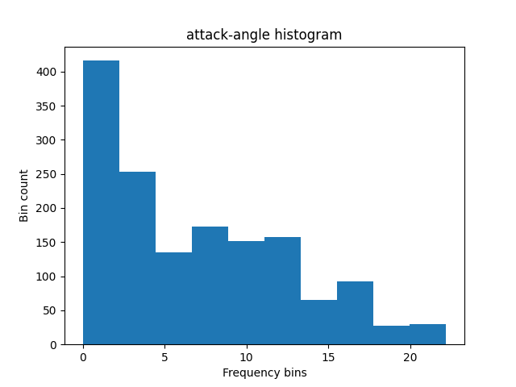

  
  
Attack-angle scatter plot :  

    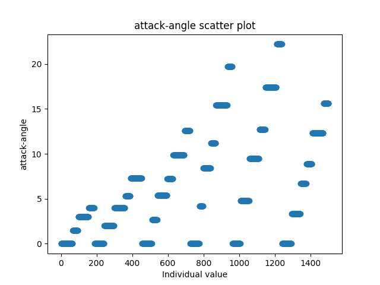

  
  
Attack-angle violin plot :  

    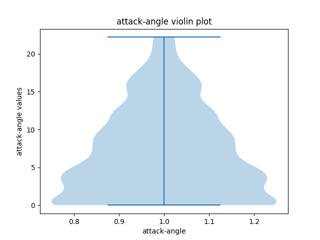

  
  
Attack-angle takes on a relatively small range of values : [0-22.2]  
Mean is greater than median indicating a long right tail, ie. positive skew.  
&nbsp;&nbsp;&nbsp;This is further reinforced by the plots above.  
  
Histogram and scatter plot (especially scatter plot) point to a relatively evenly distributed set of values, further reinforced by variance.  
Approximately 700 measurements belong to sub 5 category.  
Since *attack-angle* variable is still bottom heavy, althought not as much as *frequency* variable, verdict will be similar.  
  
**Verdict** :  
&nbsp;&nbsp;&nbsp;-clip before training  
&nbsp;&nbsp;&nbsp;-log scaling - see how model trains and adapt accordingly  
&nbsp;&nbsp;&nbsp;-after transforming, scale variable to range [0, 1] - scaled only on training set, then just apply it to dev and test sets  
  
## Chord-length  
Chord-length histogram plot :  

    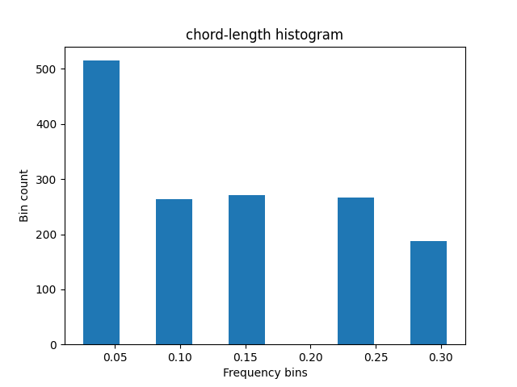

  
  
Chord-length scatter plot :  

    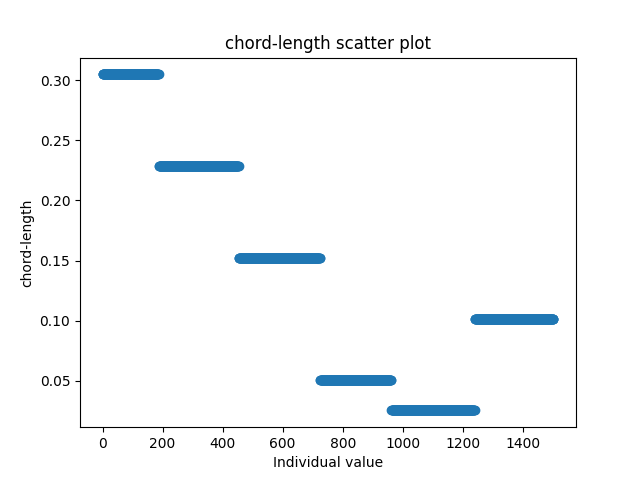

  
  
Chord-length violin plot :  

    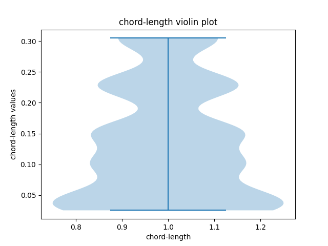

  
  
Chord-length takes on a very tight range of values : [0.0254, 0.3048]  
Mean is greater than median, albeit very slightly. This indicates long right tail (positive skew).  
Both variance and std.dev. are very small indicating there isn't a whole lot of spread in the dataset on a value-to-value basis (variance), or with respect to mean (std.dev).  
  
Histogram and scatter plot show a very balanced distribution. Peak for variable values in range [0-00.5], and lack of any values in general area of 0.20, are the only noteworthy anomalies disrupting an absolutely evenly balanced distribution.  
Broadly speaking, neural networks greatly benefit from reducing skew. Since *chord-length* has a mostly even distribution, possessing only two irregularities.  

**Verdict** :  
&nbsp;&nbsp;&nbsp;-try one of following transformations/scalers : `robust scaling`, `quantile transformation` `power transformation` (also recommended for *attack-angle*)  
&nbsp;&nbsp;&nbsp;-once you see distributions yielded by transforms above decide whether any further data preprocessing is necessary  
  
## Free-stream velocity  
Free-stream velocity histogram plot :  

    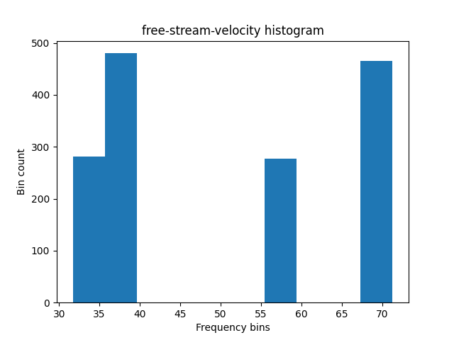

  
  
Free-stream velocity scatter plot :  

    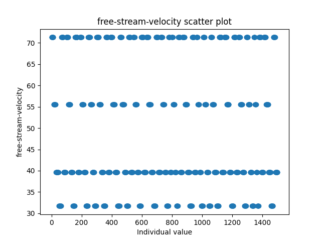

  
  
Free-stream velocity violin plot :  

    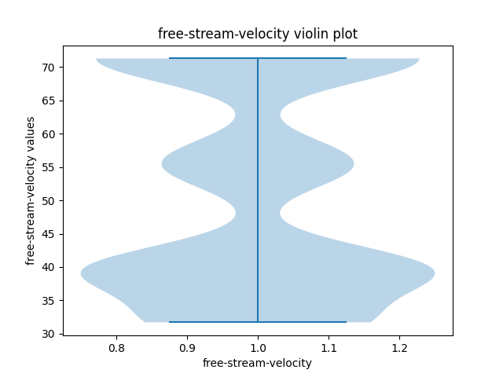

  
  
Although *free-stream velocity* takes on a relatively wide range of value ([31.7-71.3]), measured values are binned to 4 separate bins.  
Mean is bigger than median, indicating a positive right skew, but with such sparse distribution it loses any meaning.  
Scatter plot confirms histogram's findings on sparse data distrubtion.  
Because of this sparse distribution, variance and standard deviation are high. Variance is significantly higher than standard deviation, reinforcing findings about sparseness, ie. big differences on a per-value-basis.  
  
**Verdict** :  
&nbsp;&nbsp;&nbsp;-recheck whether the distribution really is that sparse, or whether you need finer binning  
&nbsp;&nbsp;&nbsp;-if the distribution really is so sparse all variable values fall into 4 separate categories, **one-hot** encode it  
&nbsp;&nbsp;&nbsp;-if one-hot encoding does not work, try leaving this variable as is  
  
## Suction side displacement thickness  
Suction side displacement thickness velocity histogram plot :  

    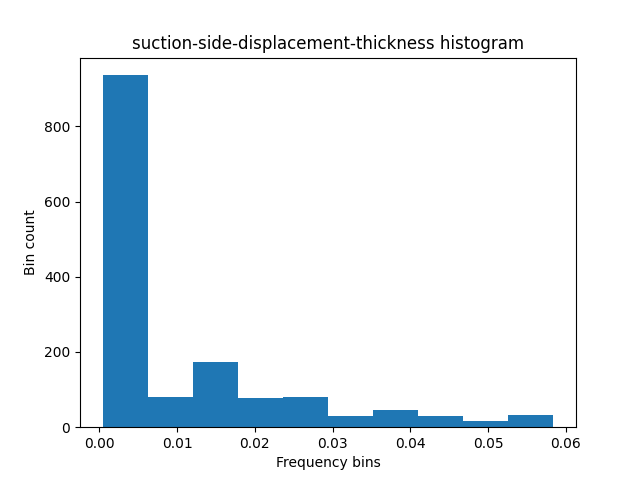

  
  
Suction side displacement thickness velocity scatter plot :  

    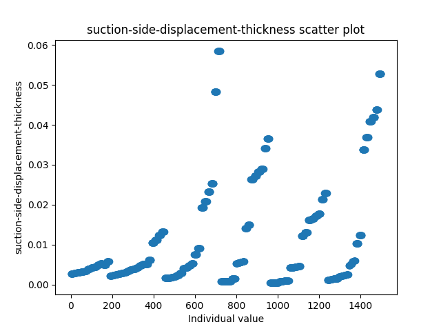

  
  
Suction side displacement thickness velocity violin plot :  

    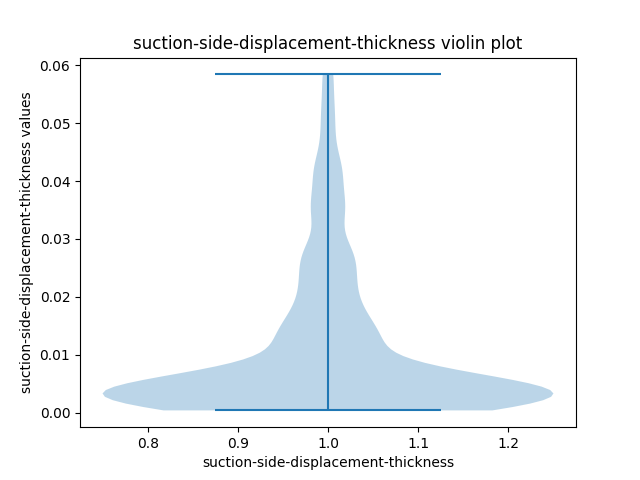

  
  
*Suction side displacement thickness* takes on a wide range of values : [0.0004, 0.0548]  
Mean is greater than median, pointing to a long right tail, ie. positive skew.  
This particular variable has a hefty right handed tail.  
Standard deviation is greater than variance, indicating a drift/outlier/peak/through is present in the data.  
  
Histogram and scatter plots confirm a distribution density anomaly is present in the form of a peak for values [0-0.005].  
Such heavy tailed distribution should be handled similarily to preprocessing outlined for *frequency* variable.  
  
**Verdict** :  
&nbsp;&nbsp;-clip before training  
&nbsp;&nbsp;-log scaling - see how model trains and adapt accordingly  
&nbsp;&nbsp;-after transforming, scale variable to range [0, 1] - scaled only on training set, then just apply it to dev and test sets