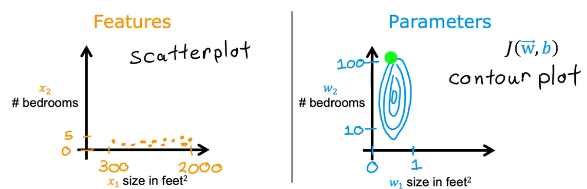
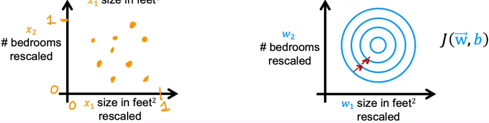

# Supervised Machine Learning: Regression and Classification  
  
# Week 2 - Regression with multiple input variables  
-the goal of W2 is to make our linear regression much faster and simpler  
-we will start this week off with `Linear regression with multiple input variables`  
  
## Multiple features  
-our example for W1 had one input variable (feature *x* )and one output variable (*y*) - using square area of the house (*x*) we were predicting its price (*y*) : `f(x) = y = wx+b`  
  
-what if instead of having only one input feature (square area) we actually had more input features : number of bedrooms, number of floors, age of house in years  
  
-we will name these features as follows :  
&nbsp;&nbsp;&nbsp;-house area (size) - x1  
&nbsp;&nbsp;&nbsp;-number of bedrooms - x2  
&nbsp;&nbsp;&nbsp;-number of floors - x3  
&nbsp;&nbsp;&nbsp;-age in years - x4  
  
-xj = represents the jth feature  
-`n` - number of features  
$\vec{x}$ i = features of the ith training example (vector containing all features of the ith training example)  
&nbsp;&nbsp;&nbsp;-example : $\vec{x}$2 - vector of features for the second training example (ie. the second row in table)  
-xj(i) - value of feature *j* in the ith training example  
&nbsp;&nbsp;&nbsp;-example : x3(2) refers to the value of third feature in the second training example; third feature is *number of floors*, and the second training example refers to the second table row, meaning we are referring to value **2**  
  
-model we used for linear regression : fw,b(x) = wx + b  
-**new model for linear regression with multiple input variables (house example)** :  
&nbsp;&nbsp;&nbsp;fw,b(x) = w1x1 + w2x2 + w3x3 + w4x4 + b  
  
-general expression for linear regression with multiple input variables :  
&nbsp;&nbsp;&nbsp;fw,b(x) = w1x1 + w2x2 + ... + wnxn + b  
  
-now we will simplify the expression above  
-all `w` parameters can be written as a row vector :  
&nbsp;&nbsp;&nbsp; $\vec{w}$ = [w1, w2, ..., wn]  
-all `x` inputs can be written as a row vector :  
&nbsp;&nbsp;&nbsp; $\vec{x}$ = [x1, x2, ..., xn]  
-`b` is just a scalar  
  
-now the model can be written more succintly :  
&nbsp;&nbsp;&nbsp;fw,b($\vec{x}$) = $\vec{x}\cdot\vec{w}$ + b  
&nbsp;&nbsp;&nbsp;-the `dot` product refers to the action of multiplying corresponding pairs of values between the used vectors;  
&nbsp;&nbsp;&nbsp;-example : for $\vec{w}$ and $\vec{x}$ we will multiply elements positionally, namely w1 * x1, w2 * x2, w3 * x3, etc.  
NOTE : in the expression above, `w` in subscript of `f` should also have a vector above it, but it wouldn't render successfully when `\vec` was in `sub` tag  
  
-this model is called **multiple linear regression** (NOT multivariate linear regression)  
  
  
## Vectorization part 1  
-makes the code shorter, simpler and executes quicker  
  
- $\vec{w}$ = [w1, w2, w3]  
- $\vec{x}$ = [x1, x2, x3]  
-`b` is a scalar  
  
-in python, using numpy :  
&nbsp;&nbsp;&nbsp;`w = np.array([1.0, 2.5, -3.3])`  
&nbsp;&nbsp;&nbsp;`x = np.array([10, 20, 30])`  
&nbsp;&nbsp;&nbsp;`b = 4`  
  
-implementing our multiple linear regression model without vectorization, using python :  
&nbsp;&nbsp;&nbsp;`f = w[0] * x[0] + w[1] * x[1] + w[2] * x[2] + b`  
&nbsp;&nbsp;&nbsp;-this kind of implemnentation is not good because it requires a lot of manual manipulation should length of vectors `w` and `x` change  
  
-another option, without vectorization is using a `for` loop, which is a lot better than the hardcoded example above  
  
-now we will implement our mutiple linear regression model WITH vectorization :  
&nbsp;&nbsp;&nbsp;`f = np.dot(w,x) + b`  
&nbsp;&nbsp;&nbsp;-when `n` is large, vectorized approach will always run much faster than the 2 other approaches outlined above  
  
## Vectorization part 2  
-let us imagine we are running grad desc  
-we have 16 `w` params because we have 16 input variables  
-because we have 16 input variables, we will also have 16 derivative terms to compute  
-imagine we have already computed all of these derivative terms, and that they are stored in a row vector called `d` (`w`is in a row vector as well) :  
&nbsp;&nbsp;&nbsp; $\vec{w}$ = [w1, w2, w3, ..., w16]  
&nbsp;&nbsp;&nbsp; $\vec{d}$ = [d1, d2, d3, ..., d16]  
  
-remember that the update term for `w` when running grad desc is wj = wj - $\alpha$*dj for j = 1,...,16  
  
-implementing this in python without vectorization would mean we would have to approach one by one each parameter `w` and compute its new value :  
&nbsp;&nbsp;&nbsp;w1 = w1 - $\alpha$*d1  
&nbsp;&nbsp;&nbsp;w2 = w2 - $\alpha$*d2  
&nbsp;&nbsp;&nbsp;w3 = w3 - $\alpha$*d3  
&nbsp;&nbsp;&nbsp;...  
&nbsp;&nbsp;&nbsp;w16 = w16 - $\alpha$*d16  
&nbsp;&nbsp;&nbsp;-in python we would write this using a for loop :  
&nbsp;&nbsp;&nbsp;&nbsp;`for j in range(0, 16) : `  
&nbsp;&nbsp;&nbsp;&nbsp;&nbsp;&nbsp;`w[j] = w[j] - alpha*d[j]`  
  
-using vectorization, we can use can clean, pretty line of code, which also makes the code maintenance easier :  
&nbsp;&nbsp;&nbsp; $\vec{w}$ = $\vec{w}$ - 0.1* $\vec{d}$  
-in python : `w = w - 0.1*d`  
  
-using vectorized implementation will result in a huge difference in run time and efficiency  
  
## Gradient descent for multiple linear regression  
  
-`b` is just a number  
- $\vec{w}$ = [w1, w2, ..., wn]  
-model : fw,b = $\vec{w} \cdot \vec{x}$ + b  
-cost function : J($\vec{w}$, b)  
-grad desc algo :  
&nbsp;&nbsp;&nbsp;&nbsp;repeat until convergence {  
&nbsp;&nbsp;&nbsp;&nbsp;&nbsp;wj = wj - $\alpha \frac{\partial}{\partial w_j}$ J($\vec{w}$, b)  
&nbsp;&nbsp;&nbsp;&nbsp;&nbsp;b = wj - $\alpha \frac{\partial}{\partial b}$ J($\vec{w}$, b)  
&nbsp;&nbsp;&nbsp;&nbsp;&nbsp;}  
  
-remember :  
&nbsp;&nbsp;&nbsp;-superscript `i` represents all features for the ith training example  
&nbsp;&nbsp;&nbsp;-subscript `j` represents the jth feature out of all available features

-in case we have n=>2 features, update terms for grad desc will change only a little bit :  
&nbsp;&nbsp;&nbsp;&nbsp;repeat until convergence {  
&nbsp;&nbsp;&nbsp;&nbsp;&nbsp; wn = wn - $\alpha \frac{1}{m} \sum_{i=1}^m$(fw,b($\vec{x}$i) - yi) $\cdot$ xni  
&nbsp;&nbsp;&nbsp;&nbsp;&nbsp; b = b - $\alpha \frac{1}{m} \sum_{i=1}^m$(fw,b($\vec{x}$i) - yi)  
  
&nbsp;&nbsp;&nbsp;&nbsp;&nbsp;&nbsp;&nbsp; simultaneously update  
&nbsp;&nbsp;&nbsp;&nbsp;&nbsp;&nbsp;&nbsp; wj (for j = 1,..., n) and b  
&nbsp;&nbsp;&nbsp;&nbsp;&nbsp;}  
  
-for each existing feature (all `j`) we have to compute their respective parameters `w`  
  
### An alternative to gradient descent  
-normal equation can be used only for linear regression  
-using normal equation we can avoid solving for w,b parameters using iteration  
  
-some disadvantages of normal equation are that this approach does not generalize to other learning algorithms, it is slow if we have a lot of features (more than 10000)  
 
# Gradient descent in practice  
-in this chapter we will check out some techniques to further improve the behaviour of our regression models  
    
## Feature scaling part 1  
-let's check out the relationship between the size of the feature and its parameter  
  
-let's assume we have a model trying to model the price of a home using size and number of bedrooms as input variables :  
&nbsp;&nbsp;&nbsp; price = w1x1 + w2x2 + b  
&nbsp;&nbsp;&nbsp;-x1 represents the size of the house  
&nbsp;&nbsp;&nbsp;-x2 represents number of bedrooms  
&nbsp;&nbsp;&nbsp;-let's assume that size of the house usually range 300-2000, while number of bedrooms ranges 0-5  
  
-here we can notice x1 takes on relatively large values, while x2 takes on relatively small values  
  
-when a possible range of values of a feature is large, a good model will learn itself to choose a small parameter for this feature  
&nbsp;&nbsp;&nbsp;-vice versa also applies  
  
-when we have such vastly different value ranges for the observed input variables, scatter plots of these variables will often end up looking disproportional, meaning that because the possible range of one variable is very large, and the possible range of values of the other variable is small, scatter plot might end up looking very flat, tight, small (think of a thin pancake pressed up to the x axis)  
  
  
  
-if you take a look at the screenshot above, you will notice what vastly different value ranges for the observed input variables will do to our cost function contour plot  
&nbsp;&nbsp;&nbsp;-instead of having circles, we end up with an ellipsoid plot of cost function W.R.T to house size and number of bedrooms  
  
-if we run grad desc using the original data, we might end up having to use a very small alpha value - why?  
&nbsp;&nbsp;&nbsp;-because the contour plot is very tight, even what might be considered small movements (alpha values) might result in huge jumps all over the cost function curve  
&nbsp;&nbsp;&nbsp;-this in turn might result in divergence of w and b parameters, leading to our cost function diverging, and therefore never reacing optimal w and b values  
  
-in such cases, **feature scaling** is very useful  
-by rescaling we make our features take up comparable ranges of values  
&nbsp;&nbsp;&nbsp;-you can see the effect of feature scaling shown below  
  
  
  
## Feature scaling part 2  
-if our input variables take on ranges outlined in the chapter above, feature scaling probably needs to be done  
  
-one option is to simply take the maximum value a variable might be, and divide all other values :  
&nbsp;&nbsp;&nbsp; 300 <= x1 <= 2000  
&nbsp;&nbsp;&nbsp; x1_scaled = $\frac{x_1}{2000}$  
&nbsp;&nbsp;&nbsp; 0.15 <= x1_scaled <= 1  
  
&nbsp;&nbsp;&nbsp; 0 <= x2 <= 5  
&nbsp;&nbsp;&nbsp; x2_scaled = $\frac{x_2}{5}$  
&nbsp;&nbsp;&nbsp; 0 <= x2_scaled <= 1  
-this is already a lot better than what we previously had  
  
-another method is **mean normalization**  
&nbsp;&nbsp;&nbsp;-we start with the original features and rescale them so that both of them are centered around zero  
&nbsp;&nbsp;&nbsp;-first we have to find average of each variable ($\mu$)  
&nbsp;&nbsp;&nbsp;&nbsp;&nbsp;-let's assume that average for x1 is $\mu_1$ = 600  
&nbsp;&nbsp;&nbsp;&nbsp;&nbsp;-to get normalized x1 we will use this expression :  
&nbsp;&nbsp;&nbsp;&nbsp;&nbsp;&nbsp; $x_1 = \frac{x_1 - \mu_1}{max-min} = \frac{x_1 - \mu_1}{2000-300}$  
&nbsp;&nbsp;&nbsp;&nbsp;&nbsp;-this results in new range values : -0.18 <= x1_normalized <= 0.82  
  
-another common rescaling method is **Z-score normalization**  
&nbsp;&nbsp;&nbsp;-to do the Z-score normalization we need the standard deviation ($\sigma$) for each variable  
&nbsp;&nbsp;&nbsp;-to compute $\sigma$ we again need the average ($\mu$)  
&nbsp;&nbsp;&nbsp;-let's assume that x1 has standard deviation $\sigma$ = 450, and mean $\mu$ = 600  
&nbsp;&nbsp;&nbsp;-to do the Z-score normalization, we use this expression :  
&nbsp;&nbsp;&nbsp;&nbsp;&nbsp;$x_1 = \frac{x_1 - \mu_1}{\sigma_1}$  
&nbsp;&nbsp;&nbsp;-this gives us a new value range for x1 : -0.67 <= x1 <= 3.1  
  
-some rules of thumb for rescaling :  
&nbsp;&nbsp;&nbsp;-too large ranges get rescaled  
&nbsp;&nbsp;&nbsp;-too small ranges get rescaled  
  
-there is almost never any harm to carring feature rescaling - when in doubt, do it  
  
## Checking gradient descent for convergence  
-objective of gradient descent is to find values w,b that minimize the cost function J (ie. we want the smallest possible error between what our model predicts, and what the real values should be)  
  
-a plot showing the relationship between the number of run iterations and the cost function is called **the learning curve**  
  
-if grad desc is working properly, generally speaking, cost (J($\vec w$, b)) should decrease after every iteration  
  
-if the cost tends to increase it usually indicates your **alpha** value is **too large**, or you have a **bug** in code  
  
-plotting this plot also allows us to figure out after how many iterations we can claim cost has coverged - often times the learning curve will level off, ie. reaching a point after which every iteration of w,b parameters does not improve the model drastically as before  
  
-number of iterations is dependent on the model - some will require a lot of iterations, some a small number  
  
-**automatic convergence test** - another method of deciding when our model is sufficiently trained  
&nbsp;&nbsp;&nbsp;-let $\epsilon$ be $10^{-3}$ (0.001)  
&nbsp;&nbsp;&nbsp;-what is the point of $\epsilon$?  
&nbsp;&nbsp;&nbsp;&nbsp;&nbsp;-if J($\vec w$, b) decreases by less than $\epsilon$ in one iteration, we can declare it has converged (ie. the last used w,b parameters are considered the best)  
&nbsp;&nbsp;&nbsp;-however, another issue can be pointed out here - how should we choose $\epsilon$?  
  
-I like the graph a lot more; I am plotting always anyways, so it is a no brainer  
  
## Feature engineering  
-engineering/making/creating new features based on the given features  
   
-example :  
&nbsp;&nbsp;&nbsp;-you are given two features : height (x1) and weight (x2)  
&nbsp;&nbsp;&nbsp;-using height and weight you can enginner a third feature based on the first two features : BMI (x3)  
  
## Polynomial regression  
-and now the fun begins :smiley:  
  
-there wasn't really a lot to note in this video - the general idea of poly regression was laid out  
  
-there is an optional lab about feature scaling and poly regression; also there is a lab showing how you can use scikit-learn to do linear regression - these are not that important now, but do track back to them in the future if you run into some issues  