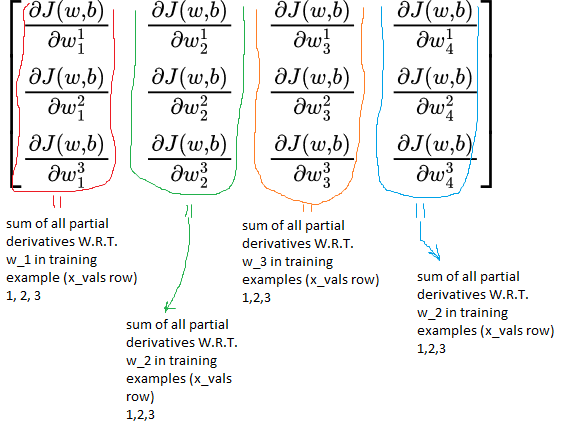

# Explained solution

This .md explains the initial implementation for multiple variable linear regression (`sol.py`).  
`sol.py` : https://github.com/josipursan/ML/blob/main/Supervised%20Machine%20Learning%3A%20Regression%20and%20Classification/W2/multiple_variable_linear_regression/sol.py  

`sol.py` is sectioned into multiple code chunks, described line by line.  

```python
This is a python code block that will be used
```  

A tidier, cleaner version `sol.py` will be pushed.  
As is, sol.py is actually pretty good looking, and is very nicely documented function by function.  
  
### Relevant expressions  
  
$$
\begin{align}
f_{\vec{w}, b} = \vec{w} \cdot \vec{x} + b
\end{align}
$$

$$
\begin{align}
J(w,b) = \frac{1}{2m} \sum_{i=1}^{m}(f_{w,b}(x^{i}) - y^{i})^{2}
\end{align}
$$

$$
\begin{align}
w_{n} = w_{n} - \alpha\frac{\partial}{\partial{w_{j}}}J(\vec{w}, b)
\end{align}
$$

$$
\begin{align}
w_{n} = w_{n} - \alpha\frac{1}{m} \sum_{i=1}^m(f_{w,b}(\vec{x}_{i}) - y^{i}) \cdot x_{n}^{i}
\end{align}
$$

$$
\begin{align}
b = b - \alpha\frac{\partial}{\partial{b}}J(\vec{w}, b)
\end{align}
$$

$$
\begin{align}
b = b - \alpha \frac{1}{m} \sum_{i=1}^{m}(f_{w,b}(\vec{x}^{i}) - y^{i})
\end{align}
$$

Equation `(4)` is just a more detailed rewrite of equation `(3)`.  
Equation `(6)` is just a more detailed rewrite of equation `(5)`.  

Equation `(1)` is model equation for multiple variable linear regression.  
Equations `(4)` and `(6)` are update terms for gradient descent.  

Example in `sol.py` uses a 4 variable model (ie. 4 input variables (x1, x2, x3, x4)) - therefore 4 w parameters must exist.  
For each training example, one output is given (y label).  

<!-- Example of a conventional looking matrix
$$
\begin{pmatrix}
  a & b & c \\
  d & e & f \\
  g & h & i
\end{pmatrix}
$$
-->
  
Here are all input variable values :  
x_input_variables = $[[2104, 5, 1, 45], [1416, 3, 2, 40], [852, 2, 1, 35]]$  
x_input_variables can be rearranged into a 3x4 matrix (m x n; 3 rows, 4 columns) :  
  
x_input_variables =
$$\left[\begin{array}{}
2104 & 5 & 1 & 45\\
1416 & 3 & 2 & 40\\
852 & 2 & 1 & 35
\end{array}\right]$$  

Rewriting x_input_variables to indicate to which w parameter each position in matrix refers to :  
  
x_input_variables = 
$$\left[\begin{array}{}
x_{1}^{1} & x_{2}^{1} & x_{3}^{1} & x_{4}^{1}\\
x_{1}^{2} & x_{2}^{2} & x_{3}^{2} & x_{4}^{2}\\
x_{1}^{3} & x_{2}^{3} & x_{3}^{3} & x_{4}^{3}
\end{array}\right]$$  
  
$x_{j}^{i}$ refers to the $j^{th}$ feature (input) of the $i^{th}$ training example (row).  
  
Here is a matrix (row vector) which positionally corresponds to the x_input_variables rows :  
y_outputs = $[460, 232, 178]$  


Here is a matrix containing all of the values for the input parameters (x1, x2, x3, x4) for each training example, as well as their respective outputs.  

[x_input_variables | y_vals] = 
$$\left[\begin{array}{}
2104 & 5 & 1 & 45&|460\\
1416 & 3 & 2 & 40&|232\\
852 & 2 & 1 & 35&|178
\end{array}\right]$$  

## Explanation
### compute_cost()
```python  
1 def compute_cost(x_vals, y_vals, w_vec, b):
2    m,n = x_vals.shape

3    cost = 0
4    for i in range(m):
5        f_wb = np.dot(x_vals[i], w_vec) + b
6        cost += (f_wb - y_vals[i])**2
7    cost = (cost/(2*m))
8    return cost
```

Line 2 : `m,n = x_vals.shape`  
&nbsp;&nbsp;&nbsp; Used to grab number of rows and columns of the x_vals array.  
&nbsp;&nbsp;&nbsp; Why? Because we need to know how many input features there are (columns), and how many training examples there are (rows).  
  
Lines 4, 5, 6  
&nbsp;&nbsp;&nbsp; line 4 : `for` loop is used to iterate over all given training examples (rows) using iterator variable `i`.  
&nbsp;&nbsp;&nbsp; line 5 : for each training example (row in x_vals) comprised of *n* features we must compute `y_hat` values for using the given `w_vec` and `b` model hypothesis, ie. the last guesses made as to what *w_vec* and *b* should be.  
&nbsp;&nbsp;&nbsp; line 6 : `cost` variable is used to sum up all of cost - it represents what is happening under the $\sum$ operator in equatoin `(2)`  
&nbsp;&nbsp;&nbsp;&nbsp;&nbsp;&nbsp;&nbsp;&nbsp;&nbsp; - note that what you are doing in line 6 is effectively `(y_hat - y_real[i])**2`, except that we are using variable name `f_wb` here because at the start of each iteration we compute what `f_wb` (y_hat) is for the $i^{th}$ row in `x_vals` matrix, and this is also why we iterate over true y values `y_vals` using `i` iterator.  
  
&nbsp;&nbsp;&nbsp; line 7 : finishing up cost computation by dividing it with $\frac{1}{2m}$ - value after line 7 represents what the total cost is for the hypothesis given with `w_vec` and `b`  
<br></br>  
  
### gradient_descent()  
```python
m,n = x_vals.shape
alpha = 5.0e-7
```  
Grabbing number of rows and columns from x_vals matrix.  
Setting alpha value to $5 * 10^{-7}$  
<br></br>

```python
cost_for_given_w_vec_b = compute_cost(x_vals, y_vals, w_vec, b)
all_costs.append(cost_for_given_w_vec_b)
```
Computing what the cost is for our latest `w_vec` and `b` assumed/adjusted values.  
Adding the last compute cost to a global list for debugging and plotting later. (irrelevant to the algorithm as such).  
<br></br>  
  
```python
1 dj_dw_j = np.zeros((n,))
2 dj_db = 0
3 for i in range(m):
4    f_wb = np.dot(x_vals[i], w_vec) + b
5    error_term = f_wb - y_vals[i]
6    for j in range(n):
7        dj_dw_j[j] = dj_dw_j[j] + error_term * x_vals[i,j]
8    dj_db += error_term
```  
line 1 and 2 : declaring variables that will be used to store partial derivatives for need to update our `w_vec` and `b` values.  
&nbsp;&nbsp;&nbsp;&nbsp;Why is `dj_dw_j` declared as an *n* sized row vector?  
&nbsp;&nbsp;&nbsp;&nbsp;&nbsp;&nbsp; Because we are trying to find out what is the total partial derivative for each individual parameter.  

$$\left[\begin{array}{}
\frac{\partial{J(w,b)}}{\partial{w_{1}^{1}}} & \frac{\partial{J(w,b)}}{\partial{w_{2}^{1}}} & \frac{\partial{J(w,b)}}{\partial{w_{3}^{1}}} & \frac{\partial{J(w,b)}}{\partial{w_{4}^{1}}}\\
\frac{\partial{J(w,b)}}{\partial{w_{1}^{2}}} & \frac{\partial{J(w,b)}}{\partial{w_{2}^{2}}} & \frac{\partial{J(w,b)}}{\partial{w_{3}^{2}}} & \frac{\partial{J(w,b)}}{\partial{w_{4}^{2}}}\\
\frac{\partial{J(w,b)}}{\partial{w_{1}^{3}}} & \frac{\partial{J(w,b)}}{\partial{w_{2}^{3}}} & \frac{\partial{J(w,b)}}{\partial{w_{3}^{3}}} & \frac{\partial{J(w,b)}}{\partial{w_{4}^{3}}}
\end{array}\right]$$  

<p align="center">
  
</p>

line 3 : `for` loop representing the $\sum$ operator in equations `(4)` and `(6)`.  
  
line 4 : computing `y_hat` values for the i-th row in x_vals, using the assumed `w_vec` and `b` values (ie. current model hypothesis).  
  
line 5 : computing the expression nested under $\sum$ operator in equations `(4)` and `(6)`.  
  
line 6 : `for` loop iterating over all columns (*n* )in each row (*m*) to compute what the derivative is for each individual row (*m*)  
  
line 7 : implementation of expression nested under the $\sum$ operator in equation `(4)`. In each of the indices of `dj_dw_j` you accumulate what the partial derivative is for each individual parameter (e.g. w1, w2, ...) for each individual training example (*m*).  
  
line 8 : if we take a look at equation `(6)` we can notice that partial derivative of `J(w,b)` W.R.T. b yields only the error term, therefore we accumulate only the error term for variable `b` (which makes sense because variable `b` does not interact with any of the input parameters (x1, x2, ...))  
<br></br>

```python
1 dj_dw_j = (dj_dw_j/m)
2 dj_db = (dj_db/m) 

3 w_vec_temp = w_vec-(alpha*dj_dw_j)
4 b_temp = b-(alpha*dj_db)

5 all_w_vec_predictions.append(w_vec_temp)
6 all_b_predictions.append(b_temp)
```  
line 1 : as per equation `(1)`, result of summation operation must be divided by $\frac{1}{m}$, ie. the total number of training examples  
  
line 2 : look at the comment above - same applies here  
  
lines 3 and 4 : simultaneous update - these lines are where we update our *w* and *b* assumptions to new *w* and *b* assumptions  
&nbsp;&nbsp;&nbsp;&nbsp; *w_vec* is the previous value that we update by subtracting $\alpha$*dj_dw_j  
&nbsp;&nbsp;&nbsp;&nbsp; Why are you using *w_vec_temp* and *b_temp*? Because in this implemetation you chose to store all *w* and *b* guesses to a global list for plotting and debugging after each run - otherwise this isn't necessary, you simply could've used the same variables passed to *gradient_descent()* function  
  
lines 5 and 6 : irrelevant; used to save all attempts for plotting and debugging  
<br></br>  

### multiple_variable_linear_regression()
```python
1 x_vals = np.array([[2104, 5, 1, 45],[1416, 3, 2, 40],[852, 2, 1, 35]])
2 y_vals = np.array([460, 232, 178])

# Let's check out the shape of our arrays, as well as their contents
3 print("x_vals shape : {}\nx_vals : {}\n\n".format(x_vals.shape, x_vals))
4 print("y_vals shape : {}\ny_vals : {}\n\n".format(y_vals.shape, y_vals))
```  
lines 1 and 2 : defining training examples/data the same way they were defined in course  
lines 3 and 4 : printing data just to check it out  
<br></br>  

```python
1 number_of_iterations = 1000
2 initial_w_assumption = np.zeros((x_vals.shape[1],))
3 b_assumption = 0
4 all_w_vec_predictions.append(initial_w_assumption)
5 all_b_predictions.append(b_assumption)
```  
line 1 : number of iterations we will run our grad desc algo  
line 2 : initializing our assumed *w* value to 0  
line 3 : same as line above, but for variable *b*  
line 4 and 5 : just adding our initial *w* and *b* assumptions to the global lists - unimprotant  
<br></br>  
  
```python
for i in range(number_of_iterations):
  gradient_descent(x_vals, y_vals, all_w_vec_predictions[-1], all_b_predictions[-1])
```  
Running the gradient descent for *number_of_iterations* iterations.  
Why are you passing latest *w* and *b* predictions as *all_w_vec_predictions[-1]* and *all_b_predictions[-1]*?  
&nbsp;&nbsp;&nbsp;&nbsp; Because these are global lists, meaning that whatever the last entry in these lists we find is actually the last *w* and *b* assumptions that should be used to evaluate the new model, hence `[-1]` access index  
<br></br>  
  
```python
print("Last cost after {} iteratons : {}\n".format(number_of_iterations, all_costs[-1]))
print("Last w prediction : {}\nLast b prediction : {}\n".format(all_w_vec_predictions[-1], all_b_predictions[-1]))
y_predicted = np.dot(x_vals, all_w_vec_predictions[-1]) + all_b_predictions[-1]
print("Real y_vals : {}\nPredicted y : {}\n".format(y_vals, y_predicted))
plt.plot([i for i in range(number_of_iterations)], all_costs)
plt.title("Cost function W.R.T number of iterations", loc="center")
plt.xlabel("number of iterations")
plt.ylabel("cost function")
plt.show()
```  
Just some debug and comprehension stuff.  