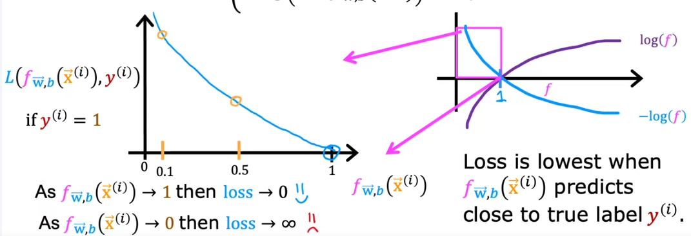
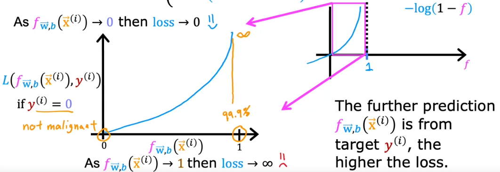
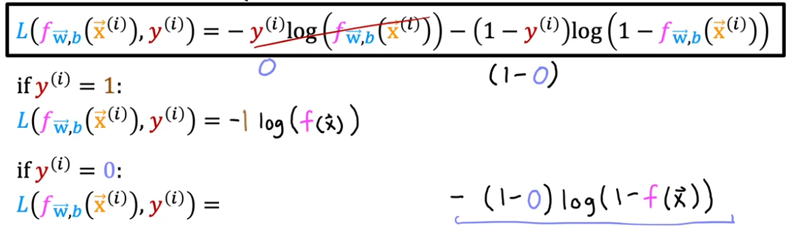

# Week 3
In week 3 we will be learning about classification.  
This week covers category prediction using logistic regression, as well as what overfitting is and how it is handled (regularization).  
  

## Logistic regression  
-**sigmoid function** is important for our logistic regression implementation  
&nbsp;&nbsp;&nbsp;-also called **logistic function**  
&nbsp;&nbsp;&nbsp;-sigmoid expression :  $g(z) = \frac{1}{1+e^{-z}}$ &nbsp;&nbsp;&nbsp;&nbsp;&nbsp;&nbsp;&nbsp;0 < g(z) < 1  
  
-how will we use sigmoid to build logistic regression?  
&nbsp;&nbsp;&nbsp;-remember that we defined a linear equation as fw,b($\vec{x}$) = $\vec{w} \cdot \vec{x} + b$  
&nbsp;&nbsp;&nbsp;-everything right of the equals sign can be called *z* : z = $\vec{w} \cdot \vec{x} + b$  
&nbsp;&nbsp;&nbsp;-now this whole expression *z* becomes what gets inserted into *z* in our sigmoid expression, thus getting the **logistic regression model**  
  
&nbsp;&nbsp;&nbsp; fw,b($\vec{x}$) = g(z) = g($\vec{w} \cdot \vec{x} + b$) = $\frac{1}{1+e^-{(\vec{w} \cdot \vec{x} + b)}}$  
  
&nbsp;&nbsp;&nbsp;-it inputs a feature x, or a set of features, and outputs a number between 0 and 1 (ie. class 0 or class 1)  
  

### Interpretation of logistic regression output  
-logistic regression output value can be thought of as the probability that class is 1 (or that it is not 0, or vice versa)  
  
fw,b($\vec{x}$) = P(y = 1 | $\vec{x};\vec{w}, b$)  
&nbsp;&nbsp;&nbsp;&nbsp;-translated in english : Probability that y is 1, given input $\vec{x}$ and parameters $\vec{w}$,b  
  
`Optional lab : Sigmoid function and logistic regression` is more of an exploratory lab for what sigmoid is and how it behaves - check it out later if you get stuck on some code implementations  
  
## Decision boundary  
-the `z` term we are using in our model can be used to determine where the `decision boundary` is  
&nbsp;&nbsp;&nbsp;-to be more precise, we check out when our term `z` will be equal to zero to figure out where the decision boundary is  
&nbsp;&nbsp;&nbsp;-if the models we are working for are modeled by some well known and described mathematical equations (such as a line, circle, etc.), by rearranging the equation we can figure out where exactly the boundary between y = 1 and y = 0 lies  
  
`Optional lab : Decision boundary` has a nice example of how logistic regression, specifically decision boundary works - check it out later in the course if you get stuck on some implementations  
  
## Cost function for logistic regression
-cost functions, generally speaking, give us a way of measuring how well y_hat values a specific set of parameters yields fit the training data, enabling us to choose best possible parameters  
  
-*m* - number of training examples  
-*n* - total number of features (each training example, ie. row in table, has *n* features)  
-xn - n-th feature  
-*y* - target (0 or 1 in case of logistic regression)  
-logistic model is defined by this equation :  
&nbsp;&nbsp;&nbsp; $f_{\vec{w},b}(\vec{x}) = \frac{1}{1+e^{-(\vec{w} \cdot \vec{x} + b)}}$  
  
-recall that for linear regression we used the **squared error cost** :  
&nbsp;&nbsp;&nbsp; $J(\vec{w}, b) = \frac{1}{m} \sum_{i=1}^m \frac{1}{2}(f_{\vec{w}, b}(\vec{x^{i}}) - y^{i})^{2}$  
  
&nbsp;&nbsp;&nbsp;-if you try using this cost function for logistic regression, you will end up with a cost function that is highly non-convex, ie. it has a lot of local minima, which is not what we want  
&nbsp;&nbsp;&nbsp;-we want a different cost function, one that will be convex and with only one, global, minimum if possible  
  
-**remember** : the loss function tells you how well you are doing on that one training example - by summing up all of the losses of all of the training examples we get the cost function (which measures how well you are doing on the whole training set)  

-let's again take a look at the squared error cost expression :  
&nbsp;&nbsp;&nbsp; $J(\vec{w}, b) = \frac{1}{m} \sum_{i=1}^m \frac{1}{2}(f_{\vec{w}, b}(\vec{x^{i}}) - y^{i})^{2}$  
&nbsp;&nbsp;&nbsp;&nbsp;-the chunk under summation operator will be called *loss*:  
&nbsp;&nbsp;&nbsp;&nbsp;&nbsp; L($f_{\vec{w},b}(\vec{x^{i}}, y^{i})) =  \frac{1}{2} (f_{\vec{w}, b}(\vec{x^{i}}) - y^{i})^{2}$  
  
&nbsp;&nbsp;&nbsp;-the loss functions inputs f(x) and the true label y, and tells us how well we are doing on that example  
&nbsp;&nbsp;&nbsp;-so, what kind of format/expression will we use for the loss function when doing logistic regression  
&nbsp;&nbsp;&nbsp;&nbsp;-we will actually split it into two cases, and therefore two expressions, based on the true label  
&nbsp;&nbsp;&nbsp;&nbsp;if y(i) = 1 ---> $-log(f_{\vec{w}, b}(\vec{x^{i}}))$  
&nbsp;&nbsp;&nbsp;&nbsp;if y(i) = 0 ---> $-log(1 - f_{\vec{w}, b}(\vec{x^{i}}))$  
  
-let us first consider the loss function for the case y(i) = 1 :  
&nbsp;&nbsp;&nbsp;-because the output of logistic regression is always between 0 and 1, we can focus only on the part of the curve between 0 and 1  

&nbsp;&nbsp;&nbsp;-if our model/algorithm predicts a probability close to 1, and the true label is 1, then the loss is 0, or very small, therefore we can infer that our model performed well (notice the graph below which is visually showing what is exaplained in this paragraph)  
&nbsp;&nbsp;&nbsp;- another way to write what is explained here is : As $f_{\vec{w}, b}(\vec{x^{i}})$ --> 1 then loss --> 0  
&nbsp;&nbsp;&nbsp;-continuing on with our y = 1 curve, if $f_{\vec{w}, b}(\vec{x^{i}})$ --> 0, then loss increases significantly because we move leftwards on our curve  
  
&nbsp;&nbsp;&nbsp;remember : y axis represents how big the loss is  
  
  
  
_ _ _ _ _ _ _ _  
  
-let us now consider the loss function for y(i) = 0 case  
&nbsp;&nbsp;&nbsp;-as with the previous example, y axis shows the amount of loss for each $f_{\vec{w}, b}(\vec{x^{i}})$ value  
&nbsp;&nbsp;&nbsp;-when our prediction is close to zero, loss for that prediction will be close to zero because our f value lies very close to the axis intersection where loss is minimal  
&nbsp;&nbsp;&nbsp;-the larger the value f is (ie. more to the right), the greater the loss  
&nbsp;&nbsp;&nbsp;-visual example shown below  
  
  
  
-these two separate expressions, one for each label, give us a convex cost function, thus making sure cost function runs fully and without any hiccups  
  

## Simplified cost function for logistic regression
-here we will lay out simpler terms for the loss and cost so that the grad desc implementation for logistic regression becomes simpler  
  
-let's first write down the loss function we figure out in the previous video :  
  
$L(f_{\vec{w},b}(\vec{x^{i}}, y^{i}) = $  
&nbsp;&nbsp;&nbsp;&nbsp;&nbsp; $-log(f_{\vec{w},b}(\vec{x^{i}})$ if y(i) = 1  
&nbsp;&nbsp;&nbsp;&nbsp;&nbsp; $-log(1 - f_{\vec{w},b}(\vec{x^{i}})$ if y(i) = 0  
  
-we can write this more succintly, in one line :  
  
$L(f_{\vec{w},b}(\vec{x^{i}}, y^{i}) = -y^{(i)} log(f_{\vec{w},b}(\vec{x^{i}})) - (1-y^{(i)})log(1 - f_{\vec{w},b}(\vec{x^{i}}))$  
  
&nbsp;&nbsp;&nbsp;&nbsp;(note that further in text you will refer to halves of this equation as left and right half, left half being everything left from the subtraction sign in the middle, and the right half being everything to the right from the subtraction sign in the middle)  
  
-why is this expression equivalent to the two, split, expressions from the previous video?  
&nbsp;&nbsp;&nbsp;-consider what happens if our true label y is 1 - left half is multiplied by our current true label 1, thus it remains, but the second half has the $(1 - y^{(i)})$ expression multiplying the $log()$, meaning that in the case our true label y is 1 this expression in parantheses will cancel out the whole right half. Why? Left half is what we previously, when the expressions were split, were using to evaluate how a predicted label *y* is performing compared to our current true label value of 1, therefore we do not need the right half which is used to evaluate values for $y^{i} = 0$  
&nbsp;&nbsp;&nbsp;-vice versa also applies  

  
  
-let's write it out one final time  
&nbsp;&nbsp;&nbsp;

$J(\vec{w}, b) = \frac{1}{m} \sum_{i = 1}^{m} [L(f_{\vec{w},b}(\vec{x^{i}}, y^{i})]$  
&nbsp;&nbsp;&nbsp;&nbsp;&nbsp;&nbsp;&nbsp;&nbsp;&nbsp;&nbsp;&nbsp;&nbsp;&nbsp;&nbsp;&nbsp;$ = -\frac{1}{m} \sum_{i = 1}^{m}[y^{(i)} log(f_{\vec{w},b}(\vec{x^{i}})) + (1-y^{(i)})log(1 - f_{\vec{w},b}(\vec{x^{i}})]$  
&nbsp;&nbsp;&nbsp;NOTE : negative signs from the shorter expression were taken out and put in front of the fraction before the summation operator  
  

# Gradient descent implementation  
-our goal is to find values $\vec{w}, b$ which minimize the cost function (ie. give the best model)  
  
-given a new, never before seen, value $\vec{x}$, run that value through our optimized model $f_{\vec{w}, b}(\vec{x}) = \frac{1}{1+e^{-\vec{w} \cdot \vec{x} + b}}$ to try and predict the probability that the label y is 1 for that specific given input ( $P(y = 1 | \vec{x}; \vec{w}, b)$ )  
  
-here is the cost function we will use during grad desc :  
$J(\vec{w}, b) = -\frac{1}{m} \sum_{i = 1}^{m}[y^{(i)} log(f_{\vec{w},b}(\vec{x^{i}})) + (1-y^{(i)})log(1 - f_{\vec{w},b}(\vec{x^{i}})]$  
  
-the usual gradient descent update steps for w and b are still valid :  
&nbsp;&nbsp; repeat {  
&nbsp;&nbsp;&nbsp; $w_{j} = w_{j} - \alpha \frac{\partial}{\partial{w_{j}}} J(\vec{w}, b)$  
&nbsp;&nbsp;&nbsp; $b = b - \alpha \frac{\partial}{\partial{b}} J(\vec{w}, b)$  
&nbsp;&nbsp;&nbsp; }  
  
-index j goes from 1 to n, where *n* is the number of features in our model  
-let's take a look at the derivative terms now  
  
$ \frac{\partial}{\partial{w_{j}}} J(\vec{w}, b) =  \frac{1}{m} \sum_{i=1}^{m}(f_{\vec{w},b}(\vec{x^{i}}) - y^{(i)}) x_{j}^{(i)}$  
&nbsp;&nbsp;&nbsp;- $x_{j}^{(i)}$ is the the j-th feature of the i-th training example  
  
$ \frac{\partial}{\partial{b}} J(\vec{w}, b) =  \frac{1}{m} \sum_{i=1}^{m}(f_{\vec{w},b}(\vec{x^{i}}) - y^{(i)})$  
  
-REMEMBER! Always do the updates simultaneously - first compute everything that can be computed on the right hand side, and only then go and update both *w* and *b* simultaneously  
  
-let's rewrite the *repeat* steps to include the derivative terms  
&nbsp;&nbsp; repeat {  
&nbsp;&nbsp;&nbsp; $w_{j} = w_{j} - \alpha [\frac{1}{m} \sum_{i=1}^{m}(f_{\vec{w},b}(\vec{x^{i}}) - y^{(i)}) x_{j}^{(i)}]$  
&nbsp;&nbsp;&nbsp; $b = b - \alpha [\frac{1}{m} \sum_{i=1}^{m}(f_{\vec{w},b}(\vec{x^{i}}) - y^{(i)})]$  
&nbsp;&nbsp;&nbsp; }  
  
-you might notice that the update expressions for logistic regression look exactly the same as for linear regression, however this does not mean they are one and the same, quite the opposite  
&nbsp;&nbsp;&nbsp;-the main difference is hidden - it is the $f_{\vec{w}, b}(\vec{x^{(i)}})$ that makes the difference because it is differently defined for **linear regression** (linear eq.) and **logistic regression** (sigmoid)  
    

# The problem of overfitting  
-**underfit model** - model that does not fit the training data very well  
&nbsp;&nbsp;&nbsp;-another term used for this is **high bias** - usage of this term makes sense because you could say that high bias models are models that have a high level of preconception that the data is representatively modeled  
  
-for models that fit the training data pretty well, we say the are **generalizations**, and that they generalize the training data pretty well  
  
-**overfit model** - a mode that fits the data extremely well  
&nbsp;&nbsp;&nbsp;-do not generalize well because they are to tightly couple to the underlying math found in the training data, ie. it aims to emulate the training data 100%  
&nbsp;&nbsp;&nbsp;-another term for overfit models is **high variance**  
&nbsp;&nbsp;&nbsp;-why is term **high variance** used for overfit models? Because they are so tightly couple to the training data, even a slight difference in the training data will result in a drastically different predictions (ie. model outputs), hence the term high variance - small input differences result in high output variance of the model  
  

## Addressing overfitting  
-if you have an overfit model...  
&nbsp;&nbsp;&nbsp;-**1. more data** - you need to collect more training data in order to avoid the algorithm fitting weird models to your data (if more data is available)  
&nbsp;&nbsp;&nbsp;-**2. feature selection** - you can select which features you want to include/exclude in your model - if you use a lot of features, but don't have enough data, it is highly likely you will end up with an overfit model; selecting what you believe are most appropriate features (process called **feature selection**) can mitigate this  
&nbsp;&nbsp;&nbsp;-**3. regularization** - overfit models can often high very high polynomial in them  
&nbsp;&nbsp;&nbsp;&nbsp;&nbsp;&nbsp;-a method which gently reduces impact chosen features of the model have  
&nbsp;&nbsp;&nbsp;&nbsp;&nbsp;&nbsp;-regularization encourages the learning algorithm to shrink the values of parameters without necessarily outright eliminating the parmaters, and therefore features  
&nbsp;&nbsp;&nbsp;&nbsp;&nbsp;&nbsp;-after regularization is done, even the high order polynomial model will behave significantly better than before  
&nbsp;&nbsp;&nbsp;&nbsp;&nbsp;&nbsp;-regularization lets us keep all of the features, but it keeps potentially problematic fetaures from having an overly large effect on the overall behaviour of the model  
&nbsp;&nbsp;&nbsp;&nbsp;&nbsp;&nbsp;-only *w* paramters are usually regularized, *b* not - however it *b* can also be regularized, it is not an issue (regularizing b in practice makes very little difference)  

# Cost function with regularization  
  
-the idea of regularization is to have small parameter values so that we can end up with a simpler model, which is less likely to overfit  
&nbsp;&nbsp;&nbsp;-of course, this approach can not be pushed too far  
  
-generally, regularization is implemented in such way that it penalizes all of the features (by *penalize* we actually mean it penalizes the parameter, the coefficient, of each feature) - this is done because in a scenario where you have a lot of features for a model you might not be able to determine which features are the important ones  
  
-so, here is our cost function modified with the regularization term :  
$J(\vec{w}, b) = \frac{1}{2m} \sum_{i=1}^{m} (f_{\vec{w}, b}(\vec{x}^{(i)})-y^{(i)})^{2} + \frac{\lambda}{2m} \sum_{j=1}^{n}w_{j}^2$  
  
$\lambda$ is the **regularization parameter**  
  
-by convention, parameter b is not penalized during regularization because it makes little, to no, difference; if added, another term appears after the already added term shown above :  
&nbsp;&nbsp;&nbsp;&nbsp; $\frac{\lambda}{2m}b^2$  
  
-in this modified cost function, we want to minimize the original cost term (*the mean squared error term*), and also the additional term (*the regularization term*)  
&nbsp;&nbsp;&nbsp;-minimizing the *mean squared error term* contributes to fitting the best possible model to the data  
&nbsp;&nbsp;&nbsp;-minimizing the *regularization term* contributes to keeping the $w_{j}$ parameters small, thus avoiding overfitting the model  
  
# Regularized linear regression  
  
-here is the regularized cost function for linear regression :  
$J(\vec{w}, b) = \frac{1}{2m} \sum_{i=1}^{m} (f_{\vec{w}, b}(\vec{x}^{(i)})-y^{(i)})^{2} + \frac{\lambda}{2m} \sum_{j=1}^{n}w_{j}^2$  
  
-previously, because we didn't have the *regularization term* after the squared error cost term, our gradient descent updated parameters $w_{j}$ and b on each iteration :  
&nbsp;&nbsp; repeat {  
&nbsp;&nbsp;&nbsp; $w_{j} = w_{j} - \alpha \frac{\partial}{\partial{w_{j}}} J(\vec{w}, b)$  
&nbsp;&nbsp;&nbsp; $b = b - \alpha \frac{\partial}{\partial{b}} J(\vec{w}, b)$  
&nbsp;&nbsp;&nbsp; }  
  
-updates as such are the same, but cost function *J* has changed, meaning the derivative term changes when we use the regularized cost function  
  
-new derivative terms for the regularized cost function :  
$\frac{\partial}{\partial{w_{j}}} J(\vec{w}, b) = \frac{1}{m}\sum_{i = 1}^{m}(f_{\vec{w}, b}(\vec{x^{(i)}}) - y^{(i)})x_{j}^{(i)} + \frac{\lambda}{m}w_{j}$  
  
$\frac{\partial}{\partial{b}} J(\vec{w}, b) = \frac{1}{m}\sum_{i = 1}^{m}(f_{\vec{w}, b}(\vec{x^{(i)}}) - y^{(i)})$  
  
-putting it all together :  
&nbsp;&nbsp; repeat {  
&nbsp;&nbsp;&nbsp; $w_{j} = w_{j} - \alpha [\frac{1}{m}\sum_{i = 1}^{m}[(f_{\vec{w}, b}(\vec{x^{(i)}}) - y^{(i)})x_{j}^{(i)}] + \frac{\lambda}{m}w_{j}]$  
&nbsp;&nbsp;&nbsp; $b = b - \alpha \frac{1}{m}\sum_{i = 1}^{m}(f_{\vec{w}, b}(\vec{x^{(i)}}) - y^{(i)})$  
&nbsp;&nbsp;&nbsp; } simultaneous update  
  
# Regularized logistic regression  
-let's remember the cost function used for logistic regression :  
$J(\vec{w}, b) = -\frac{1}{m} \sum_{i = 1}^{m}[y^{(i)} log(f_{\vec{w},b}(\vec{x^{i}})) + (1-y^{(i)})log(1 - f_{\vec{w},b}(\vec{x^{i}})]$  
  
-and here is the regularized cost function for logistic regression :  
$J(\vec{w}, b) = -\frac{1}{m} \sum_{i = 1}^{m}[y^{(i)} log(f_{\vec{w},b}(\vec{x^{i}})) + (1-y^{(i)})log(1 - f_{\vec{w},b}(\vec{x^{i}})] + \frac{\lambda}{2m}\sum_{j=1}^{n}w_{j}^{2}$  
  
-don't forget - *n* is the number of features, *m* is the number of training examples (each training examples is made up of *n* features)  
  
-gradient descent :  
&nbsp;&nbsp; repeat {  
&nbsp;&nbsp;&nbsp; $w_{j} = w_{j} - \alpha \frac{\partial}{\partial{w_{j}}} J(\vec{w}, b)$  
&nbsp;&nbsp;&nbsp; $b = b - \alpha \frac{\partial}{\partial{b}} J(\vec{w}, b)$  
&nbsp;&nbsp;&nbsp; }  

-let us now figure out what the derivative terms will be for the regularized cost function :   
$ \frac{\partial}{\partial{w_{j}}} J(\vec{w}, b) =  \frac{1}{m} \sum_{i=1}^{m}(f_{\vec{w},b}(\vec{x^{i}}) - y^{(i)}) x_{j}^{(i)} + \frac{\lambda}{2m}w_{j}$  

$ \frac{\partial}{\partial{b}} J(\vec{w}, b) =  \frac{1}{m} \sum_{i=1}^{m}(f_{\vec{w},b}(\vec{x^{i}}) - y^{(i)})$  
  
-note that the above stated derivative expressions for regularized cost function for logistic regression are identical to the derivative expressions of regularized cost function for linear regression - this is true, but the actual difference is hidden in $f_{\vec{w},b}(\vec{x^{i}})$  
  
TO DO :  
&nbsp;&nbsp;&nbsp; implement regularized linear regression  
&nbsp;&nbsp;&nbsp; implement regularized logistic regression