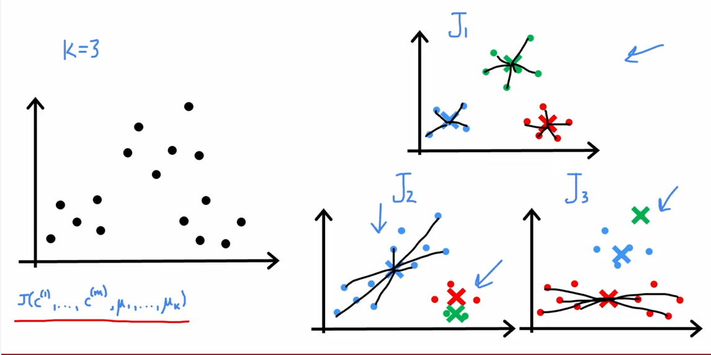

# Week 1  
## What is clustering?  
https://www.coursera.org/learn/unsupervised-learning-recommenders-reinforcement-learning/lecture/zoCuG/what-is-clustering  
  
-clustering looks at data, and finds data points that are similar, related to each other  
 
## k-means intuition  
https://www.coursera.org/learn/unsupervised-learning-recommenders-reinforcement-learning/lecture/xS8nN/k-means-intuition  
  
-initially k-means will take a random guess at where the *cluster centroids* might be  
-then it will iterate over all available data points to check which cluster centroid is closer to each data point  
-whichever cluster centroid is closest to the currently observed data point gets assigned this data point  
  
-then k-means recomputes the centroids - it does this by computing the average location of all points that have been assigned to their centroid, and moving the centroid to this average location  
-after this step we again interate over all data points, checking which cluster centroid is closest to each data point - this is an iterative process  
  
-k-means usually converges - it reaches a point where the position of cluster centroids can not be refined any more  
  
## k-means algorithm  
https://www.coursera.org/learn/unsupervised-learning-recommenders-reinforcement-learning/lecture/GwgDo/k-means-algorithm  
  
-first we randomly initialize *K* cluster centroids : $\mu_{1}, \mu_{2}, ..., \mu_{K}$ (*K* represents how many clusters we want to create, therefore how many cluster centroids we need)  
repeat {  
&nbsp;&nbsp;&nbsp;#Assign points to cluter centroids  
&nbsp;&nbsp;&nbsp;for *i* = 1 to *m*  
&nbsp;&nbsp;&nbsp;$c^{(i)}$ := index (from 1 to K) of cluster centroid closest to $x^{(i)}$  
  
&nbsp;&nbsp;&nbsp;#Move the cluster centroids  
&nbsp;&nbsp;&nbsp;for k = 1 to *K*   #*for all existing clusters we will compute their new clister centroids based on the total average position of all data points assigned to each observed cluster in the loop above*   
&nbsp;&nbsp;&nbsp;$\mu_{k}$ := average (mean) of all points assigned to cluster k  
}  
  
-assigning data points to cluster centroids, mathematically speaking, means computing which cluster centroid is closest to each data point, and then assigning the data point to that cluster centroid  
  
-*m* - number of training examples  
  
-how do we check which cluster centroid is closest to each point/training example?  
&nbsp;&nbsp;&nbsp;-we simply compute the distances, ie. the **L2 norm** :  
&nbsp;&nbsp;&nbsp;&nbsp;&nbsp;&nbsp;&nbsp;$||x^{(i)} - \mu_{k}||^{2}$  
&nbsp;&nbsp;&nbsp;-in addition to using the above written L2 norm, we are searching for cluster centroid, *k*, that minimizes the L2 norm, ie. yields the smallest distance between the observed data point and the available cluster centroids (or to be even more blunt - we are searching for a cluster centroid (*k*) closest to the observed data  point)   
  
-if a cluster is empty because no points have been assigned to it, it usually gets eliminated  
  
### k-means for clusters that are not well separated  
-k-means does not necessarily have to be used only for datasets that have well separated groups of data points  
  
## Optimization objective  
https://www.coursera.org/learn/unsupervised-learning-recommenders-reinforcement-learning/lecture/f5G5k/optimization-objective  
  
-$c^{(i)}$ - index of clusters (1, 2, ..., *K*) to which example $x^{(i)}$ is currently assigned  
-$\mu_{k}$ - cluster centroid k  
-$\mu_{c^{(i)}}$ - cluster centroid of cluster to which example $x^{i}$ has been assigned  

-notation examples :  
&nbsp;&nbsp;&nbsp;-$x^{(10)}$ - training example 10  
&nbsp;&nbsp;&nbsp;-$c^{(10)}$ - cluster centroid to which the tenth training example has been assigned  
&nbsp;&nbsp;&nbsp;-$\mu_{c}^{(10)}$ - location of the cluster centroid to which $x^{(10)}$ has been assigned  
  
**Cost function**  
$J(c^{(1)}, ..., c^{(m)}, \mu_{1}, ..., \mu_{K}) = \frac{1}{m}\sum_{i=1}^{m}||x^{(i)} - \mu_{c^{i}}||^{2}$  
  
-average of sum, from 1 to m, of the squared distance between every training example *i* and the location of the cluster centroid to which the training examle $x^{(i)}$ has been assigned  
  
-the above shown equation often gets called **distortion**  
  
-due to the nature of the k-means algorithm, especially the cost function it uses, cost function/distortion reduces for each iteration of k-means algorithm, converging at a cluster centroid points that can't be positioned any better due to the distribution of datapoints in space  
  
-cost function should NEVER go up - if it does, it usually indicates a bug in code  
  
-additionally, since k-means converges, once you reach an iteration that has the same cost function value as the previous one we can conclude the algorithm has converged, and there is no point in running further iterations  
  
## Initializing k-means  
https://www.coursera.org/learn/unsupervised-learning-recommenders-reinforcement-learning/lecture/lw9LD/initializing-k-means  
  
-high level overview of k-means algorithm :  
&nbsp;&nbsp;&nbsp;-step 0 : randomly initialize K cluster centroids $\mu_{1}$, $\mu_{2}$, ..., $\mu_{k}$  
&nbsp;&nbsp;&nbsp;-step 1 : assign points to cluster centroids  
&nbsp;&nbsp;&nbsp;-step 2 : recompute positions of cluster centroids  
&nbsp;&nbsp;&nbsp;-repeat step 1 and step 2 until convergence is reached  
  
-random initialization is a crucial step, as the initial centroid positions have the ability to heavily influence what the end result will be  
  
-different initial cluster centroid positions can result in a vastly different datapoint grouping  
  
*Random initialization*  
-randomly pick *K* training examples (*K* being the number of clusters we want to create)  
-set cluster centroids, $\mu_{1}$, $\mu_{2}$, $\mu_{k}$, equal to *K* randomly picked training examples  
-run k-means algorithm  
  
-often times we will run k-means algorithm for a number of different random initializations due to their high level of importance  
  
-here is a screenshot showing how three different random initializations result in different groupings once the algorithm converges : 

    

  
  
-when running k-algorithm multiple times we will use the end cost function to determine which run provides us with the best clustering  
  
