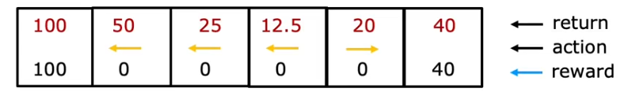
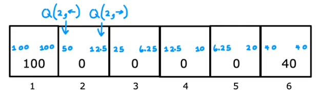

# Reinforcement learning  
## The return in reinforcement learning systems  
https://www.coursera.org/learn/unsupervised-learning-recommenders-reinforcement-learning/lecture/5SCL1/the-return-in-reinforcement-learning  
  
-discount factor ($\gamma$) - makes our reinforcement learning algorithm *impatient*  
&nbsp;&nbsp;&nbsp;-by *impatient* we mean that the first reward gets the full credit, a little bit less credit to the reward from the second step, even less credit to the reward given by the third step etc.  
&nbsp;&nbsp;&nbsp;-the more steps you need the more penalization is enforced by the discount factor  
&nbsp;&nbsp;&nbsp;-in many reinforcement learning algorithms the discount factor is usually a value pretty close to 1  
&nbsp;&nbsp;&nbsp;-lower discount factor values (closer to zero) heavily penalize future rewards (ie. heavily penalizes more steps), and vice versa  
  
## Making decisions : policies in reinforcement learning  
https://www.coursera.org/learn/unsupervised-learning-recommenders-reinforcement-learning/lecture/BsteY/making-decisions-policies-in-reinforcement-learning  
  
-in reinforcement learning our goal is to come up with a function/policy ($\pi$) whose job it is to take any state (*s*) as an input and map it to some action (*a*) that it wants us to take  
  
## Review of key concepts  
https://www.coursera.org/learn/unsupervised-learning-recommenders-reinforcement-learning/lecture/fvSTb/review-of-key-concepts  
  
-Markov Decision Process (MDP) - the future depends only on the current state, and not on anything that might have occured prior to reaching the current state  
&nbsp;&nbsp;&nbsp;-in other words, the future depends only on where you are now, not on how you got here  
  
## State-action value function definition  
https://www.coursera.org/learn/unsupervised-learning-recommenders-reinforcement-learning/lecture/FEU97/state-action-value-function-definition  
  
-state activation function is the key quantityy reinforcement learning algorithms are trying to compute  
  
-typical representation of a *state value activation function* : $Q(s,a) = x$  
&nbsp;&nbsp;&nbsp;-*s* - state the system is currently in  
&nbsp;&nbsp;&nbsp;-*a* - action you might choose to do in state *s*  
&nbsp;&nbsp;&nbsp;-*x* - return if you start in state *s* and take action *a* (once), and then behave optimally after that   
  
-the issue with the description above is how do we know what is *optimal* behaviour?  
&nbsp;&nbsp;&nbsp;-do not worry about this for now, one of later videos will provide more context and sense  
  
-let's look at a policy example :  

    

  
-this is a pretty good policy : in states 2,3,4 you move left, and go right from state 5  
  
-this is actually the optimal policy for our Mars rover example when discount factor ($\gamma$)  
  
-imagine we are in state 2, and choose to go right : $Q(2, right)$  
-since we are in state 2, and chose to go right, we end up in state 3  
-looking at the optimal policy shown above we can see that the optimal behaviour from state 3 is to go left  
-therefore we move left, ending up again in state 2  
-optimal behaviour from state 2 is to move left, ending up in state 1, the highest rewarding one, ending our traversal since we've reached optimal state  
-all in all, our traversal is made up of reward for the starting step, reward for the first step (from 2 to 3), reward for second step (from 3 to 2) and the final step (from 2 to 1) :  
$ 0 + (0.5)0 + (0.5)^{2}0 + (0.5)^{3}100 = 12.5 $  
  
-now imagine we are in state 2, and we choose to go left : $Q(2, left)$  
-we start in state 2 (reward is 0) and move left, leading us to state 1 (reward 100) where we finish our movement  
$0 + (0.5)100 = 50$
  
-here is a screenshot showing what the computed moves look like for all states :  

    

  
  
-values shown above tell you what is the value, how good it is to do a certain action *a* when in state *s* (and then behave optimally after the action *a*)  
  
-state-action value function is also called *Q-function* (is also sometimes referred to as Q* or *optimal Q function*)  
  
-the best possible return from state is $maxQ(s,a)$  
  
-the best possible action in state *s* is the action *a* that gives $maxQ(s,a)$  
  
-when you compute all of the possible rewards from all states you can determine what the optimal *Q* function is (optimal movements are shown on the first screenshot above)  
  
## Bellman equation  
https://www.coursera.org/learn/unsupervised-learning-recommenders-reinforcement-learning/lecture/3Wpee/bellman-equation  
  

  
